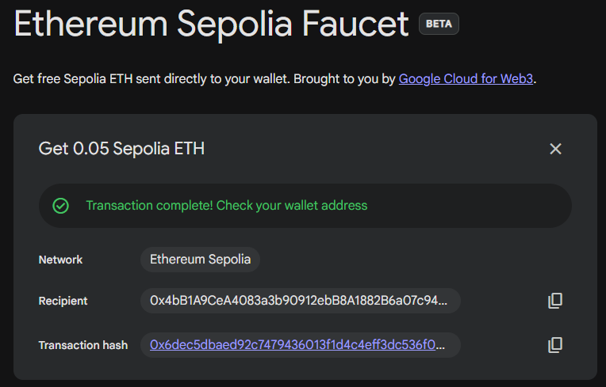
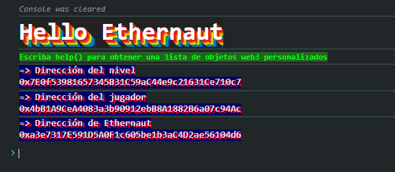
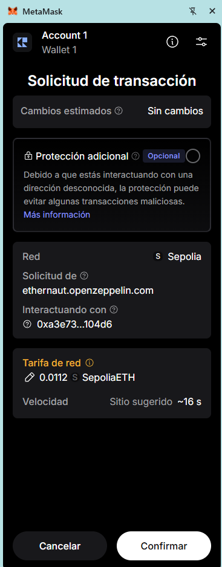
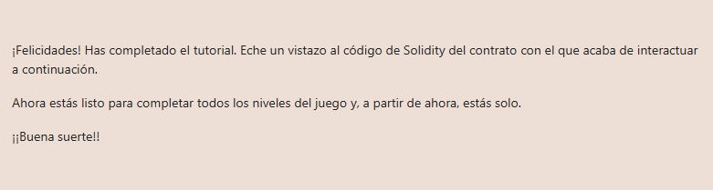

# 00 - Hello Ethernaut

**Plataforma:** Ethernaut (OpenZeppelin)  
**Categoría:** Tutorial  
**Herramientas:** MetaMask, consola del navegador (Chrome DevTools), Google Cloud Web3 Faucet  

### 📂 Estructura de Archivos
* `README.md`: Writeup del nivel.
* `assets/`: Directorio con las capturas de evidencia.

---

### Enunciado

Nivel 0 de [Ethernaut](https://ethernaut.openzeppelin.com/), el tutorial del juego. Enseña a configurar MetaMask, abrir la consola del navegador, usar los helpers que el juego carga en ella (`player`, `getBalance`, `help()`, `ethernaut`, `contract`), pedir una instancia del nivel e interactuar con su ABI. La indicación final es: revisar `contract.info()`, que *"dentro del contrato está todo lo necesario para completar el nivel"*, y enviar la instancia con **Submit instance**.

El objetivo concreto es llamar a `authenticate()` con la contraseña correcta. Eso pone en `true` la variable `cleared` de la instancia, que es lo que el contrato `Ethernaut` verifica al recibir el *submit*.

---

## Preparación del entorno

### 1. MetaMask en Sepolia

Ethernaut corre sobre la testnet **Sepolia**. En MetaMask hay que activar **"Mostrar redes de prueba"** y seleccionar Sepolia. En las versiones nuevas está en el filtro **"Todas las redes"** o en **☰ → Configuración → Avanzado**.

### 2. ETH de prueba

Cada transacción (crear la instancia, `authenticate`, *submit*) paga gas, así que hace falta ETH de prueba. Se pidió en el faucet de **Google Cloud Web3**, que entrega 0.05 Sepolia ETH:


*El faucet envía 0.05 Sepolia ETH a la dirección del jugador.*

### 3. Consola del navegador

Con la página del nivel abierta, la consola se abre con `Ctrl + Shift + J` (o `F12` → *Console*). Al cargar, el juego imprime tres direcciones:


*Dirección del nivel, del jugador (la cuenta de MetaMask) y del contrato principal `Ethernaut`.*

> Chrome bloquea el pegado en la consola la primera vez. Se habilita escribiendo a mano `allow pasting` y Enter.

Comandos de reconocimiento del tutorial:

```javascript
player                    // dirección del jugador
await getBalance(player)  // saldo de ETH de prueba
help()                    // lista de helpers disponibles
await ethernaut.owner()   // dueño del contrato principal del juego
```

---

## Análisis

### Instancia del nivel

El botón **Get New Instance** le pide al contrato `Ethernaut` que despliegue un contrato nuevo para el jugador. Esa instancia queda disponible en la consola como `contract`. Las transacciones de *Get New Instance* y *Submit instance* van dirigidas al contrato `Ethernaut` (`0xa3e7…104d6`), no a la instancia, y MetaMask pide confirmarlas:


*Solicitud de transacción desde `ethernaut.openzeppelin.com` hacia `0xa3e73…104d6` (Ethernaut), con una tarifa estimada de 0.0112 SepoliaETH.*

### Llamadas vs. transacciones

Todos los métodos `info*` son `pure`: solo devuelven un texto, no cambian el estado, no cuestan gas y MetaMask no interviene. `authenticate()` sí modifica el estado (`cleared = true`), así que es una transacción que hay que firmar.

---

## Explotación

Cada método devuelve la pista para el siguiente. Las respuestas son las cadenas que devuelve el contrato (ver el código fuente más abajo):

```javascript
await contract.info()
// 'You will find what you need in info1().'

await contract.info1()
// 'Try info2(), but with "hello" as a parameter.'

await contract.info2("hello")
// 'The property infoNum holds the number of the next info method to call.'

(await contract.infoNum()).toString()
// '42'

await contract.info42()
// 'theMethodName is the name of the next method.'

await contract.theMethodName()
// 'The method name is method7123949.'

await contract.method7123949()
// 'If you know the password, submit it to authenticate().'

await contract.password()
// 'ethernaut0'

await contract.authenticate("ethernaut0")
// transacción: MetaMask pide confirmar
```

`infoNum` es un `uint8`, así que la consola lo devuelve como un objeto *BigNumber*; `.toString()` lo muestra como número.

Antes de enviar la instancia se puede verificar que quedó resuelta:

```javascript
await contract.getCleared()
// true
```

Por último, **Submit instance** (otra transacción hacia `Ethernaut`). El contrato del juego revisa `getCleared()` en la instancia y aprueba el nivel:


*Nivel completado.*

---

## Código del contrato

Al completar el nivel, Ethernaut muestra el código Solidity de la instancia:

```solidity
// SPDX-License-Identifier: MIT
pragma solidity ^0.8.0;

contract Instance {
    string public password;
    uint8 public infoNum = 42;
    string public theMethodName = "The method name is method7123949.";
    bool private cleared = false;

    // constructor
    constructor(string memory _password) {
        password = _password;
    }

    function info() public pure returns (string memory) {
        return "You will find what you need in info1().";
    }

    function info1() public pure returns (string memory) {
        return 'Try info2(), but with "hello" as a parameter.';
    }

    function info2(string memory param) public pure returns (string memory) {
        if (keccak256(abi.encodePacked(param)) == keccak256(abi.encodePacked("hello"))) {
            return "The property infoNum holds the number of the next info method to call.";
        }
        return "Wrong parameter.";
    }

    function info42() public pure returns (string memory) {
        return "theMethodName is the name of the next method.";
    }

    function method7123949() public pure returns (string memory) {
        return "If you know the password, submit it to authenticate().";
    }

    function authenticate(string memory passkey) public {
        if (keccak256(abi.encodePacked(passkey)) == keccak256(abi.encodePacked(password))) {
            cleared = true;
        }
    }

    function getCleared() public view returns (bool) {
        return cleared;
    }
}
```

La contraseña está guardada en una variable de estado `public`, y Solidity genera automáticamente un *getter* para ellas. Por eso alcanza con `contract.password()` para leerla.

---

## 🛡️ Remediación (Developer Perspective)

- **No guardar secretos en el storage de un contrato.** Declarar `password` como `private` no la protege: `private` solo impide que *otros contratos* la lean, pero cualquiera puede leer el storage directamente (por ejemplo, con `web3.eth.getStorageAt`).
- **No autenticar con un secreto enviado como parámetro.** Aunque se guardara solo el hash, la contraseña viaja en claro en los datos de la transacción de `authenticate()` y queda pública en la blockchain. La autorización se hace por la identidad del que llama (`msg.sender`, por ejemplo con un `owner` y un modificador `onlyOwner`), que está respaldada por la firma de la transacción.
