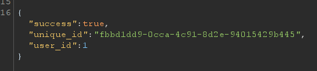
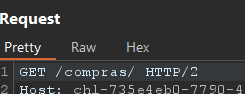
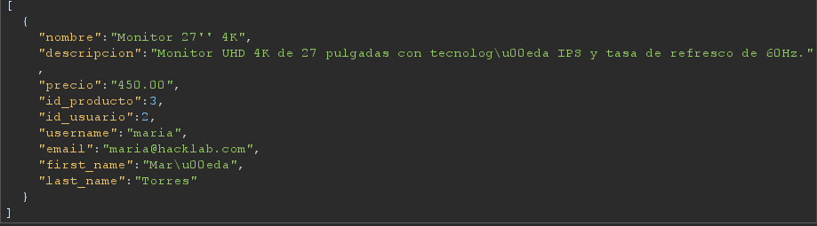
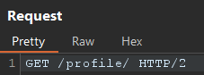
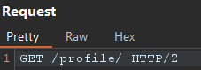
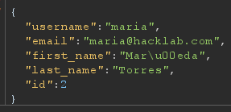
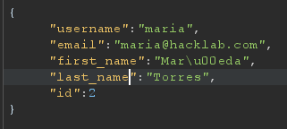
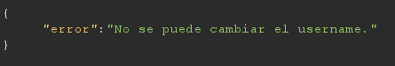
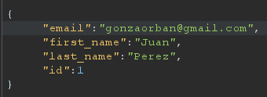
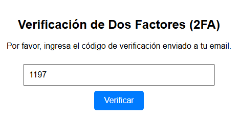

# Desafío 33 - ECommerce (HackLab 2024)

## Análisis

El sistema tiene autenticación en dos pasos para el usuario Juan. La vulnerabilidad permite modificar el email de otro usuario (sin autenticación adicional) a través de un endpoint de perfil mal protegido.

## Explotación

Se hace login con Juan y con María para obtener sus IDs.

Login Juan → `unique_id`: `fbbd1dd9-0cca-4c91-8d2e-94015429b445` (nuevo en cada login)

Analizando las respuestas de login, se identifica que el ID de María es `2`.

Juan tiene verificación en dos pasos. Se intentó pasar el código incorrecto, poner `u: null`, y agregar campos para forzar acceso válido — nada funcionó.

Desde la cuenta de María, en la pestaña de perfil hay un botón deshabilitado. Al interceptar el GET del perfil se obtiene la estructura de datos.

Se prueba un POST → error. Se prueba un **PUT** con todos los datos del JSON → también error. Al **borrar el campo `username`** del PUT, la petición es aceptada.

Se modifica el email del usuario Juan (ID `1`) usando este endpoint, cambiándolo por un email propio. Al volver a ingresar con Juan, llega el código de verificación en dos pasos al email modificado.

Se completa la autenticación de Juan y se realiza la compra del producto requerido: **Memoria RAM 16GB DDR4**.

