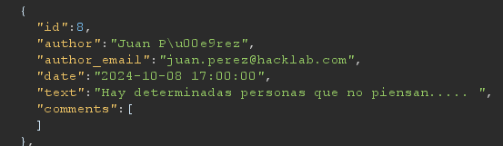
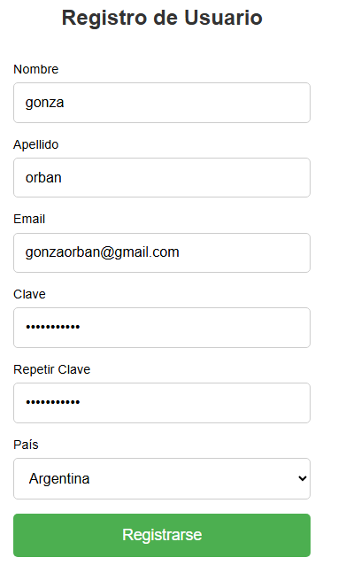
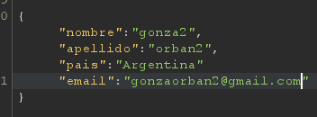
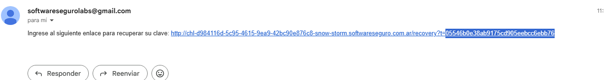
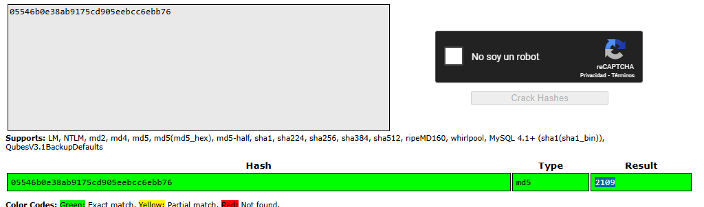
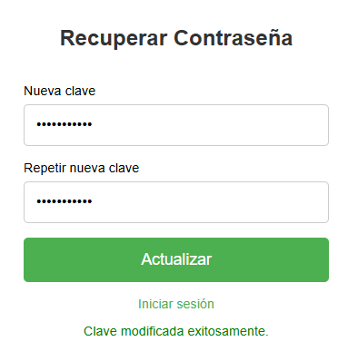
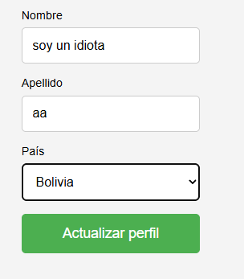

# Desafío 34 - Snow Storm (HackLab 2024)

Desafío 34 - Snow Storm (HackLab 2024) 
Busco el correo de Juan Perez 
 
 
juan.perez@hacklab.com 
 
Creamos un nuevo usuario para poder recibir el enlace de recuperación, ahí vemos que la 
contraseña que creemos se crea solamente para cada correo ya que intentamos mandar 
ambos correos a la vez por sí generaba el mismo token para ambos y no funcionaba. Cada 
token es propio del correo

Intentamos modificar directamente el correo de cada cuenta y vemos que no lo permite (asi 
se realizaba el desafío anterior) 
 
 
 
05546b0e38ab9175cd905eebcc6ebb76 
 
c3535febaff29fcb7c0d20cbe94391c7

Crackeo los dos tokens y vemos que se van generando de forma secuencial, entonces 
ahora voy a pedir el enlace al email de Juan Perea y voy a generar el hash para el número 
siguiente que seria 2111 
 
1a0a283bfe7c549dee6c638a05200e32 
 
Ahi copio la URL que me había llegado a mi correo pero cambio el token por el que genere 
ahora 
https://chl-d984116d-5c95-4615-9ea9-42bc90e876c8-snow-storm.softwareseguro.com.ar/re
covery/?t=1a0a283bfe7c549dee6c638a05200e32 
 
Entramos a entrar contraseña y generamos una contraseña que no sea debil 
gonzaaa123* 
 
 
Ahora entramos a la cuenta de Juan Perez con su correo y la contraseña que acabamos de 
crear 
juan.perez@hacklab.com 
gonzaaa123*

Le cambiamos el nombre como pide el enunciado y ganamo 
 
 
17968af07cf621117b36cfbc35b51361

