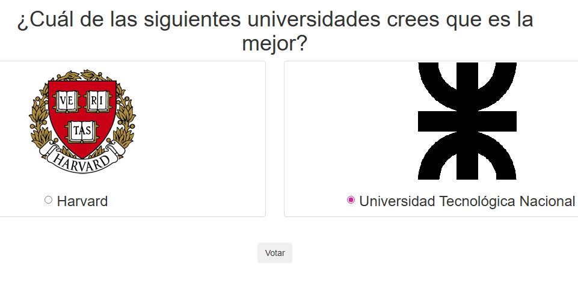
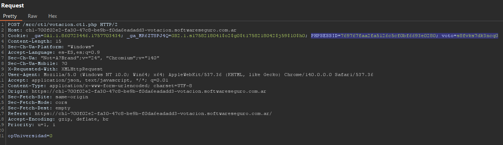
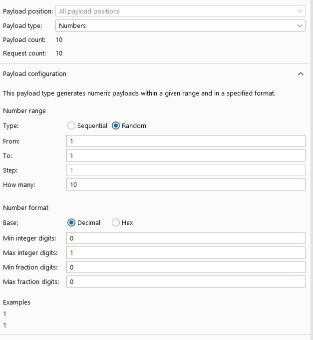
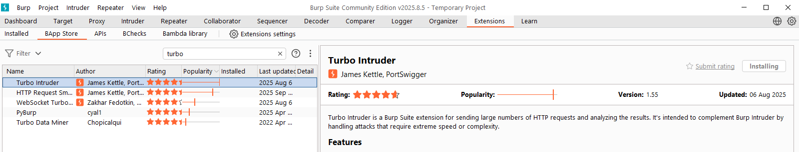
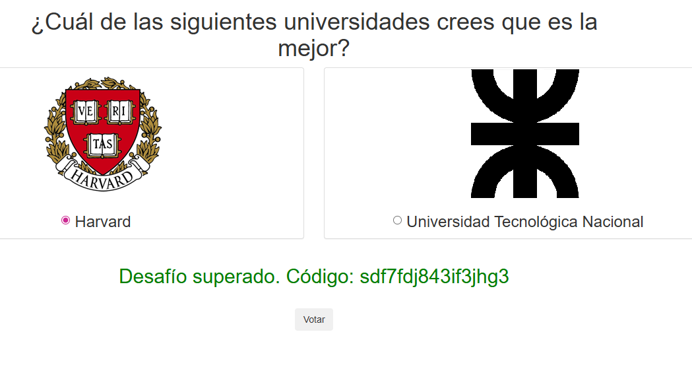
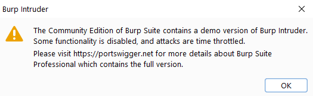
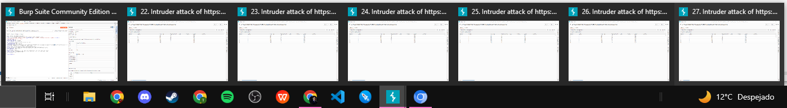

# Desafío 12 - Votación

## Análisis

La aplicación agrega una cookie `voto` después del primer voto para impedir votar nuevamente. La vulnerabilidad está en que si se omite esa cookie en el POST, el servidor acepta el voto igualmente.

## Explotación

Se realiza una votación y se intercepta el POST con Burp Suite. Se observa la cookie:

```
PHPSESSID=7a89e24b236086be28299ce7e7625ebd; voto=s8fvks7dk3ncq0
```





Se envía el mismo POST **sin la cookie `voto`** → el servidor permite el voto adicional.

Para enviar múltiples votos se usa Burp Intruder configurado con **Type: Random** y la cantidad de iteraciones deseada.



> La versión Community de Burp Suite tiene limitaciones de velocidad en Intruder. La solución alternativa fue ejecutar múltiples instancias en simultáneo.








