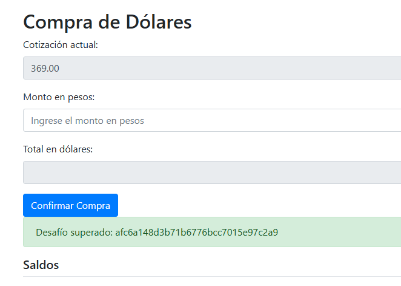

# Desafío 17 - Compra de divisas (HackLab 2023)

**Plataforma:** HackLab (SoftwareSeguro)  
**Edición:** HackLab 2023  
**Categoría:** Broken Access Control  

## Análisis

El servidor acepta la cotización enviada en el cuerpo del POST sin validarla del lado del servidor.

## Explotación

Se intercepta el POST de compra con Burp Suite y se modifica el valor del campo `cotizacion` directamente en la petición.




## Flag

```
afc6a148d3b71b6776bcc7015e97c2a9
```
