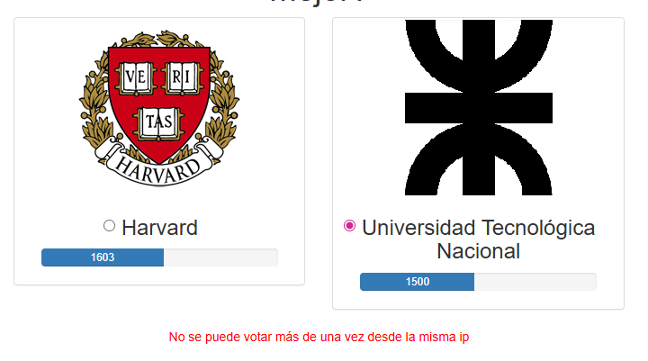
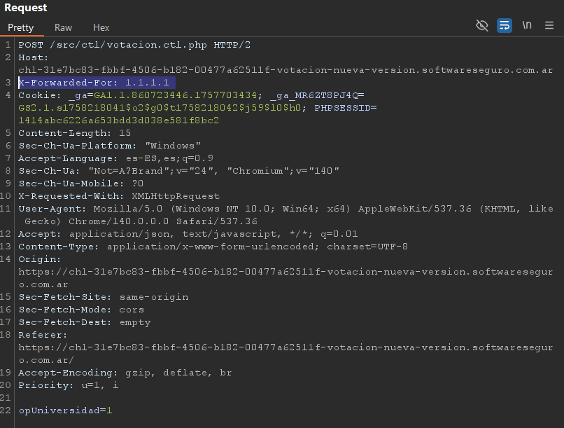
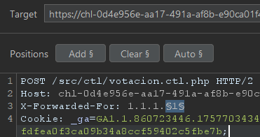
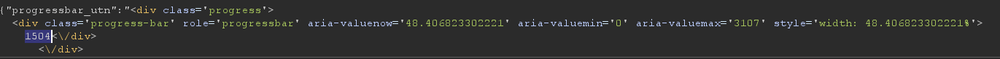
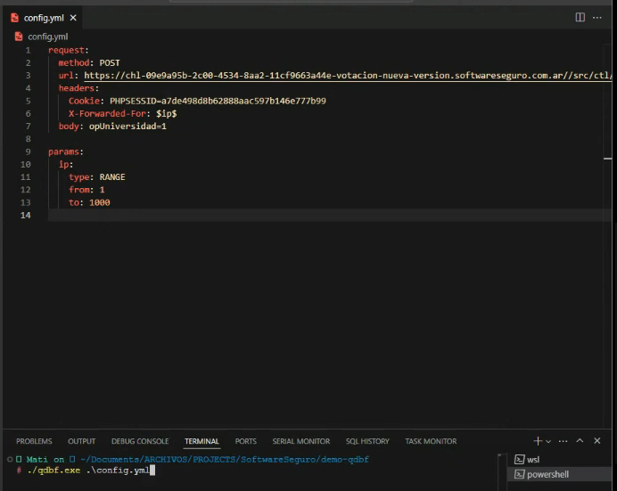
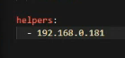

# Desafío 18 - Votación nueva versión (HackLab 2023)
 
Desafío 18 - Votación nueva versión (HackLab 2023) 
En este caso a diferencia del anterior cuando borras el voto, te aparece que votaste desde 
la misma IP

Ahora, el desafío es burlar el chequeo de la IP para que el servidor piense que la petición 
viene de un lugar diferente. 
Estrategia: Spoofing de Dirección IP 
La aplicación está alojada detrás de Cloudflare (se ve en los encabezados Server: 
cloudflare), lo que significa que el servidor web recibe la IP del cliente a través de 
encabezados HTTP especiales, no directamente. 
Para falsificar la dirección IP, debes inyectar o modificar el encabezado X-Forwarded-For 
Inyecta el Encabezado Falso de IP: Agrega el encabezado X-Forwarded-For con una 
dirección IP arbitraria (cualquier valor válido que no sea tu IP real). 
Inclusive en este caso ni siquiera válida que tenga el formato de una IP, solo verifica que 
sea distinta. 
X-Forwarded-For: 1.1.1.1 // <--- NUEVO: Inyección de IP falsa

Hago una lista modificando esa parte del IP hasta llegar a la cantidad de votos que pide 
 
Ahi podemos ver que ya se está modificando el valor 
 
 
 
143885b3abc1012375b3846f84c39203

Solución de Matias Sampieri(compa de Gochi), utiliza otra herramienta que ejecuta mucho 
más rápido. Además se puede trabajar en simultáneo de la misma red o distintas inclusive 
para así poder dividirse el ataque 
 
Indico asi la IP del que lo ayuda. Ambas computadoras se comunican entre si y conocen 
sus IP.

