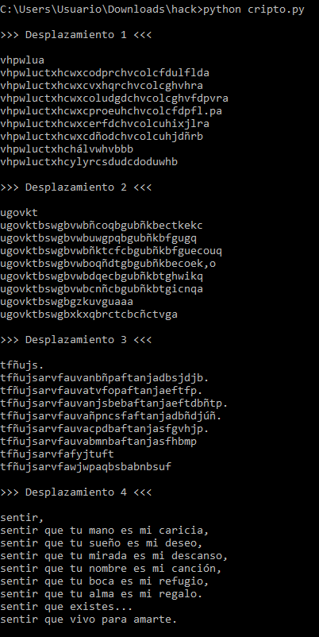
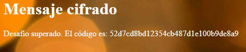

# Desafío 10 - Mensaje cifrado

Desafío 10 - Mensaje cifrado 
Fuerza bruta:con un alfabeto definido fijo (el que pegaste), prueba todos los 
desplazamientos posibles (desde 1 hasta len(alfabeto)-1) y muestra las 34/35 (según 
el alfabeto) salidas. Al inspeccionar verás cuál produce palabras en español. 
 
Y le pedi el script a chat 
# -*- coding: utf-8 -*- 
 
alphabet = [ 
    'a','b','c','d','e','f','g','h','i','j','k','l','m','n', 
    'ñ','o','p','q','r','s','t','u','v','w','x','y','z','á', 
    'é','í','ó','ú',',','.',' ' 
] 
 
cipher = """wiqxmvb 
wiqxmvduyidxydpeqsdiwdpmdgevmgmeb 
wiqxmvduyidxydwyirsdiwdpmdhiwisb 
wiqxmvduyidxydpmvehediwdpmdhiwgeqwsb 
wiqxmvduyidxydqspfvidiwdpmdgeqgm qb 
wiqxmvduyidxydfsgediwdpmdvijykmsb 
wiqxmvduyidxydeopediwdpmdvikeosc 
wiqxmvduyidiémwxiwccc 
wiqxmvduyidzmzsdtevedepevxic""" 
 
# diccionario: caracter -> índice

idx = {c: i for i, c in enumerate(alphabet)} 
 
def caesar_decode(text, shift): 
    n = len(alphabet) 
    out = "" 
    for ch in text.lower(): 
        if ch in idx: 
            out += alphabet[(idx[ch] - shift) % n] 
        else: 
            out += ch 
    return out 
 
# probamos todos los desplazamientos 
for s in range(1, len(alphabet)): 
    print(f"\n>>> Desplazamiento {s} <<<\n") 
    print(caesar_decode(cipher, s))

sentir, 
sentir que tu mano es mi caricia, 
sentir que tu sueño es mi deseo, 
sentir que tu mirada es mi descanso, 
sentir que tu nombre es mi canción, 
sentir que tu boca es mi refugio, 
sentir que tu alma es mi regalo. 
sentir que existes... 
sentir que vivo para amarte. 
 
52d7cd8bd12354cb487d1e100b9de8a9

