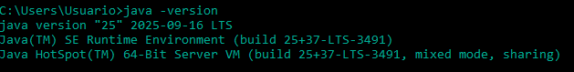
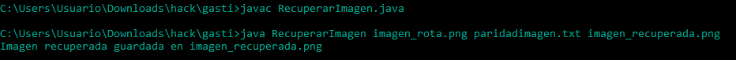
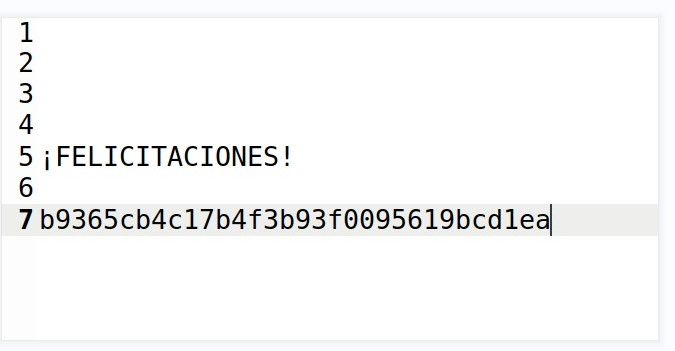

# Desafío 13 - Recuperación de imagen (HackLab 2023)

Desafío 13 - Recuperación de imagen (HackLab 2023) 
Gaston loverita le paso la imagen dañada, un .txt con la paridad y el codigo que te da a 
Geminis y le genero el código correcto. 
 
Tuvimos que descargar Java claramente 
https://download.oracle.com/java/25/latest/jdk-25_windows-x64_bin.exe 
Con esto en el cmd controlan que haya descargado 
java -version 
 
 
Este es el código que hace la magia​
import java.util.*; 
import java.io.*; 
 
public class RecuperarImagen { 
    
public static void main(String args[]) throws IOException, 
FileNotFoundException { 
        if (args.length < 3) { 
            
System.out.println("Uso: java RecuperarImagen 
<archivo_corrupto> <archivo_paridad.txt> <archivo_corregido>"); 
            return; 
        } 
 
        File archivoCorrupto = new File(args[0]); 
        FileInputStream fis = new FileInputStream(archivoCorrupto); 
 
        File archivoParidad = new File(args[1]); 
        
BufferedReader 
br 
= 
new 
BufferedReader(new 
FileReader(archivoParidad)); 
        List<String> lineasParidad = new ArrayList<>(); 
        String linea; 
        while ((linea = br.readLine()) != null) { 
            lineasParidad.add(linea); 
        } 
        br.close(); 
 
        File archivoCorregido = new File(args[2]); 
        FileOutputStream fos = new FileOutputStream(archivoCorregido);

byte[] paquete = new byte[10]; 
        int bytesLeidos; 
        int packetNum = 0; 
 
        while ((bytesLeidos = fis.read(paquete)) != -1) { 
            if (bytesLeidos < 10) { 
                
// Si no es múltiplo de 10, escribir tal cual (sin 
corregir) 
                fos.write(paquete, 0, bytesLeidos); 
                break; 
            } 
 
            if (packetNum >= lineasParidad.size()) { 
                // Más paquetes que paridades, escribir tal cual 
                fos.write(paquete); 
                packetNum++; 
                continue; 
            } 
 
            String paridadLinea = lineasParidad.get(packetNum); 
            String[] parts = paridadLinea.split(" "); 
            String rowStr = parts[0]; 
            String colStr = parts[1]; 
            int[] storedRows = new int[5]; 
            for (int k = 0; k < 5; k++) { 
                storedRows[k] = rowStr.charAt(k) - '0'; 
            } 
            int[] storedCols = new int[16]; 
            for (int k = 0; k < 16; k++) { 
                storedCols[k] = colStr.charAt(k) - '0'; 
            } 
 
            BitParidadPaquete current = computeParidad(paquete); 
 
            int errorRow = -1; 
            int errorCol = -1; 
            int rowMismatchCount = 0; 
            int colMismatchCount = 0; 
 
            for (int r = 0; r < 5; r++) { 
                int synd = current.bpFilas[r] ^ storedRows[r]; 
                if (synd == 1) {

errorRow = r; 
                    rowMismatchCount++; 
                } 
            } 
 
            for (int c = 0; c < 16; c++) { 
                int synd = current.bpColumnas[c] ^ storedCols[c]; 
                if (synd == 1) { 
                    errorCol = c; 
                    colMismatchCount++; 
                } 
            } 
 
            if (rowMismatchCount == 1 && colMismatchCount == 1) { 
                // Corregir el bit 
                int r = errorRow; 
                int c = errorCol; 
                int byteIdx = 2 * r + (c >= 8 ? 0 : 1); 
                int bitPos = c >= 8 ? (15 - c) : (7 - c); 
                paquete[byteIdx] ^= (1 << bitPos); 
            } else if (rowMismatchCount > 1 || colMismatchCount > 1) { 
                
// Error no corregible (más de un error), dejar tal 
cual 
                
System.out.println("Paquete " + packetNum + " tiene 
errores no corregibles."); 
            } 
            // Si 0 mismatches, no error 
 
            fos.write(paquete); 
            packetNum++; 
        } 
 
        fis.close(); 
        fos.close(); 
        System.out.println("Imagen recuperada guardada en " + args[2]); 
    } 
 
    private static BitParidadPaquete computeParidad(byte[] paquete) { 
        BitParidadPaquete bpPaquete = new BitParidadPaquete(); 
        for (int i = 0; i < paquete.length; i += 2) { 
            int bp = bitParidad(paquete[i], paquete[i + 1]); 
            bpPaquete.bpFilas[i / 2] = bp;

int palabraAnalizando = paquete[i] & 0xFF; // Unsigned 
            int mascara = 1; 
            for (int j = 0; j < 16; j++) { 
                if (j == 8) { 
                    palabraAnalizando = paquete[i + 1] & 0xFF; 
                    mascara = 1; 
                } 
                if ((palabraAnalizando & mascara) == mascara) { 
                    
bpPaquete.bpColumnas[16 - j - 1] = 
(bpPaquete.bpColumnas[16 - j - 1] + 1) % 2; 
                } 
                mascara <<= 1; 
            } 
        } 
        return bpPaquete; 
    } 
 
    private static int bitParidad(byte b1, byte b2) { 
        int n1 = Integer.bitCount(b1 & 0xFF); 
        int n2 = Integer.bitCount(b2 & 0xFF); 
        int r = 1; 
        if ((n1 + n2) % 2 == 0) { 
            r = 0; 
        } 
        return r; 
    } 
 
    static class BitParidadPaquete { 
        int bpFilas[]; 
        int bpColumnas[]; 
 
        public BitParidadPaquete() { 
            this.bpFilas = new int[5]; 
            this.bpColumnas = new int[16]; 
        } 
    } 
}

Para ejecutar tienen que estar los 3 archivos en el mismo directorio que la consola indica 
javac RecuperarImagen.java 
 
java RecuperarImagen imagen_rota.png paridadimagen.txt imagen_recuperada.png 
Imagen recuperada guardada en imagen_recuperada.png 
 
 
b9365cb4c17b4f3b93f0095619bcd1ea

