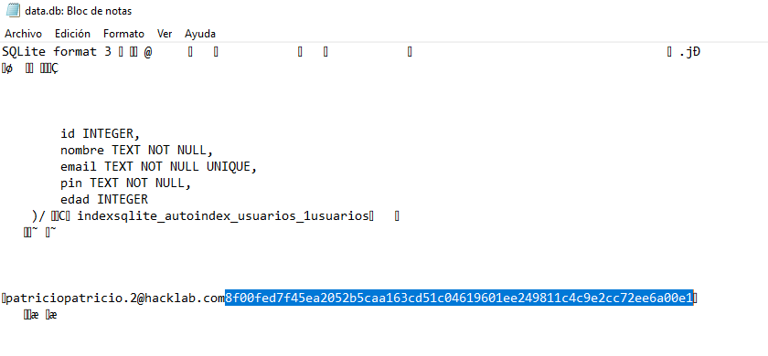
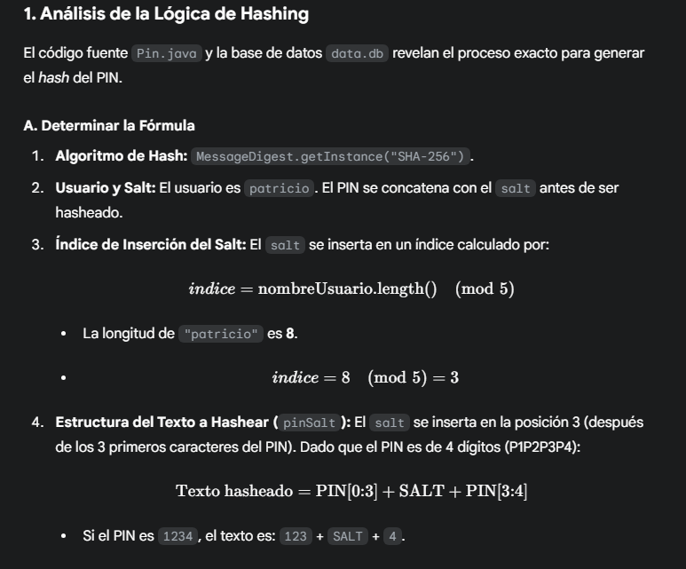
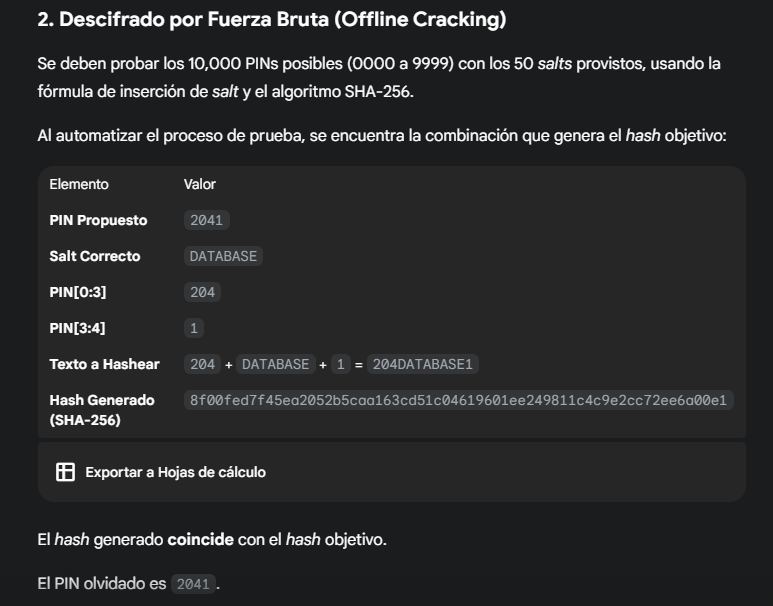
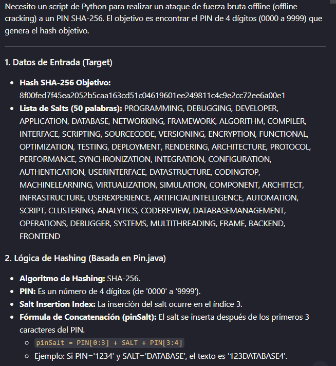
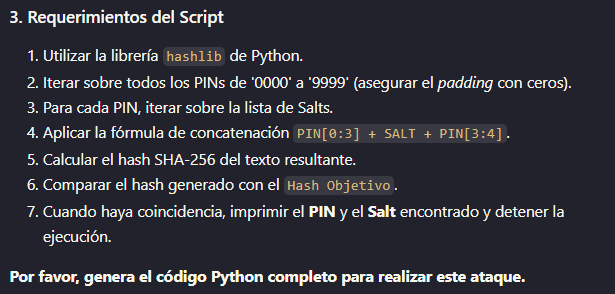
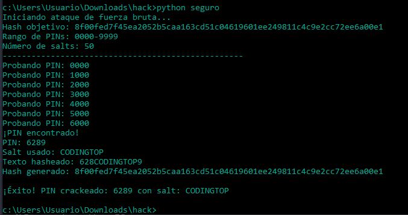

# Desafío 25 - Chat Seguro (HackLab 2024)

## Análisis

Se abre la base de datos (como `.txt`) y se identifica el nombre de usuario `patricio` junto con su hash. El PIN está salteado con una lista de palabras conocidas y hasheado con SHA-256.

## Explotación









Script de fuerza bruta para crackear el PIN:

```python
import hashlib

def brute_force_pin():
    # Hash objetivo
    TARGET_HASH = "8f00fed7f45ea2052b5caa163cd51c04619601ee249811c4c9e2cc72ee6a00e1"

    # Lista de salts
    SALTS = [
        "PROGRAMMING", "DEBUGGING", "DEVELOPER", "APPLICATION", "DATABASE",
        "NETWORKING", "FRAMEWORK", "ALGORITHM", "COMPILER", "INTERFACE",
        "SCRIPTING", "SOURCECODE", "VERSIONING", "ENCRYPTION", "FUNCTIONAL",
        "OPTIMIZATION", "TESTING", "DEPLOYMENT", "RENDERING", "ARCHITECTURE",
        "PROTOCOL", "PERFORMANCE", "SYNCHRONIZATION", "INTEGRATION", "CONFIGURATION",
        "AUTHENTICATION", "USERINTERFACE", "DATASTRUCTURE", "CODINGTOP", "MACHINELEARNING",
        "VIRTUALIZATION", "SIMULATION", "COMPONENT", "ARCHITECT", "INFRASTRUCTURE",
        "USEREXPERIENCE", "ARTIFICIALINTELLIGENCE", "AUTOMATION", "SCRIPT", "CLUSTERING",
        "ANALYTICS", "CODEREVIEW", "DATABASEMANAGEMENT", "OPERATIONS", "DEBUGGER",
        "SYSTEMS", "MULTITHREADING", "FRAME", "BACKEND", "FRONTEND"
    ]

    def insert_salt(pin, salt, index=3):
        """Insertar salt en la posición especificada del PIN"""
        if index >= len(pin):
            return pin + salt
        return pin[:index] + salt + pin[index:]

    def calculate_sha256(text):
        """Calcular hash SHA-256 de un texto"""
        return hashlib.sha256(text.encode('utf-8')).hexdigest()

    # Iterar sobre todos los PINs posibles (0000-9999)
    for pin in range(10000):
        pin_str = f"{pin:04d}"  # Padding con ceros para obtener 4 dígitos

        for salt in SALTS:
            pin_salt = insert_salt(pin_str, salt, 3)
            hash_result = calculate_sha256(pin_salt)

            if hash_result == TARGET_HASH:
                print(f"¡PIN encontrado!")
                print(f"PIN: {pin_str}")
                print(f"Salt usado: {salt}")
                print(f"Texto hasheado: {pin_salt}")
                print(f"Hash generado: {hash_result}")
                return pin_str, salt

        if pin % 1000 == 0:
            print(f"Probando PIN: {pin_str}")

    print("PIN no encontrado en el rango especificado.")
    return None, None

if __name__ == "__main__":
    print("Iniciando ataque de fuerza bruta...")
    print("Hash objetivo: 8f00fed7f45ea2052b5caa163cd51c04619601ee249811c4c9e2cc72ee6a00e1")
    print("Rango de PINs: 0000-9999")
    print("Número de salts: 50")
    print("-" * 50)

    pin_found, salt_found = brute_force_pin()

    if pin_found:
        print(f"\n¡Éxito! PIN crackeado: {pin_found} con salt: {salt_found}")
    else:
        print("\nNo se pudo encontrar el PIN.")
```



PIN encontrado: `6289`

Se hashea el PIN para obtener el código final:



## Flag

```
f7fbc4bafcc80cbf690acbef25f2ce1c
```
