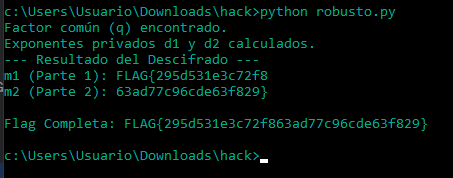

# Desafío 30 - RSA Robusto (HackLab 2024)

**Plataforma:** HackLab (SoftwareSeguro)  
**Edición:** HackLab 2024  
**Categoría:** Criptoanálisis  

## Análisis de la Vulnerabilidad

Es un caso clásico de RSA con primo compartido (*common factor* / *shared prime*). Mirando `encrypt.py`:

```python
p = getPrime(1024)
q = getPrime(1024)
r = getPrime(1024)
n1 = p*q   # módulo del mensaje 1
n2 = q*r   # módulo del mensaje 2  <-- reutiliza q
```

Los dos módulos comparten el primo `q`. RSA es seguro solo mientras factorizar `n` sea inviable, y eso vale para módulos generados de forma independiente. Pero acá, al reutilizar `q`, alcanza con calcular:

```python
q = gcd(n1, n2)
```

El máximo común divisor de dos números de 2048 bits se computa en milisegundos con el algoritmo de Euclides. Una vez que tenés `q`, obtenés `p = n1/q` y `r = n2/q`, y con eso reconstruís ambas claves privadas. No hace falta factorizar nada por fuerza bruta: la factorización se cae sola.

El error de fondo es reutilizar material de clave entre operaciones distintas. Los primos RSA deben ser únicos y generados de forma independiente en cada par de claves.

## Metodología de Resolución

1. Del código deduje que `n1 = p·q` y `n2 = q·r` comparten `q`.
2. Calculé `q = gcd(n1, n2)`.
3. Recuperé `p = n1/q` y `r = n2/q`.
4. Reconstruí las privadas: `d1 = e⁻¹ mod (p−1)(q−1)` y `d2 = e⁻¹ mod (q−1)(r−1)`.
5. Descifré: `m1 = c1^d1 mod n1`, `m2 = c2^d2 mod n2`, convertí a bytes y concatené.

```python
import math
from functools import reduce

# --- Valores fugados ---
n1 = # (pegar valor)
n2 = # (pegar valor)
e = 65537

# --- Mensajes cifrados ---
c1 = # (pegar valor)
c2 = # (pegar valor)

# --- Función auxiliar para conversión de entero a bytes ---
def long_to_bytes(n):
    return n.to_bytes((n.bit_length() + 7) // 8, 'big')

# 1. Encontrar el factor común q = GCD(n1, n2)
q = math.gcd(n1, n2)
print(f"Factor común (q) encontrado.")

# 2. Factorizar los módulos
p = n1 // q
r = n2 // q

# 3. Calcular los Totientes de Euler
phi_n1 = (p - 1) * (q - 1)
phi_n2 = (q - 1) * (r - 1)

# 4. Calcular los exponentes privados d1 y d2
# pow(a, -1, m) calcula el inverso modular (requiere Python 3.8+)
d1 = pow(e, -1, phi_n1)
d2 = pow(e, -1, phi_n2)

print(f"Exponentes privados d1 y d2 calculados.")

# 5. Descifrar los mensajes (m = c^d mod n)
m1_int = pow(c1, d1, n1)
m2_int = pow(c2, d2, n2)

# 6. Convertir a bytes y concatenar
m1_bytes = long_to_bytes(m1_int)
m2_bytes = long_to_bytes(m2_int)

# Decodificar y concatenar la flag
flag = (m1_bytes + m2_bytes).decode('ascii')

print("--- Resultado del Descifrado ---")
print(f"m1 (Parte 1): {m1_bytes.decode('ascii')}")
print(f"m2 (Parte 2): {m2_bytes.decode('ascii')}")
print(f"\nFlag Completa: {flag}")
```



## Flag

```
295d531e3c72f863ad77c96cde63f829
```

## Impacto en la Tríada de Seguridad (CIA)

Confidencialidad: Al recuperar `q` con el GCD se reconstruyen ambas claves privadas (`d1` y `d2`), lo que permite descifrar `c1` y `c2` y leer el contenido completo de los mensajes sin ser el destinatario legítimo. Cualquier otro mensaje cifrado con `n1` o `n2` queda igualmente expuesto.
