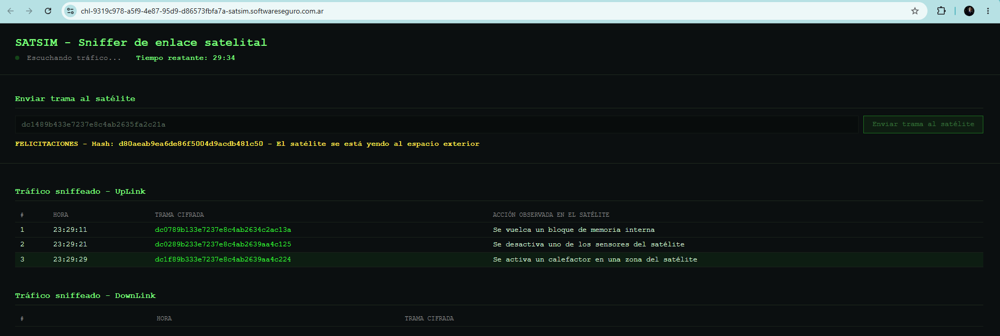

# Desafío 50 - SatSim

**Plataforma:** HackLab (SoftwareSeguro)  
**Categoría:** Criptoanálisis  

## Enunciado

Se sniffea el tráfico entre una estación de control y un satélite enemigo. Cada comando es una trama de **16 bytes** con el formato:

```
[CMD_ID 2B][SEQ 2B][PAYLOAD 12B]
```

El equipo de reversing documentó 5 comandos:

- `CMD_ID = 0x0001` **SET_ATTITUDE** — payload `[pitch 4B][yaw 4B][roll 4B]`
- `CMD_ID = 0x0002` **SOLAR_PANEL** — payload `[0x00 * 8][deploy/retract 2B][angle 2B]`
- `CMD_ID = 0x0003` **THRUSTER_FIRE** — payload `[0x00 * 8][duration_ms 2B][delta_v 2B]`
- `CMD_ID = 0x0004` **PAYLOAD_TOGGLE** — payload `[0x00 * 10][on/off 1B][channel 1B]`
- `CMD_ID = 0x0005` **SAFE_MODE** — payload `[0x00 * 11][reason_code 1B]`

**Objetivo:** enviar un `THRUSTER_FIRE` con `delta_v > 50` y `duration_ms > 2000` para que el satélite se vaya al espacio exterior.

La interfaz permite enviar una "trama cifrada en hexadecimal" y muestra el tráfico sniffeado en vivo. Cada operación tiene un tiempo límite antes de ser detectada.

## Análisis

### Qué es un keystream

Un **keystream** es la secuencia de bytes "clave" que un cifrado de flujo combina con el texto plano para cifrarlo. En el caso más simple (que es el de este desafío), la combinación es un **XOR byte a byte**:

```
cifrado[i] = plano[i] XOR keystream[i]
```

Dos propiedades del XOR son las que hacen que el ataque funcione:

1. **Es reversible con la misma operación:** `plano[i] = cifrado[i] XOR keystream[i]`. Conociendo el keystream, descifrar es igual que cifrar.
2. **Si el texto plano es cero, el cifrado ES el keystream:** `0x00 XOR keystream[i] = keystream[i]`. Por eso los bytes del payload que siempre valen `0x00` "filtran" el keystream directamente.

El error de diseño del cifrado de SatSim es que **reutiliza el mismo keystream** para muchas tramas (es fijo dentro de cada bloque de 16). Un cifrado de flujo seguro nunca repite keystream: en cuanto se conoce (o se adivina) parte del texto plano, se recupera el keystream y se puede cifrar cualquier mensaje propio. Eso es exactamente lo que se explota acá.

### El cifrado es XOR con keystream fijo por bloque

Varias tramas con distinto contenido comparten bytes idénticos en las mismas posiciones. Eso solo puede pasar si el cifrado es **XOR posición a posición** (sin difusión): si fuera un cifrado con difusión (AES-CBC, etc.), cambiar un byte cambiaría toda la trama.

Agrupando el tráfico por el **primer byte** (prefijo), se ve que las tramas vienen en **bloques de 16**, y dentro de cada bloque el keystream de 16 bytes es **constante**. El keystream **rota cada 16 tramas** (~2 minutos). Ejemplos de prefijos observados: `f0`, `df`, `04`, `08`, `26`, `77`, `09`, `dc`...

### Ataque de known-plaintext sobre el payload

La mayoría de los comandos tienen el payload lleno de ceros salvo en sus últimos bytes:

- **SAFE_MODE** = `[0x00 * 11][reason_code]` → los primeros 11 bytes del payload son cero.
- **SOLAR_PANEL**, **PAYLOAD_TOGGLE** → también empiezan con muchos ceros.

Como `0x00 XOR KS = KS`, el payload cifrado de un `SAFE_MODE` **es directamente el keystream** del payload (posiciones 0..10). Tomando una trama de "modo seguro" del bloque activo se recupera `KS_payload[0..10]` de una. La posición 11 (que casi siempre lleva datos) se resuelve tomando el byte más frecuente entre tramas cuyo comando no usa ese byte.

### El CMD_ID

- El **byte alto** del CMD siempre es `0x00` en claro → su cifrado es directamente el keystream (`KS_cmd_hi = prefijo del bloque`).
- El **byte bajo** se cifra con `KS_cmd_lo`, que es **constante dentro del bloque**. Se recupera usando cualquier acción conocida como *ancla*:

  ```
  KS_cmd_lo = cmd_lo_cifrado XOR CMD_ID_plano
  ```

  Verificando entre bloques, muchas acciones extendidas (no documentadas) resultan tener CMD_ID consistente (`limite termico = 0x1b`, `revision bateria = 0x07`, `reconfigura bus = 0x1a`, `watchdog = 0x11`, `vuelca memoria = 0x10`, etc.), lo que amplía las anclas disponibles.

Confirmación de que **THRUSTER_FIRE = 0x0003**: en los bloques donde aparecen tramas reales de "encendido de propulsores", su `cmd_lo_cifrado XOR 0x03` da el mismo `KS_cmd_lo` que el `SAFE_MODE` del mismo bloque (`cmd_lo_cifrado XOR 0x05`). Además, descifrando esas tramas se leen duraciones coherentes con la descripción: "breve" ≈ 130 ms, "moderado" ≈ 1000-1650 ms, "prolongado" ≈ 2800-3000 ms, siempre en **big-endian** en las posiciones 8-9 (duration) y 10-11 (delta_v) del payload.

### El SEQ es un contador global (anti-replay)

Este fue el punto que hizo fallar los primeros envíos con el error **"Número de secuencia incorrecto"** (el satélite descifraba bien la trama, pero rechazaba el SEQ).

El campo SEQ se cifra con XOR igual que el resto, pero su valor en claro es un **contador global que coincide con el número de fila del sniffer** (la primera columna), y **no se reinicia** dentro de una sesión:

```
KS_seq = SEQ_cifrado XOR numero_de_fila     (constante dentro del bloque)
```

Esto se confirmó comprobando que `SEQ_cifrado XOR numero_de_fila` da el mismo valor para todas las tramas de un bloque. El servidor exige un SEQ **mayor** al último procesado, así que hay que enviar `numero_de_fila_del_ultimo_visto + margen`, cifrado con `KS_seq`.

## Explotación

Se automatizó todo en [satsim.py](satsim.py). Dado el tráfico del bloque activo (pegado tal cual, con al menos una fila que sirva de ancla), el script:

1. Deduce el keystream del payload por byte más frecuente por posición.
2. Deduce `KS_cmd_lo` con una acción conocida como ancla.
3. Deduce `KS_seq` a partir del número de fila y calcula el siguiente SEQ.
4. Construye la trama `THRUSTER_FIRE` con `duration_ms = 5000` y `delta_v = 800`.

Se usa `delta_v = 800` (byte alto `0x03`) para que aunque el último byte del keystream tuviera alguna incertidumbre, el `delta_v` resultante siga siendo ≥ 768, muy por encima de 50.

Salida del script sobre el bloque `dc`:

```
Bloque (prefijo): dc   tramas usadas: 2
KS payload pos4..15: 33e7237e8c4ab2634c2ac13a
KS_cmd_lo: 17  (ancla: 'Se vuelca un bloque de memoria interna' = CMD 0010)
KS_seq: 89b0  (contador GLOBAL = numero de fila)
ultimo frame visto: 2  -> SEQ_plano a enviar: 4 (MARGEN=2)

>>> TRAMA THRUSTER_FIRE:  dc1489b433e7237e8c4ab2635fa2c21a

    verifica: CMD=0003 SEQ_plano=4 duration=5000 payload0-7=0000000000000000
```

Trama enviada:

```
dc1489b433e7237e8c4ab2635fa2c21a
```

Que descifra a: `CMD_ID = 0x0003` (THRUSTER_FIRE), `duration_ms = 5000`, `delta_v = 800`.



## Flag

```
d80aeab9ea6de86f5004d9acdb481c50
```
