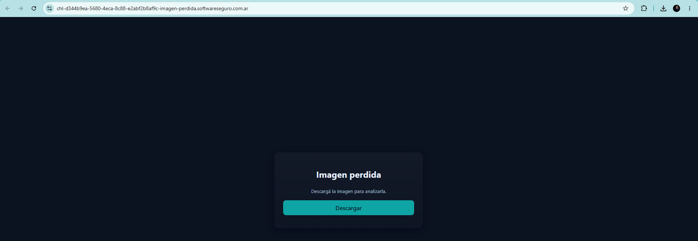

# Desafío 51 - Imagen Perdida

**Plataforma:** HackLab (SoftwareSeguro)  
**Categoría:** Criptoanálisis  

## Enunciado

Una empresa necesita descifrar una imagen. Saben que fue cifrada usando AES-CTR e incluso tienen la clave de descifrado en hexadecimal: `"deb5a45546ad4c06280c655ae81d327c4a55b4eadf8b97aab5372586dc7dd7ec"`. Pero claro... falta el nonce y los contadores. ¿Podés ayudarlos? Al terminar, generá un hash md5 de la imagen descifrada y ese es el hash de la solución.

La página del desafío solo tiene un botón **Descargar**, que baja el archivo cifrado [confidencial.png.enc](assets/confidencial.png.enc).



## Análisis

### Cómo funciona AES-CTR

En modo CTR, AES no cifra los datos directamente. Cifra un **bloque contador** de 16 bytes (nonce + contador) y hace XOR del resultado (el keystream) con el texto plano. Para cada bloque siguiente, el contador se incrementa en uno:

```
C_i = P_i XOR AES_K(ctr0 + i)
```

Sin el bloque contador inicial `ctr0`, tener la clave no alcanza para generar el keystream. Pero la ecuación se puede despejar: si se conoce un bloque de texto plano, se obtiene su keystream, y como se tiene la clave, se le puede aplicar **AES en sentido inverso** (descifrado ECB) para recuperar el bloque contador:

```
ctr0 = AES_K^-1(C_0 XOR P_0)
```

### Texto plano conocido: el header del PNG

El archivo descargado se llama `confidencial.png.enc`, así que el texto plano es un PNG. Además, el archivo no trae el nonce al principio: arranca directamente con datos cifrados.

Todo PNG empieza con los mismos 16 bytes: la firma de 8 bytes y, a continuación, la longitud (siempre 13) y el tipo del primer chunk, que siempre es `IHDR`:

```
89 50 4E 47 0D 0A 1A 0A   00 00 00 0D   49 48 44 52
       firma PNG           long. = 13      "IHDR"
```

Eso es justo un bloque AES completo de texto plano conocido.

## Explotación

Se automatizó en [solve.py](solve.py):

1. XOR de los primeros 16 bytes del archivo cifrado con el header del PNG → keystream del bloque 0.
2. Descifrado AES-ECB de ese keystream con la clave → bloque contador inicial.
3. Descifrado AES-CTR del archivo completo, partiendo de ese contador (incremento de 128 bits).
4. MD5 de la imagen descifrada.

```bash
python solve.py
```

```
bloque contador inicial: c0a00d17b75274d0f54e7dc64b67f444
md5: a5e89cc52563abe3d50d8fc4db0ebad3
```

El bloque contador inicial es un valor aleatorio de 128 bits. Para confirmar que el descifrado es correcto, se recorrieron los chunks del PNG resultante: los 38 tienen CRC válido y el chunk `IEND` termina exactamente en el último byte del archivo. La imagen descifrada ([confidencial.png](assets/confidencial.png)) es un PNG de 1024x559:


## Flag

```
a5e89cc52563abe3d50d8fc4db0ebad3
```
