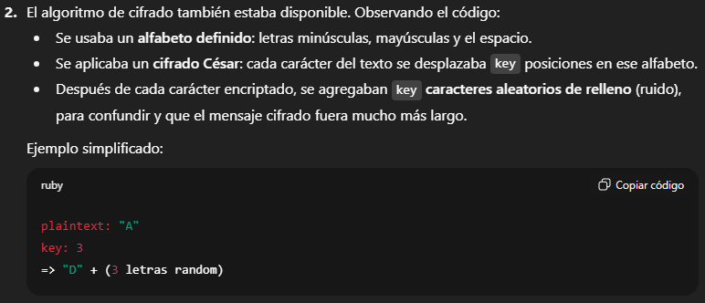
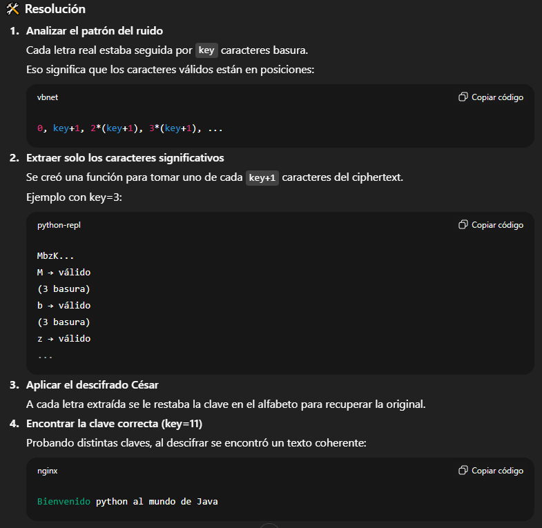
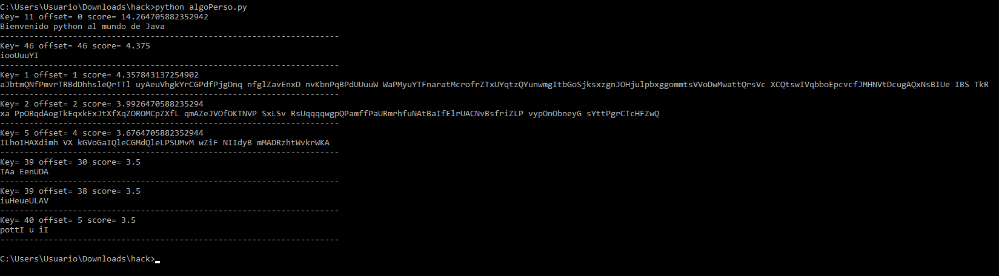
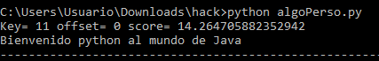
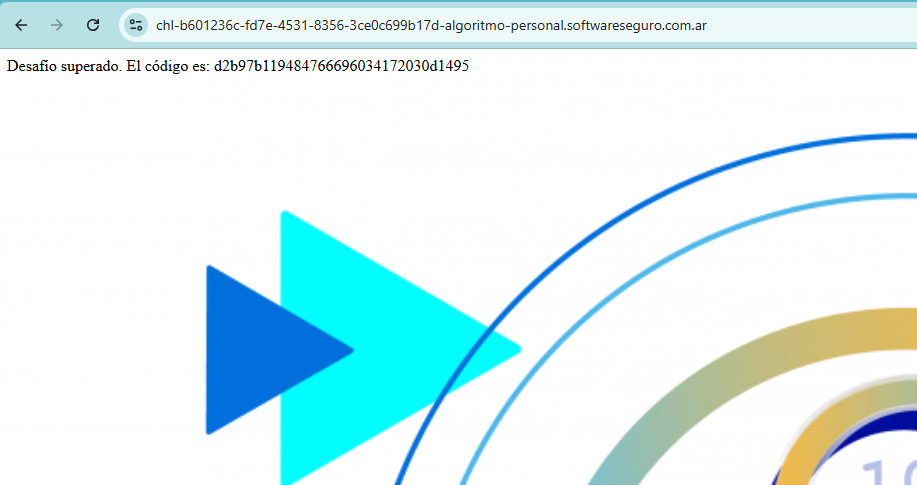

# Desafío 9 - Algoritmo personalizado (HackLab 2023)

Criptoanálisis 
Desafío 9 - Algoritmo personalizado (HackLab 2023) 
Me tiro un script mal chat, le aclare unos detalles y dps ya me tiro un script que resolvió. Así 
que le pedi que me haga un resumen del planteo y solución.

# -*- coding: utf-8 -*- 
alphabet = "abcdefghijklmnopqrstuvwxyzABCDEFGHIJKLMNOPQRSTUVWXYZ " 
cipher 
= 
"""MbzKNclubnQRtOrgmQPnDwtspUfSNCFeqEMiyiVtFmIfGRbsGUzUimiaGvnzpBLfrvzW
ZimhylZZesgDaH 
QteTgbQokOheEoorrpaDoZgLhzmN  
bfwsFtokyCELaBogwfLAcXoNQKrhCVQJeMVqVMvPvjXEaRXHb 
QUNLzsvNZRUkGxoibzsTbVucNWdqsypsgjsg 
sUQykViZUrNuSAXRlZcvZoaxhnRhwJRuAcnHWpRTkkoletByjABhxowKdPVICknvFmDqKc 
yKhehypGnSniuttNWoWCpNEJxPNixzbDuDucRhsGtkWkdeaxYNDrRoubtRxeJAWFrpcQcIp
YFQqWdkwpdEgVKANmIUObWyuAE davlhvBARQyiOptGCEJwVmfeaaJlCHTPazUylFS""" 
 
def extract_encoded(cipher, key, offset=0): 
    step = key + 1 
    return ''.join(cipher[i] for i in range(offset, len(cipher), step)) 
 
def caesar_decrypt(text, key): 
    n = len(alphabet) 
    out = "" 
    for ch in text: 
        if ch in alphabet: 
            out += alphabet[(alphabet.index(ch) - key) % n] 
        else: 
            out += ch 
    return out 
 
# scoring sencillo para español 
common_words = [" que ", " de ", " la ", " el ", " y ", " para ", " por 
", " tu ", " me ", " te "]

vowels = set("aeiouáéíóúAEIOUÁÉÍÓÚ") 
def score_text(txt): 
    t = txt.lower() 
    score = sum(t.count(w) * 10 for w in common_words) 
    if len(txt) > 0: 
        score += (sum(1 for c in txt if c in vowels) / len(txt)) * 5 
    score += txt.count(" ") * 0.5 
    return score 
 
cands = [] 
for k in range(1, len(alphabet)): 
    for offset in range(k+1): 
        cleaned = extract_encoded(cipher, k, offset) 
        dec = caesar_decrypt(cleaned, k) 
        sc = score_text(dec) 
        cands.append((sc, k, offset, dec)) 
 
cands.sort(reverse=True, key=lambda x: x[0]) 
for sc, k, off, dec in cands[:8]: 
    print("Key=", k, "offset=", off, "score=", sc) 
    print(dec) 
    print("-"*70)

El mensaje se desencripta descubriendo dos pasos ocultos: 
1.​ Eliminar el ruido (cada key letras aleatorias).​
 
2.​ Revertir el cifrado César con la misma clave key. 
Este es el mensaje descifrado: Bienvenido python al mundo de Java 
 
d2b97b119484766696034172030d1495

