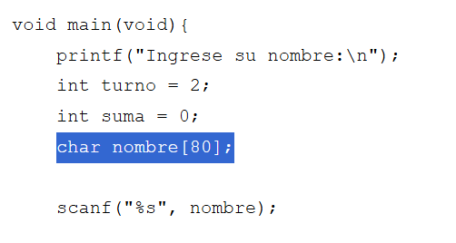
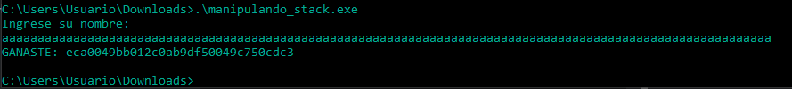
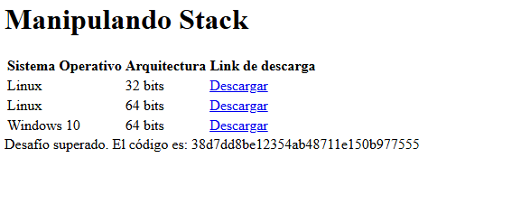

# Desafío 14 - Manipulando el Stack

Desbordamiento de memoria 
Desafío 14 - Manipulando el Stack 
 
Como la IA siempre juega perfecto hay que intentar ganar saliendo de la lógica del juego. 
Como en el código vemos que tiene un límite de caracteres introducimos un nombre mayor 
a esa longitud 
 
 
eca0049bb012c0ab9df50049c750cdc3 
 
 
38d7dd8be12354ab48711e150b977555

