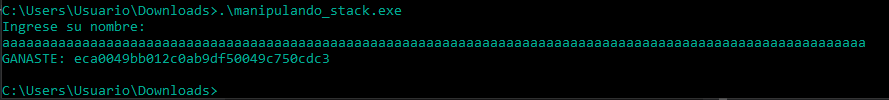
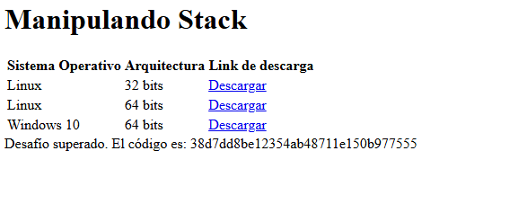

# Desafío 14 - Manipulando el Stack

**Plataforma:** HackLab (SoftwareSeguro)  
**Categoría:** Desbordamiento de memoria  

## El juego

Es el juego de las 15 bolitas (una variante del juego de Nim): en cada turno se suman 1 o 2 bolitas y gana quien deje la canasta en exactamente 15. Juan sabe que, con el truco matemático correcto, el segundo jugador siempre puede forzar la victoria, así que programó la "IA" para que juegue perfecto. Dentro de la lógica del juego es imposible ganarle.

La clave es que el premio no se decide por `suma`, sino por la variable **`turno`**:

```c
if(turno == 2){
    printf ("PERDISTE\n");
}else{
    printf ("GANASTE: XXXXXX\n"); // En esta instrucción se muestra el código ganador.
}
```

`turno` arranca en `2` y, dentro del bucle, vuelve a `2` justo después de la jugada de la computadora. Solo queda en `1` en el instante entre la jugada del humano y la respuesta de la IA, y el bucle solo corta ahí si el humano llegó a 15 — cosa que la IA perfecta nunca permite. Por eso, jugando limpio, al salir del bucle `turno` siempre vale `2` y siempre se imprime `PERDISTE`.

El objetivo real no es ganar el juego: es **ejecutar la rama del `else`**, o sea lograr que al terminar `turno != 2`.

## Por qué funciona el overflow

El código fuente deja la vulnerabilidad a la vista — y lo que importa es el **orden de declaración** de las variables locales:

```c
void main(void){
    printf("Ingrese su nombre:\n");
    int turno = 2;
    int suma = 0;
    char nombre[80];

    scanf("%s", nombre);
```

![Código fuente de main con el buffer nombre[80]](assets/01.png)

Dos defectos se combinan:

1. **`scanf("%s", nombre)` no tiene límite de longitud.** El especificador `%s` copia caracteres hasta encontrar un espacio o salto de línea, sin importarle que `nombre` mida solo 80 bytes. Es el mismo defecto que `gets()`. Además el binario se compiló con `-fno-stack-protector` (ver el tip del enunciado), así que no hay canario que detecte el desborde.
2. **`turno` y `suma` viven en el stack junto al buffer.** Se declararon antes que `nombre`, por lo que en el layout típico de la pila quedan en direcciones *por encima* del buffer. `nombre` crece hacia direcciones más altas al escribirse, de modo que lo que se pasa de los 80 bytes cae justo sobre `suma` y luego sobre `turno`.

Al escribir un nombre largo, el excedente sobrescribe ambas variables con el byte `0x61` (`'a'`), dejándolas en `0x61616161`:

- `suma` pasa a valer `0x61616161` (~1600 millones), que es `>= 15`, así que el `while(suma < 15)` es falso de entrada y **el cuerpo del bucle nunca se ejecuta** — nunca se pide jugar ni la IA responde.
- `turno` también quedó en `0x61616161`, que es **distinto de `2`**, así que el `if(turno == 2)` es falso y se toma la rama del `else`: se imprime `GANASTE` con el código.

No hace falta ganarle a la IA ni resolver el juego: se corrompe directamente el estado que decide el premio. Es un **stack-based buffer overflow** de tipo *variable overwrite* (sobrescritura de variables adyacentes), no un secuestro de la dirección de retorno — no se desvía el flujo de ejecución, solo se pisan datos locales.

## Explotación

Se introduce un nombre mucho más largo que el buffer. Con ~130 caracteres `a`, los primeros 80 llenan `nombre` y el excedente pisa `suma` y `turno` como se describió arriba:

```
aaaaaaaaaaaaaaaaaaaaaaaaaaaaaaaaaaaaaaaaaaaaaaaaaaaaaaaaaaaaaaaaaaaaaaaaaaaaaaaaaaaaaaaaaaaaaaaaaaaaaaaaaaaaaaaaaaaaaaaaaaaaaaaaaaaa
```

El binario responde con `GANASTE` y la primera flag:




```
eca0049bb012c0ab9df50049c750cdc3
```

El sitio valida el código y entrega la segunda flag:



## Flags

```
38d7dd8be12354ab48711e150b977555
```
