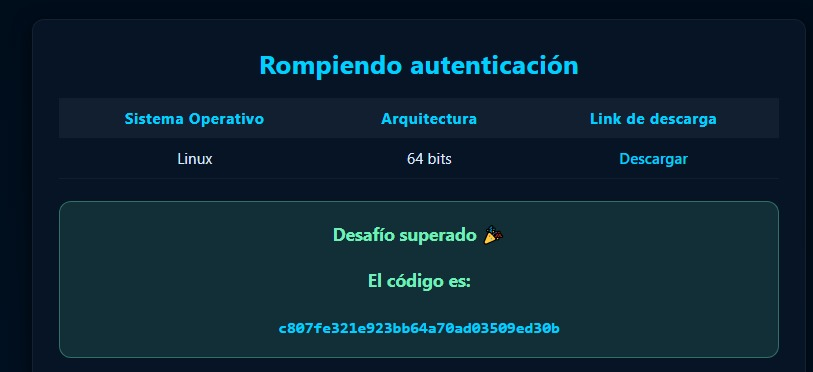

# Desafío 48 - Rompiendo autenticación

**Plataforma:** HackLab (SoftwareSeguro)  
**Categoría:** Desbordamiento de memoria  

## Enunciado

Hay un software que se distribuye a ciertas personas importantes. Pudiste conseguir el software, ahora hay que entrar a él.

A su vez, mediante un ataque de ingeniería social conseguiste el código fuente de una función del software. ¿Podrás encontrar la forma de autenticarte sin conocer las credenciales?

Se entrega un binario ELF de 64 bits para Linux ([`assets/rompiendo-autenticacion.out`](assets/rompiendo-autenticacion.out)) y el código fuente de una función:

```c
bool check_authentication(char *password) {
    int auth_flag = 0;
    char password_buffer[16];

    strcpy(password_buffer, password);

    char hash_buffer[SHA256_DIGEST_LENGTH * 2 + 1];
    sha256_hex(password_buffer, hash_buffer);

    if (strcmp(hash_buffer,
        "9cb2b63232ae1077ad065d770e8a29b0f68fdea3eade0fd7d633f368e8e0445f") == 0) {
        auth_flag = 1;
    }

    return auth_flag == 1;
}
```

## Análisis

La función copia el `password` a `password_buffer[16]` con `strcpy`, **sin controlar la longitud**: es un desbordamiento de buffer clásico. Con una entrada suficientemente larga se puede pisar `auth_flag` y forzar la autenticación sin conocer la contraseña cuyo SHA-256 es `9cb2b63232ae1077ad065d770e8a29b0f68fdea3eade0fd7d633f368e8e0445f`. Esa es la vía que enseña el desafío.

Sin embargo, el **código que pide la plataforma** no depende del overflow: es el mensaje de éxito, que el binario guarda ofuscado. Inspeccionando el ELF aparecen símbolos reveladores:

- La variable global `success_msg_b64_enc` (64 bytes en `.rodata`), con contenido no imprimible.
- Las funciones `decode_success_b64`, `base64_decode` y `b64_char_val`.

El nombre `base64_decode` es una pista falsa para este mensaje. Lo importante está en `decode_success_b64`, cuyo desensamblado recorre los 64 bytes de la global y a cada uno le aplica `xor eax, 0x23`:

```
0x147b: movzx eax, byte ptr [rax + rdx]   ; byte de success_msg_b64_enc
0x147f: xor   eax, 0x23                    ; XOR con 0x23
0x1493: mov   byte ptr [rax], dl           ; guarda el resultado
```

Es decir, la desofuscación son **dos pasos**: primero XOR de cada byte con `0x23`, y el resultado es una cadena Base64 que luego se decodifica.

## Explotación

No hace falta ejecutar el binario ni conocer la contraseña: basta con replicar la desofuscación sobre los bytes de la global. El solver [`solve.py`](./solve.py) parsea el ELF a mano (no requiere `objdump`/`readelf`), extrae `success_msg_b64_enc`, aplica XOR `0x23` y decodifica el Base64:

```bash
python solve.py assets/rompiendo-autenticacion.out
```

Salida:

```
[+] blob ofuscado (64 bytes): b'rtmIy{mUjfu\x17B{qU@\x11\x1b\x15jgf\x11nI@[mYb\x11mYf\x16nYmOztyOmdv\x13ngn\x13mYaInYvZyI@\x16'
[+] tras XOR 0x23 (base64):          QWNjZXNvIEV4aXRvc286IDE2MjcxNzA2NzE5MzNlYWZlNGU0MDM0NzBjMzUyZjc5
[+] mensaje decodificado:            Acceso Exitoso: 1627170671933eafe4e403470c352f79
[+] CÓDIGO A ENVIAR:                 1627170671933eafe4e403470c352f79
```

Al enviar el código en la plataforma, el desafío queda superado:



## Flag

```
c807fe321e923bb64a70ad03509ed30b
```
