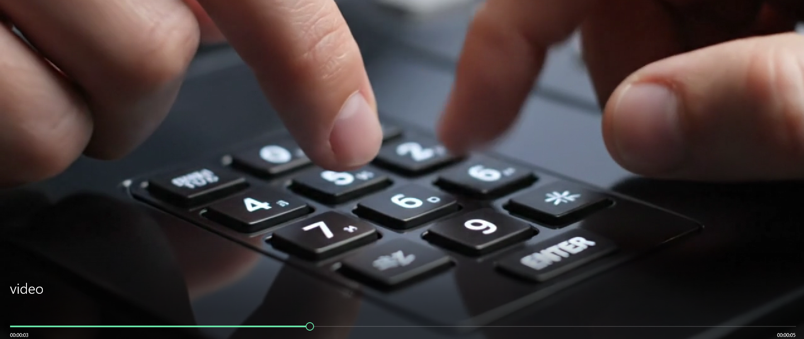

# Desafío 39 - El mejor secreto

**Plataforma:** HackLab (SoftwareSeguro)  
**Edición:** HackLab 2025  
**Categoría:** Fuerza bruta  

## Enunciado

Lograste grabar un video de un jefe de estado tecleando la clave que protege uno de los archivos más importantes: `secreto.zip`.

Por seguridad, el jefe usa un teclado numérico modificado: las posiciones de las teclas son visibles en el video, pero el dígito que corresponde a cada tecla no coincide con la etiqueta física y no conocés la correspondencia. Sí sabés que cada tecla corresponde a un dígito distinto.

**Objetivo:** ¿Podrás descifrar el archivo zip?

## Análisis

El insumo son dos archivos: el [video](./assets/video.mp4) del teclado y el [`secreto.zip`](./assets/secreto.zip) cifrado.

Inspeccionando el zip:

```bash
unzip -v secreto.zip
#   Length   Method    Size  Cmpr    Date    Time   CRC-32   Name
#       33  Unk:099      51 -55% 2025-10-01 00:52 a41a7068  secreto.txt
```

El método `Unk:099` (99) indica cifrado **WinZip AES**. Mirando el campo extra `0x9901` de la cabecera local, la fuerza es `3` → **AES-256**, con derivación de clave **PBKDF2-HMAC-SHA1, 1000 iteraciones**. No hay forma de leerlo sin la contraseña; hay que recuperarla.

### El teclado



El video (generado con Veo, bastante borroso) muestra una mano tecleando sobre un teclado numérico. Las **etiquetas físicas no corresponden al dígito real** de cada tecla: lo único confiable son las **posiciones**. Se identificaron 5 teclas físicas distintas pulsadas, que etiqueté por su posición:

- `6A` → tecla del centro
- `6B` → tecla a su derecha (justo al lado del `6A`)
- `2`, `9`, `5` → por su etiqueta visible

La secuencia posicional leída del video fue, aproximadamente:

```
6A 6B 2 6B 9 6A 9 9 9 9 5 6B
```

El tramo final (`... 9 6A 9 9 9 9 5 6B`) se leía con claridad, pero el **tramo inicial estaba borroso**: no quedaba claro el orden de las primeras teclas ni cuántas pulsaciones había antes del primer `9`.

El enunciado garantiza que **cada tecla corresponde a un dígito distinto**. Es decir, la contraseña es esa secuencia de pulsaciones, donde cada tecla distinta se sustituye por un dígito distinto (una biyección desconocida de teclas a dígitos).

## Explotación

La idea es combinar dos incertidumbres y probarlas todas con un script propio en Python, sin herramientas externas:

1. **Qué secuencia de teclas se pulsó** (el tramo inicial dudoso), y
2. **Qué dígito corresponde a cada tecla** (la biyección desconocida).

### Paso 1 — Enumerar las variantes de la secuencia

El tramo final es fijo. Para el tramo inicial borroso escribí a mano las variantes plausibles (distinto orden entre `6A`, `6B`, `2`, y la duda de si había una pulsación repetida de más):

```
6A 6B 2 6B 6B  9 6A 9 9 9 9 5 6B
6A 6B 2 2  6B  9 6A 9 9 9 9 5 6B
6A 6B 2 6B 2   9 6A 9 9 9 9 5 6B
6A 2  6B 6B    9 6A 9 9 9 9 5 6B
6A 6B 2 6B     9 6A 9 9 9 9 5 6B
...
```

### Paso 2 — Probar cada asignación de dígitos

Para cada secuencia, como las teclas distintas corresponden a dígitos distintos, pruebo todas las asignaciones **inyectivas** de teclas a dígitos. Una secuencia con `k` teclas distintas da `P(10, k)` contraseñas; sumando todas las variantes, el espacio total queda en **~240 mil contraseñas candidatas** — chico, barrible en Python en minutos.

El script [`./solve.py`](./solve.py) hace exactamente esto: genera las secuencias candidatas, prueba cada asignación de dígitos y verifica cada contraseña contra el **verificador y el HMAC reales** del zip (el verificador de 2 bytes por sí solo da falsos positivos, así que se confirma con el HMAC). Cuando una valida, descifra `secreto.txt` y muestra la flag:

```bash
python solve.py
```

```
Contraseña : 547795999937
Flag       : 696026dd5bf583f34530a657d896ebea
```

La contraseña correcta resultó de la variante `6A 2 6B 6B 9 6A 9 9 9 9 5 6B` (la lectura inicial tenía las primeras teclas mal ordenadas y le faltaba una `6B`), con el mapeo `6A→5`, `6B→7`, `2→4`, `9→9`, `5→3`.

### Paso 3 — Extraer el archivo

Con la contraseña ya se abre el zip directamente:

```bash
unzip -P 547795999937 secreto.zip
cat secreto.txt
```

> **Nota:** el zip usa WinZip AES, que no todas las utilidades soportan. Con el `unzip` estándar puede fallar; en ese caso sirve 7-Zip (`7z x -p547795999937 secreto.zip`) o la librería `pyzipper` de Python, que es lo que usa `solve.py`.

## Flag

```
696026dd5bf583f34530a657d896ebea
```
