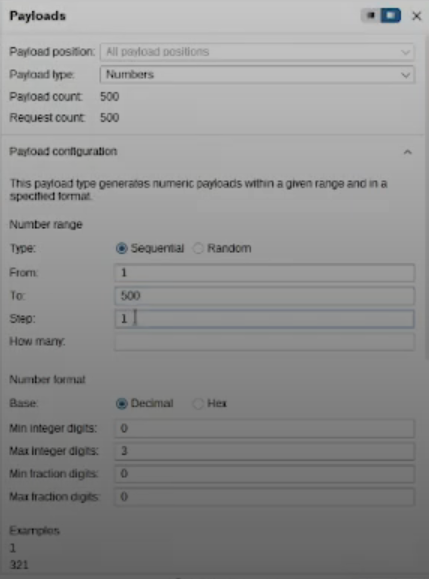
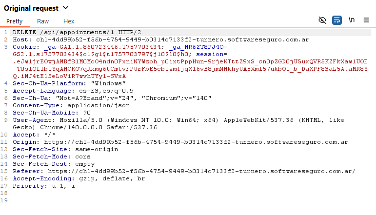

# Desafío 22 - Turnero (HackLab 2024)

**Plataforma:** HackLab (SoftwareSeguro)  
**Edición:** HackLab 2024  
**Categoría:** IDOR  

## Análisis

Se usa Burp Suite con las herramientas **Proxy** e **Intruder**:

- **Proxy**: intercepta todo el tráfico entre el browser y el server. Hasta que no se habilita *Forward*, la página no se actualiza. Permite ver y modificar todos los headers y el cuerpo de la petición antes de enviarla.
- **Intruder**: permite automatizar peticiones modificando parámetros en un rango definido.

## Explotación

Se configura Intruder para iterar sobre el parámetro `id` y encontrar el usuario solicitado. Una clave para no revisar todas las respuestas una por una es ordenar por **Length**: los usuarios que habían pedido turnos tienen respuestas de mayor tamaño.

Identifico según la longitud de la response que el usuario usuario de ID `101` es el que estabamos buscando y se identifican los IDs de sus turnos (del 10 al 13) para eliminarlos luego.

Se presiona el botón **Cancelar** para enviar la petición al Burp Suite.

En la petición de cancelar el turno, el parámetro de ID del turno (que originalmente era `1`) se reemplaza por los IDs de los turnos del usuario `xdalvik` (del 10 al 13).

## Flag

Al volver a la página principal aparece el código.

