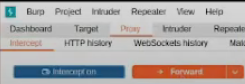
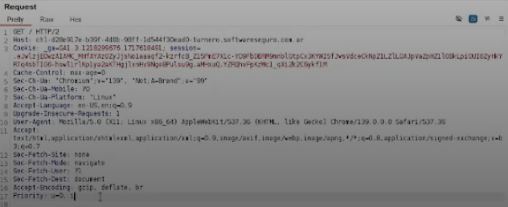
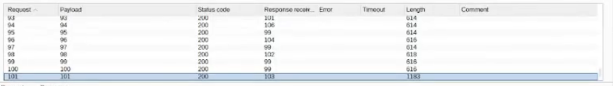
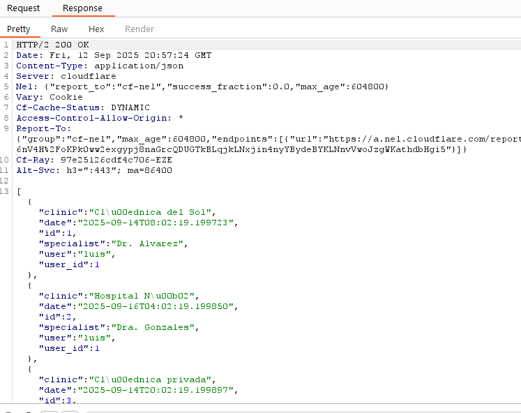
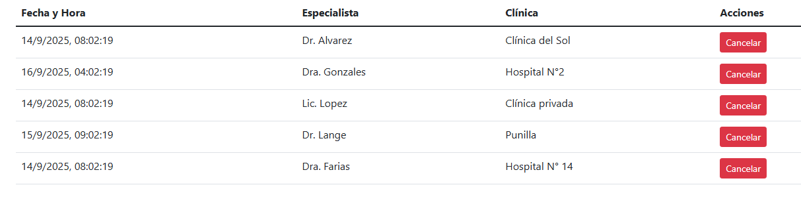
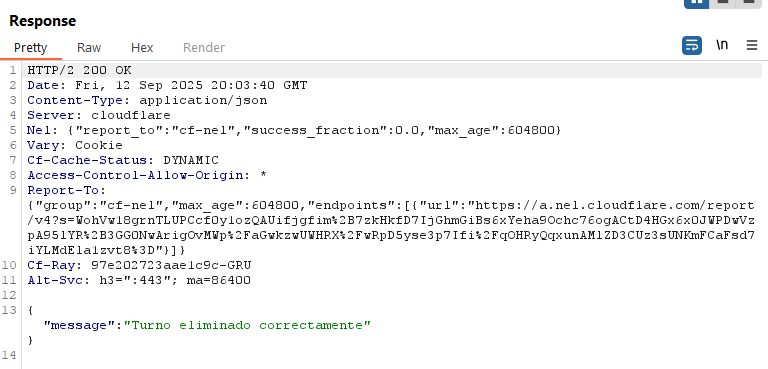

# Desafío 22 - Turnero (HacklLab 2024)

Desafío 22 - Turnero (HacklLab 2024) 
Dentro de Burp Suite tenes la herramienta proxy que va a servir como comunicación entre el 
Browser y el Server, además de que vas a poder modificar todo. 
 
Con Proxy podemos ver. 
Intercepta todo y hasta que no habilites la opción de Forward. No va a actualizar la página 
 
 
La petición que se manda al server podes modificarla, todos estos son Headers 
 
 
Con Intruder vamos a atacar.

A la derecha configuras la cantidad de iteraciones para buscar el id del usuario solicitado 
 
 
En este caso servia mucho identificar la longitud(lenght) de las respuestas para no tener 
que revisar todas una por una y solamente ibas a las respuestas con mayor tamaño(en este 
caso los usuarios que habían pedido turnos

Abrimos este usuario confirmando que es el que buscamos y vemos los ID(101 era en este 
ejercicio) de los turnos que solicitó los cuales vamos a eliminar después. 
 
 
 
 
Tocas 
el 
botón 
Cancelar 
para 
que 
mande 
esa 
petición 
al 
Burp 
Suite

En esta parte donde hay que eliminar los turnos, tenes la ID del turno que sería 1. Y habría 
que reemplazar eso por los turnos del usuario ‘xdalvik’. (Eran del 10 al 13) 
 
 
Vuelvo a la página principal y aparece el código

