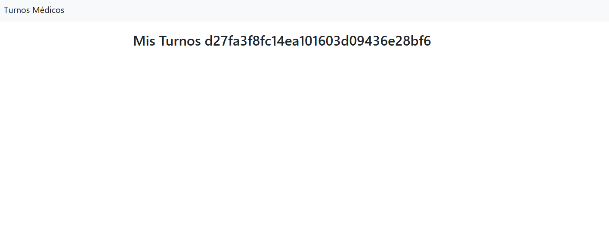
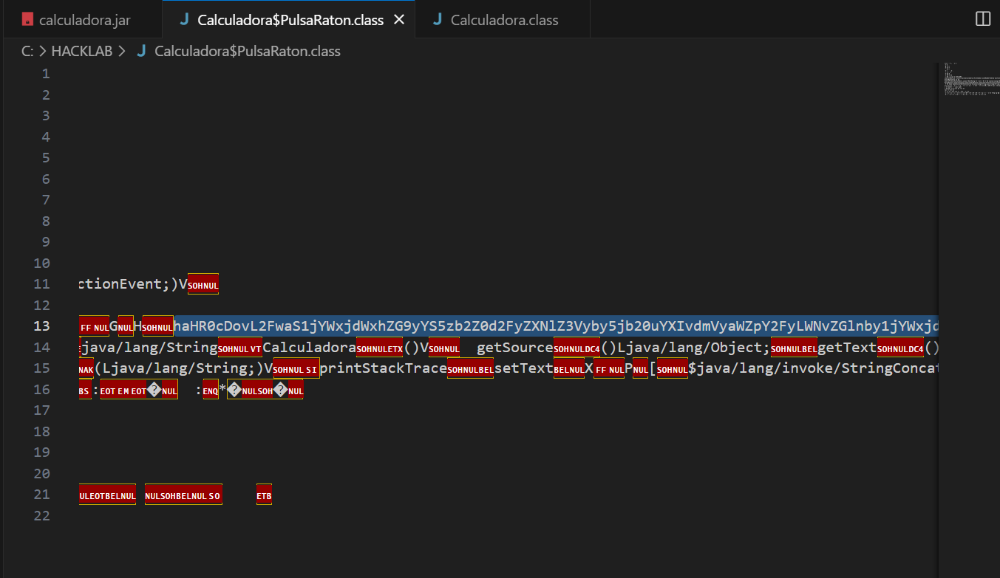
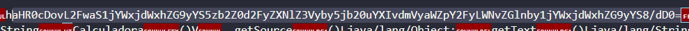
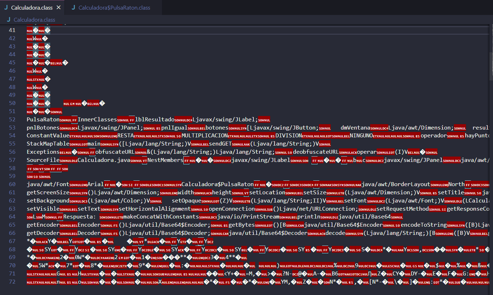
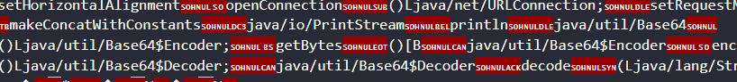
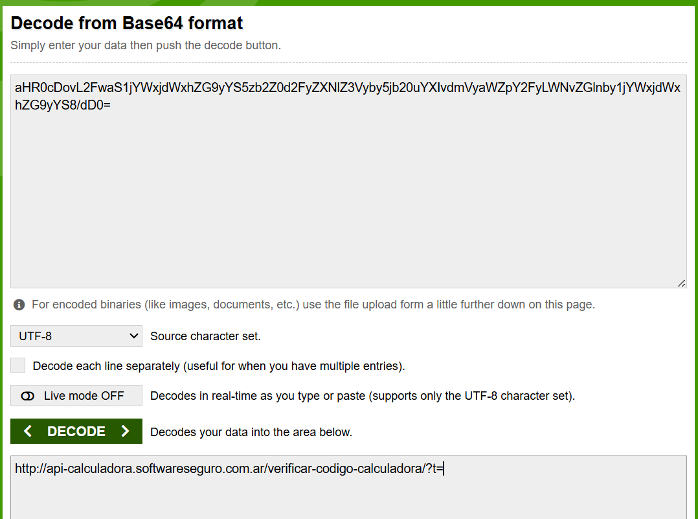
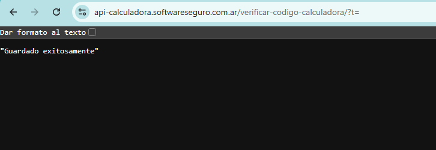
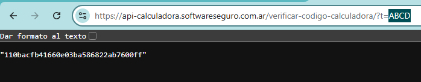
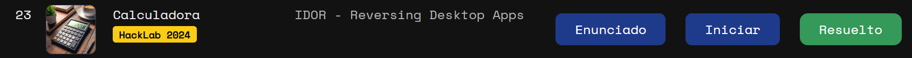

# Desafío 23 - Calculadora (HackLab 2024)

## Análisis

Se descarga el archivo `calculadora.jar` y se extrae el RAR. Abriendo el archivo `.class` se identifica un string en Base64 (la única cadena larga que aparece en todo el archivo, parcialmente ocultada por elementos rojos de la UI).

## Explotación







Se identifica que el archivo `.class` usa Base64 en varias partes.





Se borra la primer `h` del código encontrado, dejando como primer elemento la `a`, para que el decodificador funcione correctamente. Las cadenas Base64 que codifican URLs que empiezan por `http` normalmente comienzan con `aHR0c...`.

> **Nota sobre el `=` al final:** es padding. Indica que el total de bytes no llenó un bloque completo de 3 bytes. No forma parte del contenido, solo fija la longitud para que el decodificador reconstruya correctamente los bytes finales.

```
aHR0cDovL2FwaS1jYWxjdWxhZG9yYS5zb2Z0d2FyZXNlZ3Vyby5jb20uYXIvdmVyaWZpY2
FyLWNvZGlnby1jYWxjdWxhZG9yYS8/dD0=
```

Se decodifica en [base64decode.org](https://www.base64decode.org/es/) y se obtiene la URL del endpoint.



Se abre en otra pestaña:

```
https://api-calculadora.softwareseguro.com.ar/verificar-codigo-calculadora/?t=
```

Se envía el código oculto (ABCD) al endpoint de la API, que devuelve el hash.







## Flag

```
d27fa3f8fc14ea101603d09436e28fb6
```

```
110bacfb41660e03ba586822ab7600ff
```
