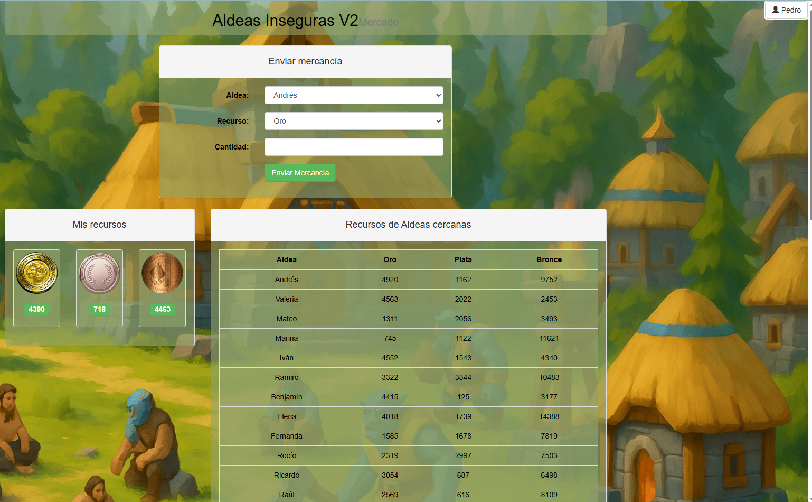
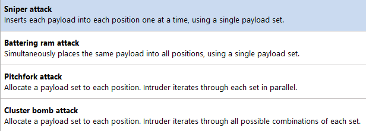
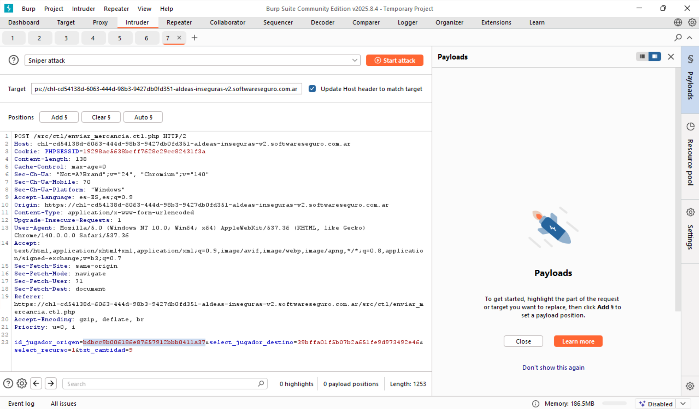
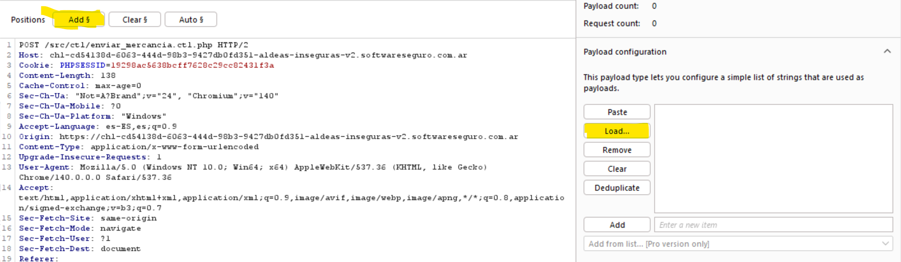
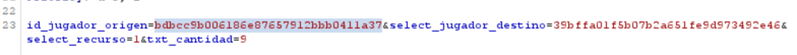
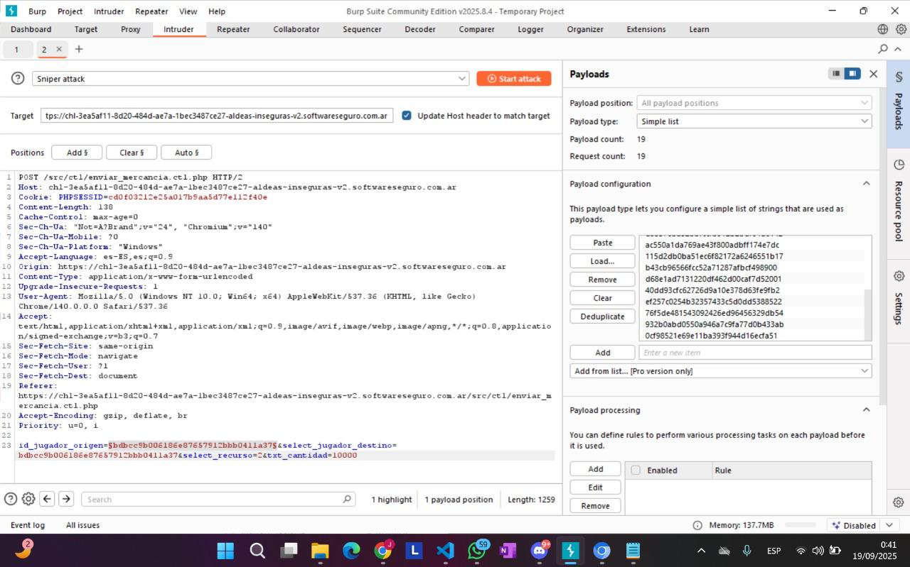
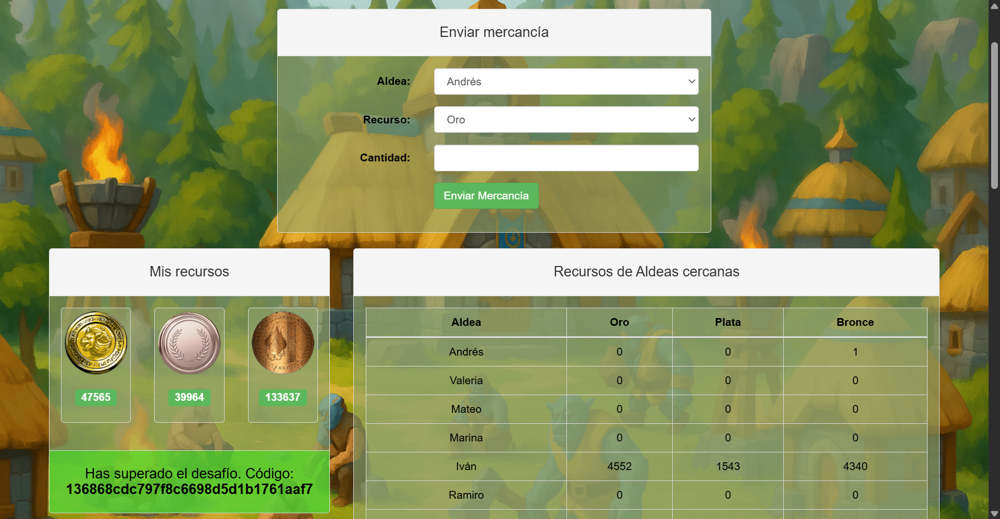

# Desafío 35 - Aldeas Inseguras V2

## Análisis

Muy parecido al desafío de Aldeas Inseguras original. En este caso:

- **Plata y Bronce**: no tienen límite para recibirlos, se pueden enviar todos directamente a Pedro.
- **Oro**: hay que realizar una escalera (Alfonzo → Juana → Santiago → Pedro), acumulando el oro sucesivamente.

Como son muchos registros, en vez de hacerlo uno a uno se usan ataques de listas en Burp Intruder.

## Explotación

Se realiza una petición de "Enviar mercancía" y se abre en Intruder con click derecho.

- **Sniper Attack**: para Plata y Bronce (una sola lista de orígenes, destino fijo = Pedro).
- **Pitchfork Attack**: para el Oro (dos listas en paralelo, origen y destino en escalera).

> El ataque **Pitchfork** empareja el primer elemento de la Lista 1 con el primero de la Lista 2, el segundo con el segundo, etc.
> El ataque **Cluster Bomb** hace el producto cartesiano de todas las combinaciones.



### Listas para el ataque Pitchfork (Oro)

**Lista 1** (orígenes):

```
bde44e88ebd3925ff843b2e31bda83d7
74d2afa3a1f4894c8829c6f80a7a436b
f29ae2207b53b27bc0cfb758b910476f
f6cb7ff9058fdfe1b6cd21de0dcb4618
e9432dc2f3f99b5d00fb4144d232efda
6464c004dfdf96f42bd5d64f8e3f507d
6aca358cf89c4ee1b46cfef0ace4e0bf
d9537eba52bbfccfb912b2bdf64d6142
be637e3073a1e7e5cfb86c5978c9560a
ac550a1da769ae43f800adbff174e7dc
9fedb91a0f93706d7f09b44d0e5b94c1
115d2db0ba51ec6f82172a6246551b17
bdbcc9b006186e87657912bbb0411a37
```

**Lista 2** (destinos en escalera):

```
ee2e04b3d8686ef9a055626e762c20be
bde44e88ebd3925ff843b2e31bda83d7
74d2afa3a1f4894c8829c6f80a7a436b
f29ae2207b53b27bc0cfb758b910476f
f6cb7ff9058fdfe1b6cd21de0dcb4618
e9432dc2f3f99b5d00fb4144d232efda
6464c004dfdf96f42bd5d64f8e3f507d
6aca358cf89c4ee1b46cfef0ace4e0bf
d9537eba52bbfccfb912b2bdf64d6142
be637e3073a1e7e5cfb86c5978c9560a
ac550a1da769ae43f800adbff174e7dc
9fedb91a0f93706d7f09b44d0e5b94c1
115d2db0ba51ec6f82172a6246551b17
```

> Los IDs se recolectaron de los jugadores y se guardaron en un `.txt` para cargarlos en Intruder con **Load…**. En el SCRIPT se indican los primeros dos elementos de cada lista que no deben cargarse; si están presentes, hacer REMOVE de esa línea.



Se selecciona el origen con **Add $** y se carga el txt.









## Flag

```
136868cdc797f8c6698d5d1b1761aaf7
```


