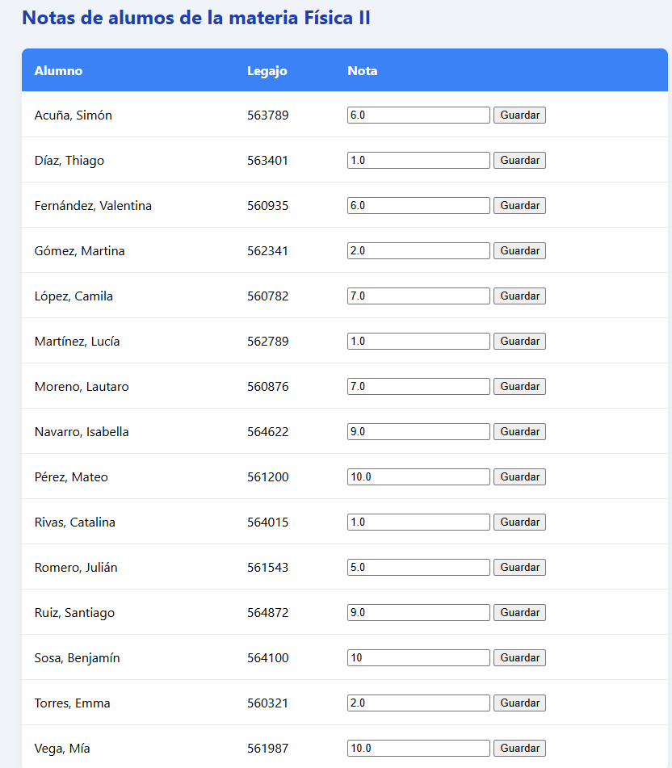
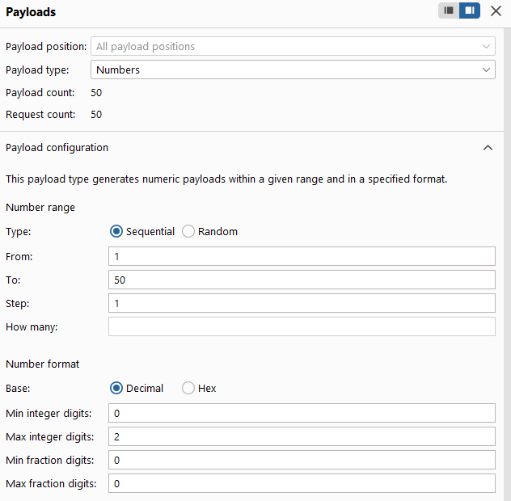
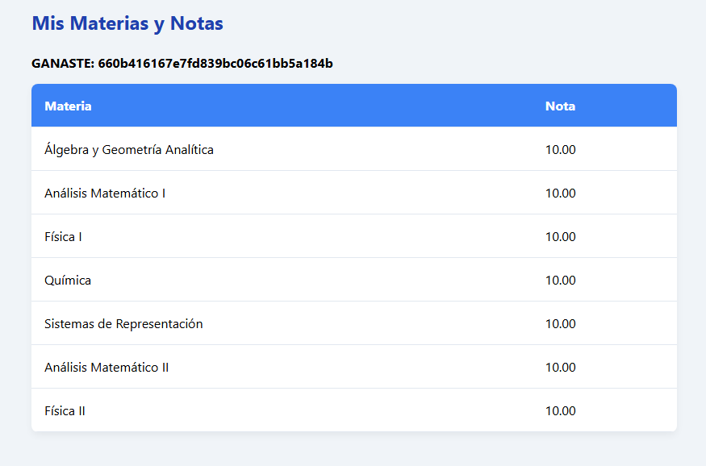

# Desafío 36 - Notas Universitarias

## Análisis

Las credenciales del superusuario no han sido modificadas desde la instalación, por lo que se puede entrar con `admin` / `admin`.

## Explotación

Se modifica la nota de Sosa, Benjamín para que envíe un POST a Burp Suite.



Se identifica que el ID del estudiante es `8` y el ID de la materia es `7`. Para probar con todas las materias se realiza un ataque con Intruder.

Se hace click derecho → **Send to Intruder**.


Se marca el ID de la materia (`7`) como payload y se presiona **Add $**.


Se configura **Payload type: Numbers**, de `1` a `50`, para abarcar la mayor cantidad de IDs posibles.



> **Conclusión:** todo lo relacionado con tokens y demás era para confundir. La vulnerabilidad se explotó directamente modificando el ID de la materia vía IDOR.

## Flag

```
660b416167e7fd839bc06c61bb5a184b
```




