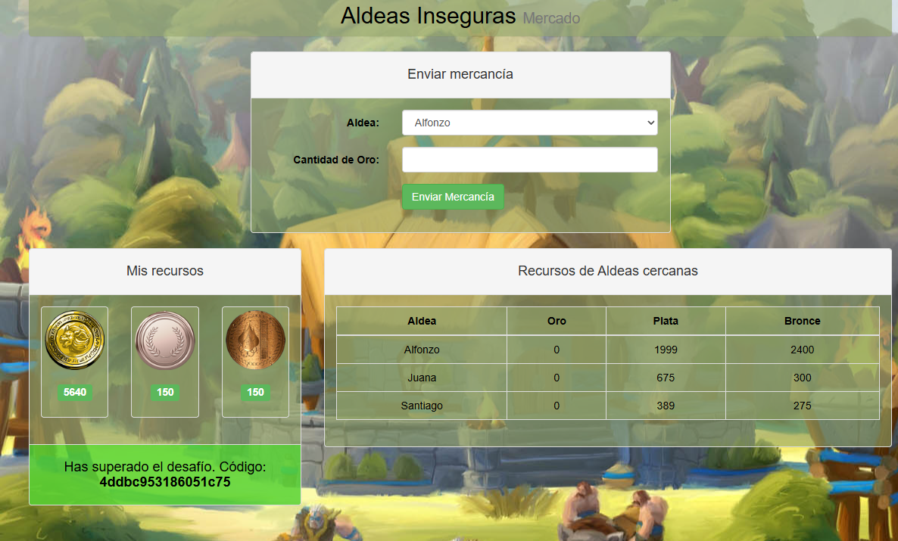

# Desafío 4 - Aldeas inseguras

**Plataforma:** HackLab (SoftwareSeguro)  
**Categoría:** IDOR  

## Análisis

La idea es que Alfonzo le envíe todo su oro a Juana, Juana a Santiago y Santiago a Pedro. Esto se debe a que solamente se puede recibir una vez el oro por día.

## Explotación

### Solución 1

Abrimos la página desde Burp Suite e interceptamos las peticiones para realizar un envío de toda la mercancía.


A la derecha podemos ver dentro del cuerpo los parámetros: el ID de Pedro y el ID de Juana. Tenemos que realizar una petición a cada uno para poder saber los IDs de todos.


Una vez modificado el envío, le vas dando a Forward y repetís el procedimiento:

1. Alfonzo le envía todo su oro a Juana.
2. Juana a Santiago.
3. Santiago a Pedro.




## Flag

```
4ddbc953186051c75
```

### Solución 2

F12 para abrir el inspector dentro de la página. Enviamos una petición cualquiera para que nos aparezca el archivo `enviar_mercancia.ctl.php` dentro de "Networks". Sobre este hacemos click derecho → copy → copy as cURL (cmd).

El código que nos copia podemos ejecutarlo cambiando el id origen y destino, y la cantidad de oro.

Envíos:
1. alfonzo → juana
2. juana → santiago
3. santiago → pedro


