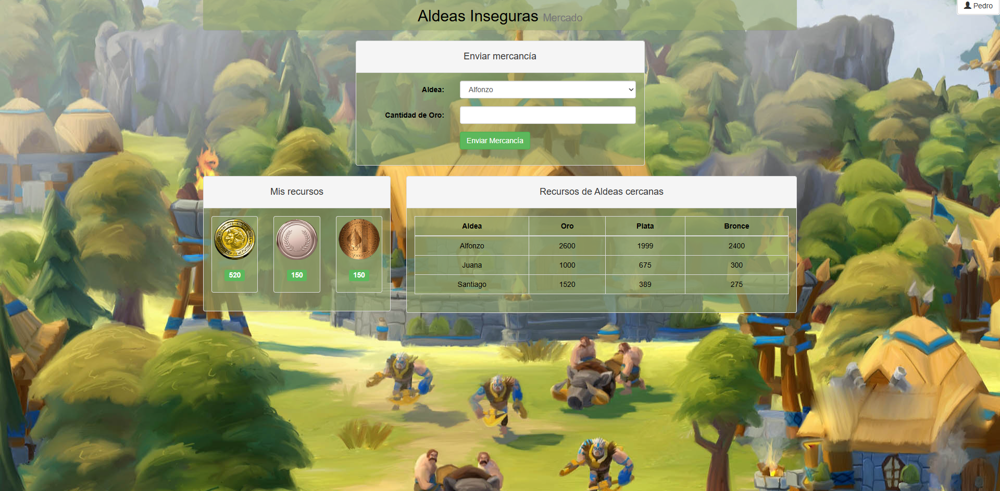
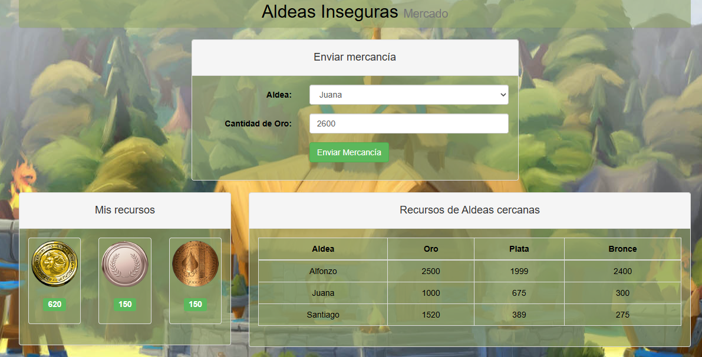
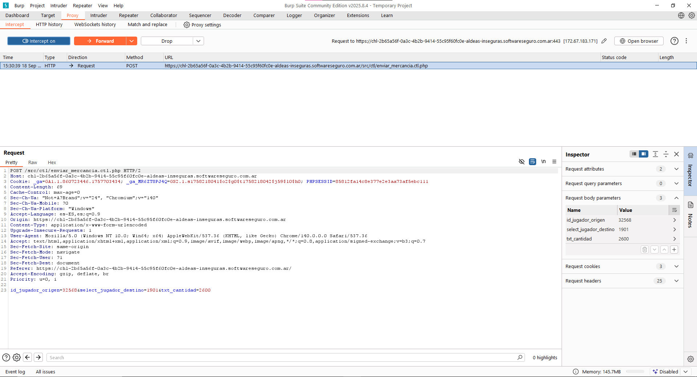
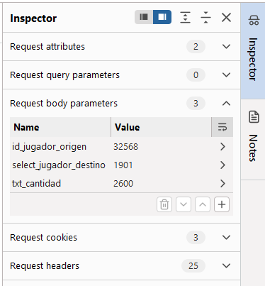
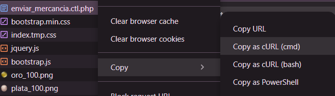

# Desafío 4 - Aldeas Inseguras

IDOR 
Desafío 4 - Aldeas Inseguras 
🚀 Solución | Aldeas Inseguras (para más claridad esta el video) 
Solución 1 
Abro la pagina desde Burp Suite, la idea sería que Alfonzo le envíe todo su oro a Juana. 
Juana a Santiago y Santiago a Pedro. Esto debido a que solamente se puede recibir una 
vez el oro por día. Para eso vamos a necesitar abrir el burp suite y poner que intercepte las 
peticiones, y vamos a realizar un envió de toda la mercancía

Aca a a la derecha podemos ver dentro del cuerpo los parámetros que seria el ID de Pedro 
y el ID de Juana en este caso. Tendríamos que realizar una petición a cada uno para poder 
saber los ID de todos.

Una vez modificado para enviar, le vas dando a Forward y repetis el procedimiento 
Alfonzo le envía todo su oro a Juana.  
Juana a Santiago 
Santiago a Pedro.

4ddbc953186051c75 
Solución 2 
F12 para abrir el inspector dentro de la página.  
Enviamos 
una 
petición 
cualquiera 
para 
que 
nos 
aparezca 
el 
archivo 
enviar_mercancia.ctl.php dentro de ‘Networks’, sobre este hacemos click derecho → copy 
→ copy as cURL (cmd). 
 
 
El código que nos copia podemos ejecutarlo cambiando el id origen y dentino, y la cantidad 
de oro, y listo!! =)  
envios: 
1.​ alfonzo → juana 
2.​ juana → santiago 
3.​ santiago → pedro

