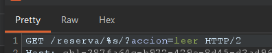
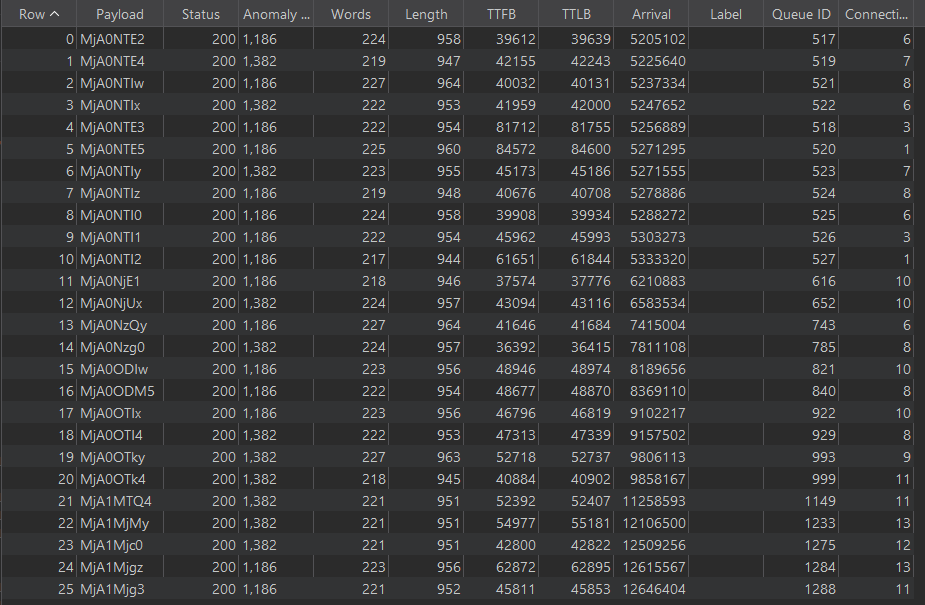
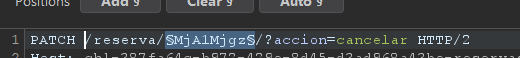
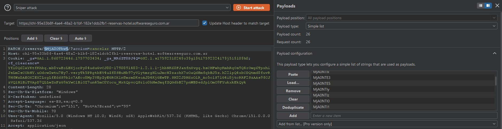
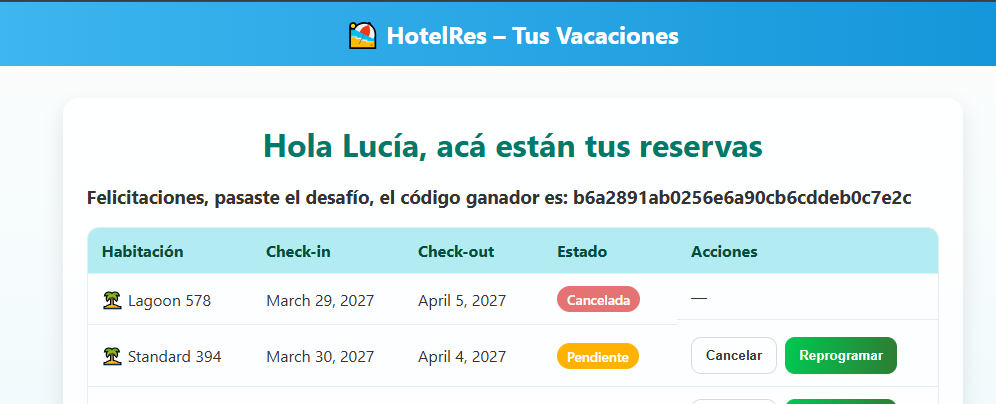

# Reservas de hotel

**Plataforma:** HackLab (SoftwareSeguro)
**Edición:** HackLab 2025
**Categoría:** IDOR

## Enunciado

Estás autenticada como `lucia` en un sistema de reservas. El objetivo es, con la
máxima discreción, anular únicamente las reservas del usuario `esteban`. Cualquier
cancelación que afecte a otros usuarios (distintos de `esteban` o las propias de
`lucia`) invalida el intento. El sistema debe mostrar que las reservas de `esteban`
quedaron canceladas mientras el resto de usuarios conserva las suyas.

## Análisis

Cada fila de la tabla ("Cancelar" / "Reprogramar") opera sobre un endpoint por ID:

```http
GET /reserva/<id>/?accion=leer
PATCH /reserva/<id>/?accion=reprogramar
PATCH /reserva/<id>/?accion=cancelar
```

El `<id>` no es un entero plano: viaja **Base64-encodeado** en la URL. Decodificando
un ID propio se ve que por debajo es un **entero secuencial**:

```bash
echo "MjA1MTEz" | base64 -d   # -> 205113
echo -n "205114" | base64     # -> MjA1MTE0
```

Base64 no es cifrado, solo codificación. El servidor resuelve la acción a partir
del ID sin verificar que la reserva pertenezca a la usuaria autenticada: es un
**IDOR** (Insecure Direct Object Reference). La acción `leer` permite consultar
cualquier reserva ajena y obtener su titular y estado:

```json
{
  "ok": true,
  "estado": "confirmada",
  "username": "esteban",
  "check_in": "2026-11-20",
  "check_out": "2026-11-24"
}
```

La cookie `cf_clearance` presente en las peticiones es de Cloudflare (token del
challenge anti-bot, firmado por Cloudflare y atado a IP/User-Agent). No contiene
datos de la aplicación y no es parte de la vulnerabilidad; solo hay que reenviarla
para no recibir un 403 de Cloudflare al repetir peticiones fuera del navegador.

## Explotación

### 1. Enumerar en modo lectura

Como los IDs son secuenciales, se barre el rango con **Turbo Intruder** usando la
acción `leer` (que no modifica nada) y se filtra por titular `esteban`. Esto evita
cancelar a ciegas y tocar a un tercero, lo que invalidaría el intento.

Request base (el `%s` es donde Turbo inyecta el ID Base64):

```http
GET /reserva/%s/?accion=leer HTTP/2
```

Script: [`./turbo_enum_esteban.py`](./turbo_enum_esteban.py). Filtra las respuestas
cuyo `username` sea `esteban` y cuyo `estado` sea `pendiente` o `confirmada`, es
decir, las reservas **activas** de `esteban` (todo lo que no esté ya cancelado).
Así no se re-tocan las ya canceladas ni se omiten las confirmadas, que también hay
que anular según el criterio de éxito.





Los payloads que matchean (las reservas objetivo de `esteban`) se vuelcan a
[`./esteban_activas.txt`](./esteban_activas.txt). Cada línea es el ID Base64 listo
para reutilizar como wordlist. En esta corrida fueron 26 reservas activas de
`esteban`, en el rango `204516`–`205287`.

### 2. Cancelar solo esas reservas

La cancelación usa el mismo esquema IDOR con `PATCH` y `accion=cancelar`. Se hace
con **Burp Intruder** (ataque *Sniper*) cargando como *payload list* los 26 IDs de
[`./esteban_activas.txt`](./esteban_activas.txt) en la posición del ID — nunca un
rango completo, de modo que es imposible tocar a un tercero.

```http
PATCH /reserva/§id§/?accion=cancelar HTTP/2
```





## Flag

Tras cancelar las 26 reservas activas de `esteban`, el sistema valida que solo se
anularon las suyas y entrega la flag:

```
b6a2891ab0256e6a90cb6cddeb0c7e2c
```


