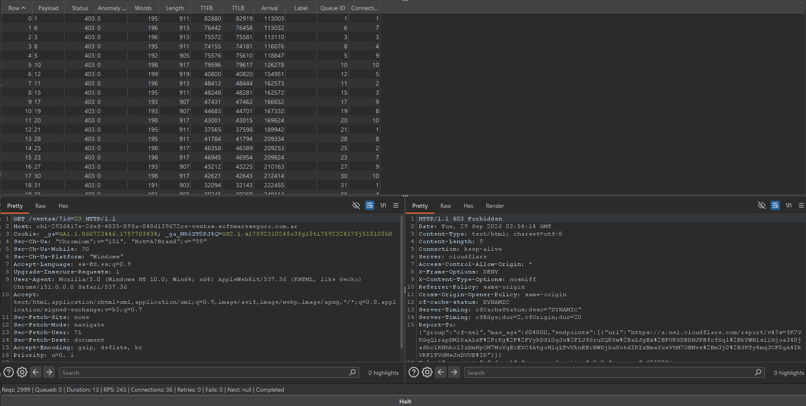
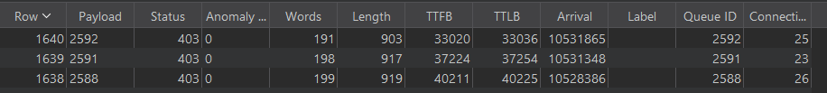

# Desafío 16 - Ventas

**Plataforma:** HackLab (SoftwareSeguro)  
**Categoría:** Information Disclosure - IDOR  

## Enunciado

Fernando, un amigo, necesita un favor. Él quiere saber cuántas ventas hizo su competencia.

Cuando encuentres cuántas ventas hizo la competencia de Fernando, generá el MD5 de ese número y ese es el código para pasar este desafío.

Las ventas se encuentran en la ruta `/ventas`.

## Análisis

La ruta `/ventas` redirige (301) a `/ventas/`. Sin parámetros, la aplicación responde **400 Bad request**, lo que indica que espera un parámetro obligatorio.

Probando nombres de parámetro, solo `id` es reconocido: cualquier otro nombre devuelve **400**. El parámetro es *case-sensitive* (`ID`/`Id` → 400).

Con `?id=<n>` aparecen tres comportamientos según el valor:

| Respuesta | Significado |
| :--- | :--- |
| **400 Bad request** | falta el parámetro `id` |
| **404 Not found** | la venta con ese `id` no existe |
| **403 Forbidden** | la venta existe, pero no está autorizada a leerse |

El control de acceso en sí funciona: al pedir una venta ajena el servidor responde `403 Forbidden` y no expone su contenido. La vulnerabilidad es de **information disclosure**: la distinción entre `403` (existe pero prohibida) y `404` (no existe) actúa como un *oracle* que filtra información que no debería ser observable. Aunque el detalle de cada venta no puede leerse, el código de estado revela **qué `id` corresponden a ventas reales**. Como el vector es manipular un identificador directo (`?id=`) para sondear objetos ajenos, la enumeración es un **IDOR**: cada `id` que responde `403` es una venta existente que pertenece a otro (la competencia).

El objetivo no es leer el contenido de las ventas, sino **contar cuántas existen**: la cantidad de `id` que devuelven `403`.

Los intentos de bypass del `403` (headers `X-Forwarded-For` y similares, tricks de path, encoding, override de método, parámetro duplicado) no tuvieron efecto: el control se aplica sobre el recurso antes que el método.

## Explotación

Barriendo el espacio de `id` se observa que las ventas existen de forma dispersa desde `id=1` y que el último `id` válido es **2592** (más allá de ~2600 todo es `404`).

Se enumera el rango `1..3000` con **Turbo Intruder** para contar las respuestas `403`, filtrando por status:

```python
def queueRequests(target, wordlists):
    engine = RequestEngine(endpoint=target.endpoint,
                           concurrentConnections=10,
                           requestsPerConnection=100,
                           pipeline=False)
    for i in range(1, 3001):
        engine.queue(target.req, str(i))

def handleResponse(req, interesting):
    if req.status == 403:
        table.add(req)
```

Request base (el marcador se coloca en el valor de `id`):

```http
GET /ventas/?id=§1§ HTTP/2
Host: <host>
```

La tabla de resultados queda con todas las filas en `403` (a la derecha se ve la respuesta `403 Forbidden` con `Content-Length: 9`):



El ataque recorre las 3000 iteraciones y termina sin fallos:


Turbo Intruder numera las filas desde `Row 0`. Ordenando la tabla, la última fila es `Row 1640` con payload `2592` (el último `id` válido), por lo que hay **1641** respuestas `403`: esa es la cantidad de ventas de la competencia.



## Flag

El código es el MD5 del número de ventas:

```bash
echo -n "1641" | md5sum
```

```
10c272d06794d3e5785d5e7c5356e9ff
```
