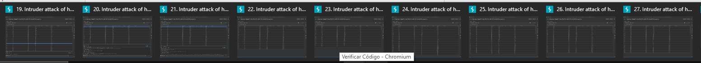
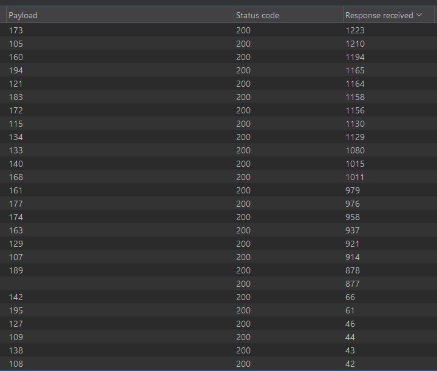

# Desafío 26 - Asistencia (HackLab 2024)

## Análisis

El sistema solo acepta números de 3 dígitos como contraseña. La cantidad de asistentes se puede inferir mediante un ataque de **timing**: los números válidos tienen tiempos de respuesta significativamente mayores.

## Explotación

Se prueban todos los números del `100` al `999` con Burp Intruder, enviando siempre la misma contraseña arbitraria.



Se ordenan los resultados por tiempo de respuesta. Los números que tardan más corresponden a los asistentes registrados. Se cuenta la cantidad de respuestas con mayor longitud/tiempo.



Resultado: **159 asistentes**.

Se hashea ese número para obtener el código.

## Flag

```
140f6969d5213fd0ece03148e62e461e
```
