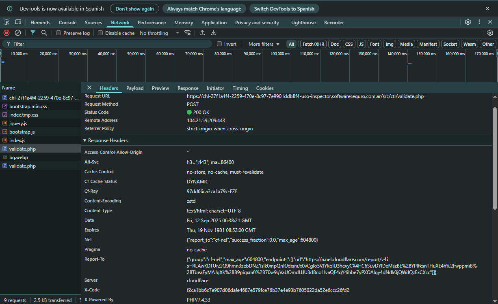
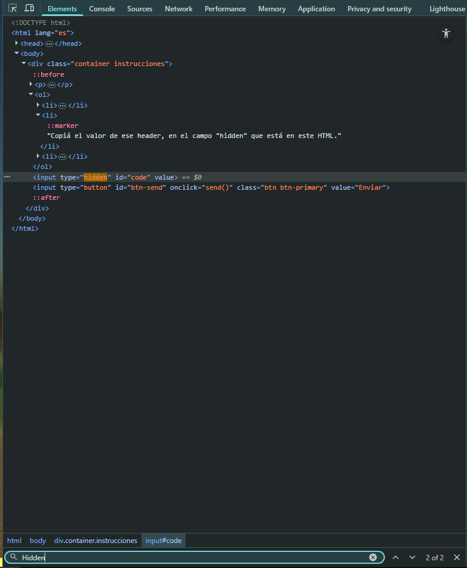
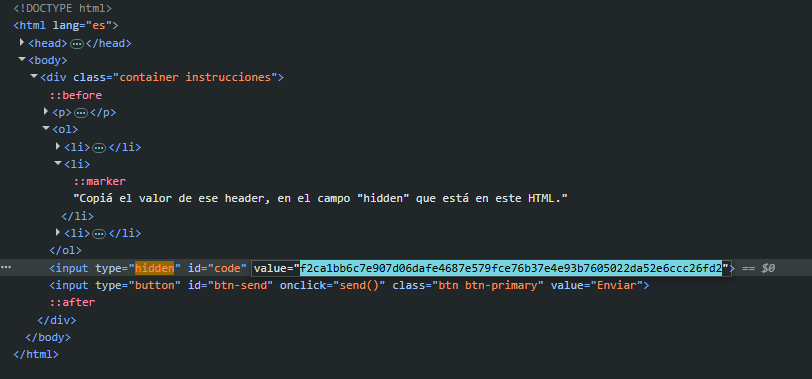
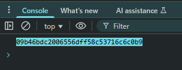

# Desafío 1 - Uso del inspector

Introducción 
Desafío 1 - Uso del inspector 
🚀 Solución | Uso del inspector (para más claridad esta el video) 
Primero le das en inspeccionar a la página y recargas. Ahi te van a llegar las peticiones y 
dentro del apartado de Network buscas en los Headers cual dice X-CODE.  
 
 
f2ca1bb6c7e907d06dafe4687e579fce76b37e4e93b7605022da52e6ccc26fd2

En el apartado de Elements buscas donde dice Hidden y ahi pegas ese codigo.

Actualizas la página y te devuelve el código ganador en la consola 
 
09b46bdc2006556dff58c53716c6c0b9

