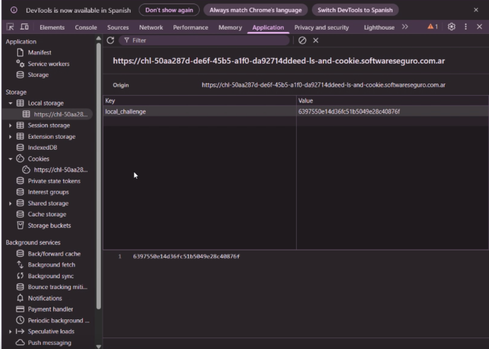
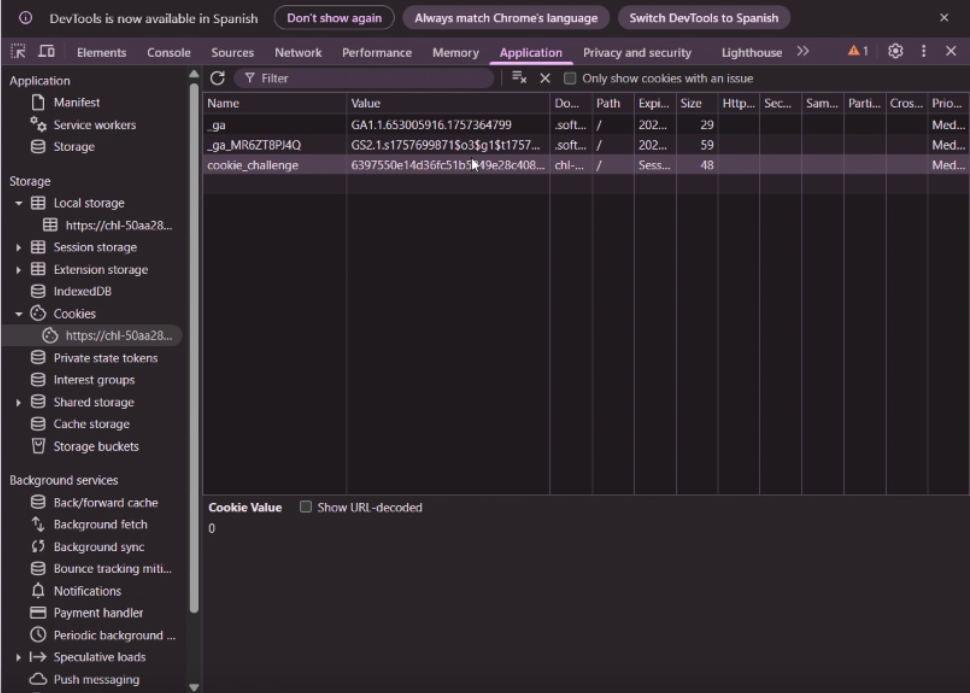

# Desafio 37 - Local Storage and Cookie

## Análisis

El MD5 de "hackertech" es:

```
6397550e14d36fc51b5049e28c40876f
```

## Explotación

Abrís el inspector y vas a la parte de Aplicación, dentro de Local Storage modificas la variable local que estaba en 0 por `6397550e14d36fc51b5049e28c40876f`.



## Flag

```
2a67fed05c1362c6f39e7ddb95d96101
```


