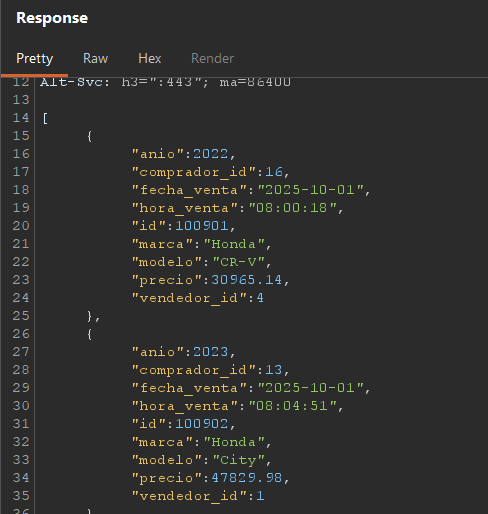
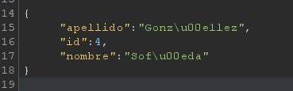
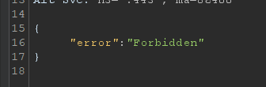
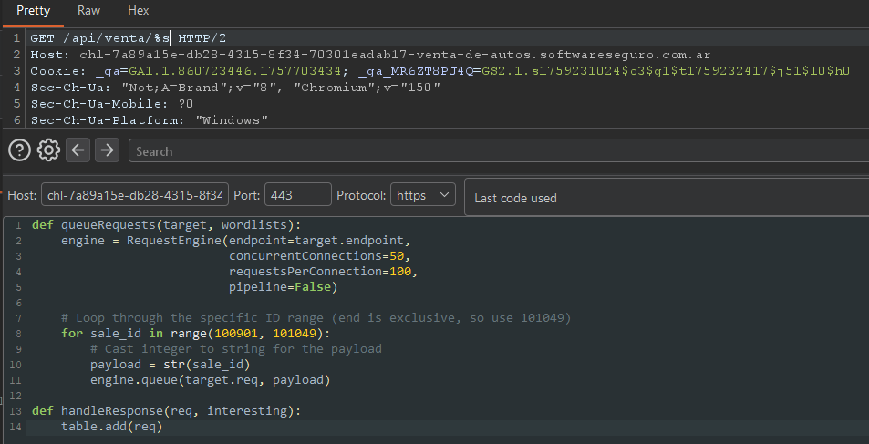
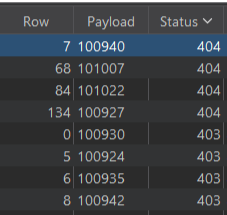

# Desafío 47 - Venta de autos

## Análisis de la Vulnerabilidad

Con la información que me dieron que pruebe en la fecha `01/10/2025` y con el header:

```http
X-API-Key: 55f53057-d320-4bec-8447-0ba940740595
```

Encuentro las ventas que hubo ese día.



## Metodología de Resolución

Analizando las ventas que me devuelve, empiezo a probar `GET /api/vendedor/{id}` con los distintos IDs de los vendedores que únicamente iban del 1 al 4. En todos me devolvía correctamente, hasta que pruebe con los IDs mayores a 4 y me empieza a dar error 403.





Entonces ahí obtengo la información que ese endpoint me devolvía únicamente las ventas de mí concesionaria.

Entonces verifico que las ventas de ese día van desde 100901 a 101048 ya que una venta menos o una venta más ya era otra fecha. Realizo con turbo intruder un script para verificar que todos esos IDs existan y tengan una venta asociada y encuentro que 4 de ellos me da error 404 osea que no existen.

```python
def queueRequests(target, wordlists):
    engine = RequestEngine(endpoint=target.endpoint,
                           concurrentConnections=50,
                           requestsPerConnection=100,
                           pipeline=False)

    # Loop through the specific ID range (end is exclusive, so use 101049)
    for sale_id in range(100901, 101049):
        # Cast integer to string for the payload
        payload = str(sale_id)
        engine.queue(target.req, payload)

def handleResponse(req, interesting):
    table.add(req)
```





45 respuestas 200 OK correspondientes a las ventas propias, 4 respuestas 404 Not Found correspondientes a IDs inexistentes que deben descartarse por no representar ventas reales, y 99 respuestas 403 Forbidden correspondientes a las ventas de las otras concesionarias.

El ID de la última venta del día perteneciente a las otras concesionarias es 101047, ya que el 101048 pertenece a la concesionaria propia y el 101047 es el mayor ID con respuesta 403 dentro del rango.

La cadena a hashear resulta de concatenar la cantidad y el último ID, quedando `99101047`, cuyo hash MD5 es `5064f37401dd1c8710edf69cd492784e`, siendo este la flag.

## Flag

```
5064f37401dd1c8710edf69cd492784e
```

## Impacto en la Tríada de Seguridad (CIA)

Confidencialidad: Ya que no logre ver de forma explícita información sensible pero si a través de una diferenciación entre respuestas de 403 y 404 identificar la existencia de las cantidad de ventas de otras concesionarias.
