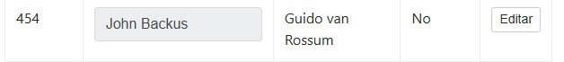
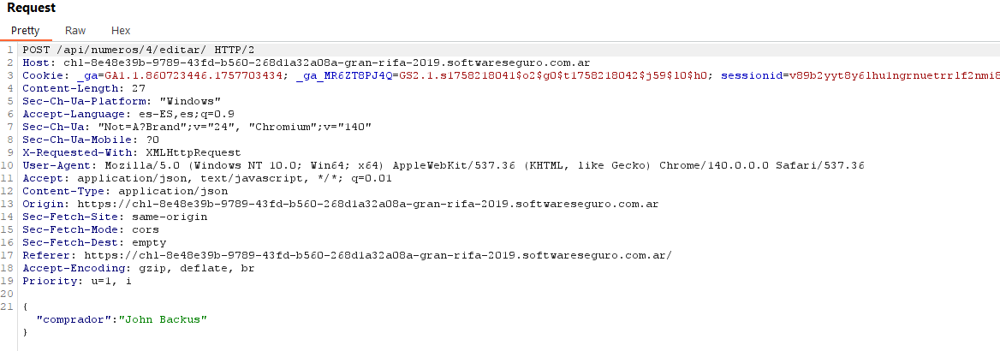
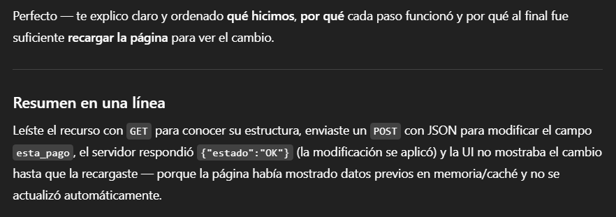

# Desafío 11 - Gran Rifa 2019

Mass Assignment 
Desafío 11 - Gran Rifa 2019 
Primero que nada mando un GET normal recargando la página para ver el formato que 
genera. 
 
 
Dentro de http history veo la respuesta a la petición GET e Identificó que el campo a 
modificar se llama esta_pago. 
 
 
Luego envió un POST presionando Editar y Guadar

En el cual voy a modificar el formato JSON que está entre llaves por esto 
{ 
  "comprador": "John Backus", 
  "esta_pago": true 
} 
 
 
Vemos que la petición me da por válida (En la request no aparece lo del "esta_pago": true 
pero es normal porque lo procesa así digamos) 
 
 
Recargamos la página y ganamos zzz

ed20b8f11252a75b30d594af897c3aad

