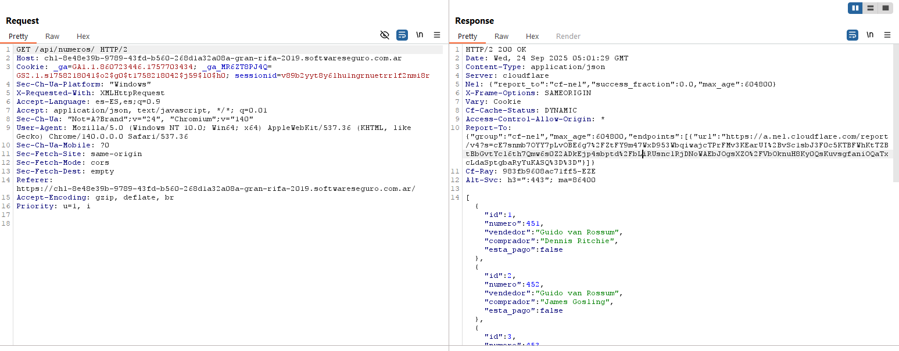
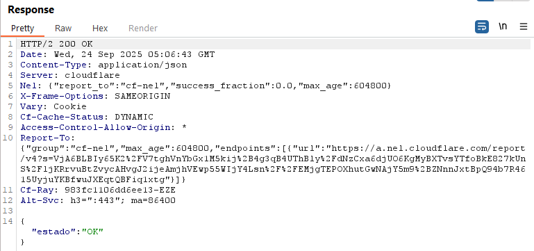
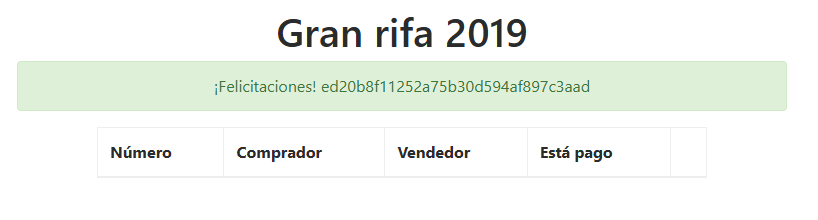
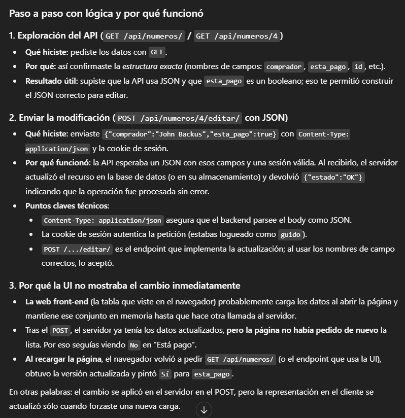

# Desafío 11 - Gran Rifa 2019

**Plataforma:** HackLab (SoftwareSeguro)  
**Categoría:** Mass Assignment  

## Análisis

El endpoint de edición acepta campos adicionales en el JSON que no deberían ser modificables por el usuario. Al incluir `esta_pago: true` en el cuerpo del POST, el servidor lo procesa y marca la rifa como pagada.

## Explotación

Se recarga la página y se intercepta el GET en **HTTP History** de Burp Suite. Se identifica el campo `esta_pago` en la respuesta.




Se presiona **Editar** y **Guardar** para capturar el POST. Se modifica el JSON del cuerpo:

```json
{
  "comprador": "John Backus",
  "esta_pago": true
}
```


La petición se procesa correctamente. Se recarga la página y el estado queda como pagado.



## Flag

```
ed20b8f11252a75b30d594af897c3aad
```





