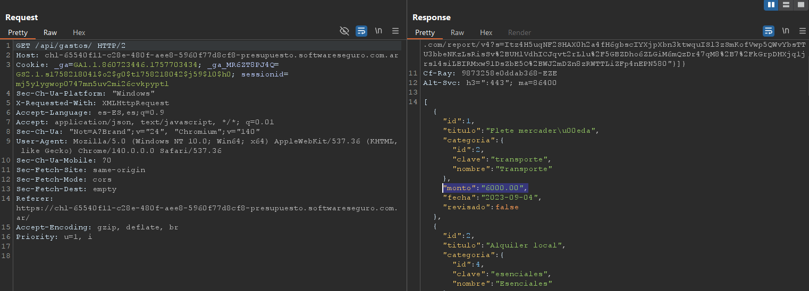
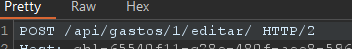
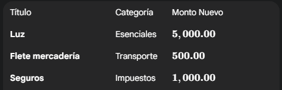

# Desafío 19 - Presupuesto (HackLab 2023)

**Plataforma:** HackLab (SoftwareSeguro)  
**Edición:** HackLab 2023  
**Categoría:** Mass Assignment  

## Análisis

El endpoint de edición de presupuestos acepta campos adicionales en el JSON. Al incluir `revisado: true` junto al monto, el servidor lo procesa sin validación.

## Explotación

Se inspecciona la estructura de la respuesta GET para identificar los campos disponibles.




Al presionar "Revisar", se intercepta el POST y se modifica el JSON:

```json
{
  "monto": "1000.00",
  "revisado": true
}
```

Se repite para todos los presupuestos indicados por el enunciado (se usó IA para determinar cuáles campos modificar con los datos de la tabla).








Una vez modificados todos los registros indicados con `revisado: true`, se obtiene el código.


## Flag

```
bf58371373e52613ae270d5acf832bad
```
