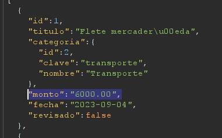
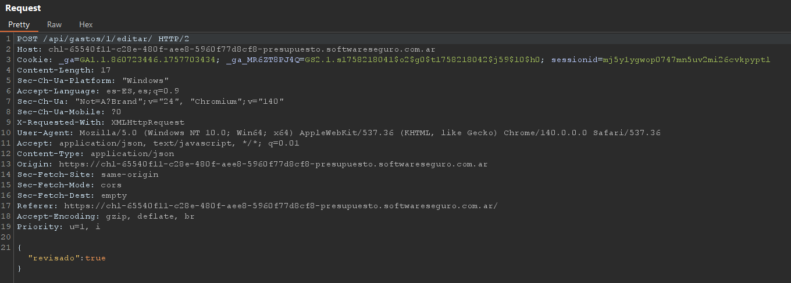
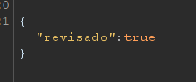
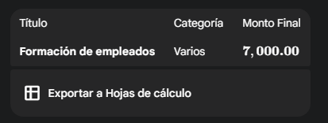
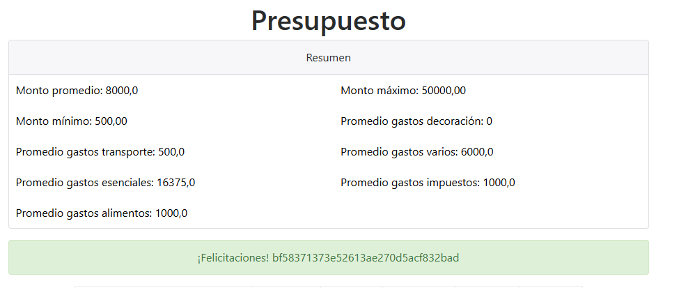

# Desafío 19 - Presupuesto (HackLab 2023)

Desafío 19 - Presupuesto (HackLab 2023) 
 
Acá podemos identificar la estructura

Vemos que al modificar y poner en revisado, podemos enviar un JSON en el cual vamos 
agregar el valor que queres modificar al poder ver la estructura anteriormente 
 
 
 
Enviamos esto por ejemplo 
{ 
 "monto": "1000.00", 
"revisado":true 
} 
 
Le pase a Géminis los cálculos que me pide con toda la tabla y le dije que me aclare que 
campos debo modificar para que quede así 
 
Me dio los 3 de arriba, le faltaba un poco así que me tiro que modifique este campo también

Una vez que modifico los que me indica y pongo todos en si, me da el código 
 
bf58371373e52613ae270d5acf832bad

