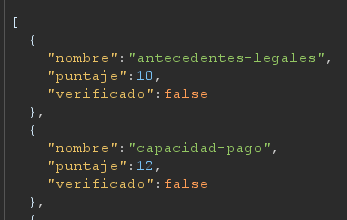
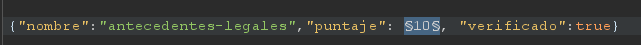
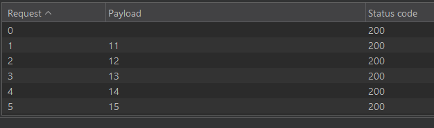
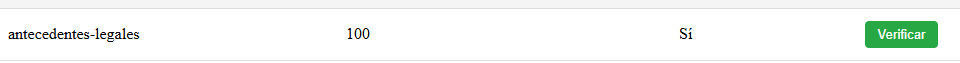
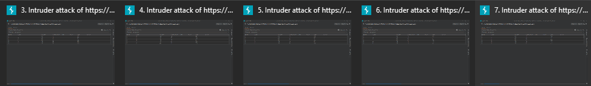
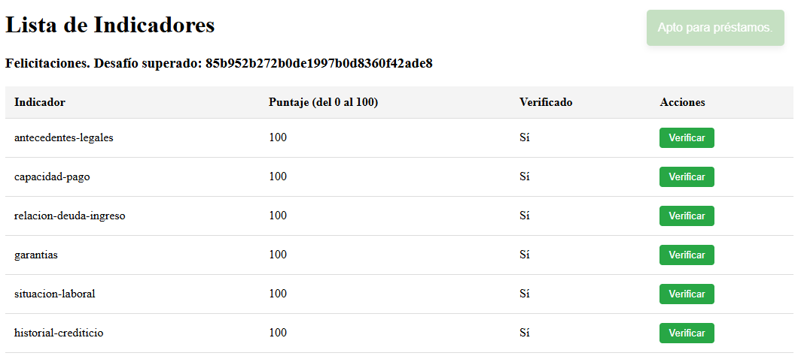

# Desafío 24 - Préstamo (HackLab 2024)

**Plataforma:** HackLab (SoftwareSeguro)  
**Edición:** HackLab 2024  
**Categoría:** Mass Assignment  

## Análisis

El servidor expone los indicadores de puntaje en un GET. Al modificar directamente el valor a 100 el usuario es bloqueado, por lo que hay que incrementar los valores de a uno hasta llegar al máximo.

## Explotación

Se intercepta el GET de los indicadores y se analiza la estructura de la respuesta.





Se configura un ataque con Intruder iterando el valor del indicador de `From: (valor_actual + 1)` hasta `To: 100` para cada indicador.




Se confirma que la modificación fue exitosa y se repite el proceso para cada indicador.







## Flag

```
85b952b272b0de1997b0d8360f42ade8
```


