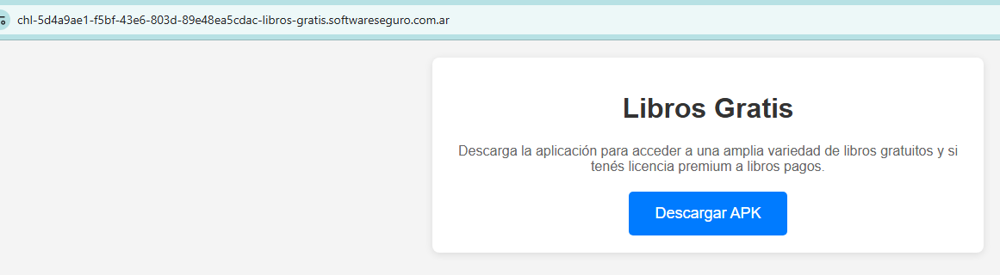
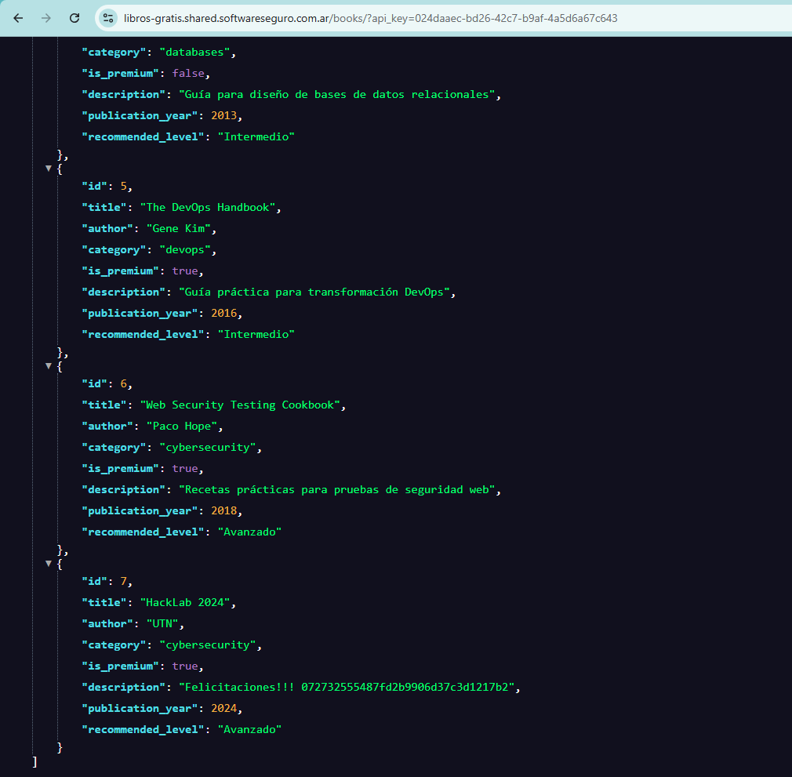

# Desafío 31 - Libros Gratis

**Plataforma:** HackLab (SoftwareSeguro)  
**Edición:** HackLab 2024  
**Categoría:** Reversing Apk - Broken Access Control  

## Enunciado

> Hemos identificado una aplicación en formato APK que permite a los usuarios
> acceder a una biblioteca de libros. La mayoría de los títulos son gratuitos,
> pero algunos están disponibles únicamente mediante pago. Sin embargo, hemos
> recibido informes de que podría existir una vulnerabilidad que permita el
> acceso no autorizado a los libros pagos.
>
> Tu objetivo es acceder a los libros pagos.

Se entrega un único archivo, [`libros-gratis.apk`](./assets/libros-gratis.apk).
La app se llama **FreeBooks**: muestra una lista de libros gratuitos y un botón
"Premium" para los de pago.



## Análisis

Un APK es un ZIP, así que se descomprime directamente. En la raíz aparecen
`assets/capacitor.config.json`, `assets/native-bridge.js` y una carpeta
`assets/public/` con un bundle de Angular (archivos `NNNN.hash.js` y un
`3rdpartylicenses.txt`). Es una **app híbrida Ionic/Angular empaquetada con
Capacitor** (`appId: ar.com.softwareseguro.freebooks`). El `classes.dex` de 7 MB
es solo el runtime de Capacitor: **la lógica de la app está en JavaScript**, sin
cifrar, dentro de `assets/public/`.

Esto define la estrategia: no hace falta emulador, root ni desensamblar Smali.
Alcanza con leer el bundle web.

Buscando en `assets/public/` por el host de la API y por `premium`, todo
converge en un único módulo (`6441.*.js`), que contiene el `HomePageModule`. Ahí
está el servicio que consume la API:

```javascript
class n {
  constructor(t) {
    this.http = t;
    this.apiUrl = "https://libros-gratis.shared.softwareseguro.com.ar/books/";
  }
  getBooks(t = "") {
    let r = new k.Nl;
    if (null != t && "" !== t) r.set("api_key", t);
    return this.http.get(this.apiUrl, { params: r });
  }
}
```

`getBooks(clave)` pega a `GET .../books/` y **solo agrega `?api_key=<clave>` si
se le pasa una clave**. Sin clave devuelve los libros gratis; con clave, los
pagos.

¿De dónde sale la clave premium? Del propio componente, hardcodeada:

```javascript
class n {
  constructor(t) {
    this.bookService = t;
    this.apiKey = "024daaec-bd26-42c7-b9af-4a5d6a67c643";
    this.books = [];
    this.isUserPremium = !1;
    this.loadBooks();
  }
  loadPremium() {
    this.bookService.getBooks(this.apiKey).subscribe(t => { this.books = t });
  }
  loadBooks() {
    this.isUserPremium
      ? this.bookService.getBooks(this.apiKey).subscribe(t => { this.books = t })
      : this.bookService.getBooks().subscribe(t => { this.books = t });
  }
}
```

El control de acceso es **puramente del lado del cliente**: el flag
`isUserPremium` arranca en `false`, y el botón "Premium" que dispara
`loadPremium()` se renderiza deshabilitado (`disabled="true"`) en el template.
Pero nada de eso protege el recurso: la **API key premium viaja dentro del APK
distribuido**, así que cualquiera que abra el bundle la obtiene. El backend
confía en una clave que es, en la práctica, pública.

## Explotación

No hace falta ni ejecutar la app: se llama directamente al endpoint con la clave
extraída del bundle.

```bash
curl "https://libros-gratis.shared.softwareseguro.com.ar/books/?api_key=024daaec-bd26-42c7-b9af-4a5d6a67c643"
```

Sin clave, la API devuelve solo los tres libros con `is_premium:false`. Con la
clave, aparecen además los que tienen `is_premium:true`, incluido uno que no es
un libro real:

```json
{
  "id": 7,
  "title": "HackLab 2024",
  "author": "UTN",
  "category": "cybersecurity",
  "is_premium": true,
  "description": "Felicitaciones!!! 072732555487fd2b9906d37c3d1217b2",
  "publication_year": 2024,
  "recommended_level": "Avanzado"
}
```

La flag está en la descripción de ese "libro" pago.



## Flag

```
072732555487fd2b9906d37c3d1217b2
```
