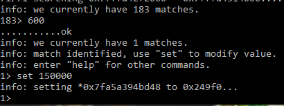
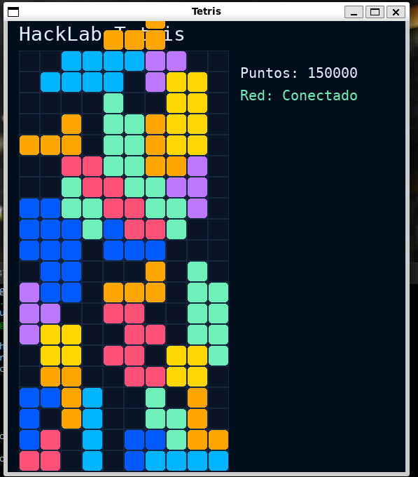
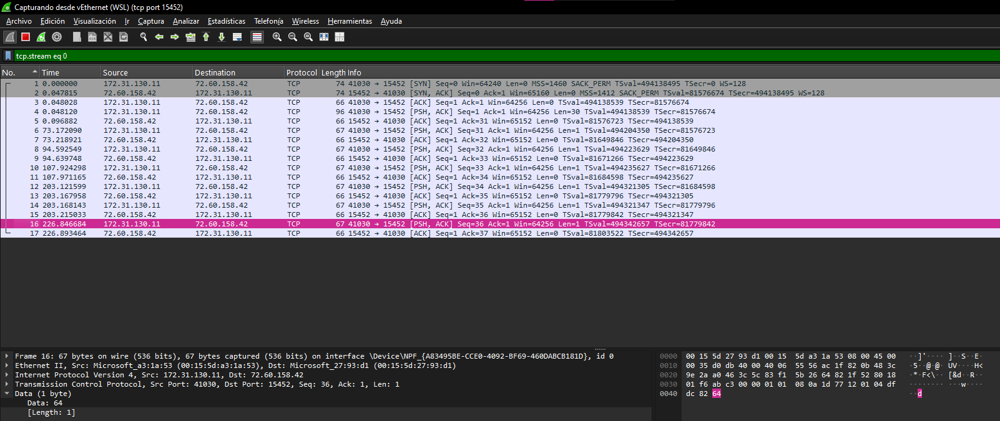
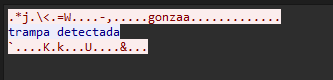
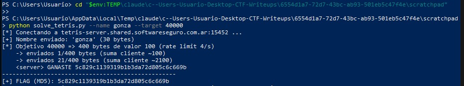

# Desafío 45 - Tetris (HackLab 2025)

**Plataforma:** HackLab (SoftwareSeguro)  
**Edición:** HackLab 2025  
**Categoría:** Reversing Desktop Apps - Lógica de negocio  

## Enunciado

> Ganá 40000 puntos al tetris. Solo eso.

Se entrega un único archivo, `client`, sin extensión.

## Análisis

El archivo `client` es un ELF de Linux x86-64 de ~24 MB. Ese tamaño y las cadenas
internas (`pyinstaller`, `libpython3.10`, `pygame.libs/...`) delatan que es un
juego en **Python 3.10 + pygame** empaquetado con **PyInstaller**.

Se extrae el archivo con `pyinstxtractor` y se obtiene el punto de entrada
`client.pyc`. Como es Python 3.10, se desensambla el bytecode para leer la lógica.

Del desensamblado surgen las constantes y el protocolo de red del cliente:

```python
SERVER_DOMAIN = "tetris-server.shared.softwareseguro.com.ar"
SERVER_PORT = 15452
NAME_BYTES = 30            # el nombre viaja en 30 bytes
MAX_SEND_PER_SEC = 4      # rate limit del cliente
MD5_RE = re.compile(r"\b[a-fA-F0-9]{32}\b")
```

El flujo de la clase `NetClient` es:

1. `socket.create_connection((host, 15452))`.
2. Enviar el nombre: `name.encode("utf-8")[:30].ljust(30, b"\x00")` (30 bytes fijos).
3. Enviar el puntaje **byte a byte**. El método `send_score` encola *"un valor de
   0..100 para enviar como un byte"*, y `_send_loop` lo manda por el socket.
4. Recibir texto del server; cuando llega uno que contiene `GANASTE`, se extrae el
   MD5 con `MD5_RE`.

En la lógica del juego (`main`), cada línea limpiada hace `score += 100` y llama a
`net.send_score(100)`. Es decir, **el puntaje que vale es el que se acumula del
lado del servidor** con los bytes que se le envían; el `score` que se dibuja en
pantalla es solo cosmético.

El envío está limitado por `_rate_limit_before_send`: como máximo `MAX_SEND_PER_SEC = 4`
bytes por segundo, con una ventana deslizante de 1 segundo.

## Enfoques descartados

- **Modificar el `score` en memoria.** Con un editor de memoria se busca el valor del
  puntaje (arrancando desde `600`, filtrando hasta quedar con una sola coincidencia) y
  se lo fuerza a `150000` con `set`. En pantalla el juego pasa a mostrar
  `Puntos: 150000`, pero no se gana: ese valor es solo local y el servidor lleva su
  propia cuenta a partir de los bytes que efectivamente recibe.

  

  

- **Reenviar paquetes crudos con Wireshark.** Capturando el tráfico se ve el protocolo:
  tras el nombre, el cliente manda paquetes TCP de **1 byte** con `Data: 64` (0x64 =
  100), uno por línea. Al replicar esos bytes por fuera del cliente —sin respetar la
  cadencia legítima— el servidor responde **`trampa detectada`** y corta. El envío
  tiene que salir al ritmo del propio cliente (`MAX_SEND_PER_SEC = 4`), no en ráfaga.

  

  

## Explotación

La vulnerabilidad es de **lógica de negocio**: el servidor confía en el puntaje que
le reporta el cliente. No hace falta jugar; alcanza con reproducir el protocolo y
enviar los bytes de puntaje directamente, respetando el rate limit.

Se escribe un cliente en Python (solo librería estándar) que replica exactamente el
comportamiento de `NetClient`: conecta, envía el nombre en 30 bytes, y va enviando
bytes de valor 100 con el mismo `RateLimiter` (≤ 4/s) mientras escucha la respuesta
del server buscando el MD5. El script completo es
[`solve_tetris.py`](./assets/solve_tetris.py); el núcleo de la explotación es:

```python
import re, socket, time
from collections import deque

HOST = "tetris-server.shared.softwareseguro.com.ar"
PORT = 15452
NAME_BYTES = 30
MAX_SEND_PER_SEC = 4
MD5_RE = re.compile(rb"\b[a-fA-F0-9]{32}\b")

name = b"gonza".ljust(NAME_BYTES, b"\x00")[:NAME_BYTES]

sock = socket.create_connection((HOST, PORT), timeout=4)
sock.settimeout(0.5)
sock.sendall(name)                       # 1) nombre en 30 bytes

sent_times = deque()
buf = bytearray()
flag = None

while flag is None:
    # rate limit: <= 4 envíos por segundo (ventana de 1s)
    now = time.monotonic()
    while sent_times and now - sent_times[0] > 1.0:
        sent_times.popleft()
    if len(sent_times) >= MAX_SEND_PER_SEC:
        time.sleep(0.2)
        continue

    sock.sendall(bytes([100]))           # 2) un byte de puntaje = 100
    sent_times.append(time.monotonic())

    try:
        data = sock.recv(4096)
        if data:
            buf.extend(data)
            m = MD5_RE.search(bytes(buf))
            if m:
                flag = m.group().decode()
    except socket.timeout:
        pass

print("FLAG (MD5):", flag)
```

`solve_tetris.py` agrega, sobre este núcleo, argumentos por línea de comandos
(`--name`, `--target`, `--per-byte`, `--ignore-rate`) que se usaron para explorar
las hipótesis alternativas, y el `RateLimiter` como clase. La corrida que resolvió
el reto fue la base:

```bash
python solve_tetris.py --name gonza --target 40000
```

Corriendo esa versión base (byte de valor `100`, rate limit `4/s`), el servidor
responde `GANASTE` junto con el MD5 tras enviar poco más de una veintena de bytes
—mucho antes de llegar a 40000—: el server da por ganado el desafío en cuanto el
puntaje acumulado supera su umbral, y devuelve el flag sin más validación.



## Flag

```
5c829c1139319b1b3da72d805c6c669b
```
